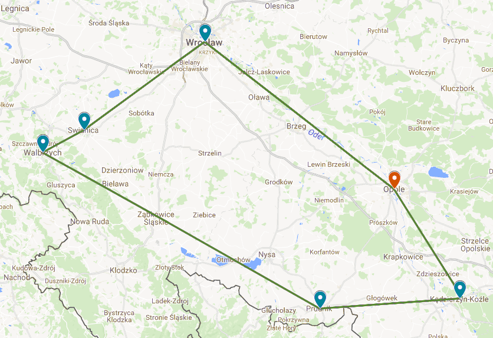

# Rozległe sieci komputerowe
## Projekt

Uczestnicy | Prowadzący | Termin zajęć
-----------|------------|-------------
Iwo Bujkiewicz (226203) Bartosz Rodziewicz (226105) | Prof. dr hab. inż. Andrzej Kasprzak | Poniedziałek 13:15

### Założenia projektowe

W zakres prac projektowych wchodziło zaprojektowanie sieci rozległej pomiędzy centralą i innymi oddziałami firmy funkcjonującej na terenie województw dolnośląskiego i opolskiego.

Projekt zakłada następujące lokalizacje oddziałów firmy:

* Opole (centrala)
* Wrocław
* Kędzierzyn-Koźle
* Prudnik
* Świdnica
* Wałbrzych

Wszystkie oddziały firmy czynne są codziennie w godzinach 09:00-18:00. W tym czasie każdego dnia między każdymi dwoma oddziałami przesyłane jest 10 MB danych, z każdego oddziału do centrali 51.5 MB, a z centrali do każdego oddziału 20 MB. Poza tymi godzinami, każdego dnia między każdymi dwoma oddziałami przesyłane jest 10.8 MB danych, a z każdego oddziału do centrali 55 MB. Klienci firmy każdego dnia generują łącznie 3 GB ruchu sieciowego przychodzącego i wychodzącego z centrali.

Do transmisji danych pomiędzy oddziałami oraz na zewnątrz firmy wykorzystywane są linie transmisyjne Orange.

### Ogólny opis koncepcji rozwiązania

Model struktury teleinformatycznej firmy jest hierarchiczny (podzielony na centralę - będącą jednocześnie oddziałem - i pozostałe oddziały). Uwzględniając występującą w sieci komunikację pomiędzy poszczególnymi oddziałami, a także ich położenie geograficzne, za najlepszy wybór uznano konstrukcję sieci w topologii pierścienia.

Sieć budowana jest z użyciem połączeń MetroEthernet firmy Orange, zgodnie z wymaganiami klienta.

Celem podniesienia niezawodności sieci zastosowane są:
* redundancja sprzętu - zapasowe routery w oddziałach, replikujące konfigurację aktywnie używanych routerów;
* odpowiedni dobór topologii sieci - zapewniający, w przypadku awarii w jednym z oddziałów, połączenie między wszystkimi pozostałymi;
* możliwość rozbudowy sieci o kolejne połączenia;
* dobór urządzeń sieciowych produkowanych przez firmy z wieloletnią renomą.

Jedną z cech prawidłowo zaprojektowanej sieci jest uwzględnienie potencjalnej przyszłej rozbudowy. Z tego powodu wykorzystane w projekcie routery posiadają dodatkowe, wolne porty, a jako tymczasowe rozwiązanie w przypadku szerzej zakrojonej rozbudowy można zastosować aktywne użycie routerów zapasowych, zakupionych na wypadek awarii (nie jest to jednak rozwiązanie wskazane, sugeruje się zakup nowych routerów).

Każdy oddział posiada światłowodowe połączenie internetowe dostarczane przez Orange. Centrala ma zapewnioną prędkość pobierania i wysyłania danych na poziomie odpowiednio 300 Mb/s i 30 Mb/s, a każdy z pozostałych oddziałów na poziomie 100 Mb/s i 10 Mb/s.

### Dobór struktury sieci
#### Topologia sieci

Wykorzystywane są połączenia MetroEthernet typu LINK, za pomocą których komunikują się ze sobą następujące pary oddziałów firmy:

* Opole - Kędzierzyn-Koźle (42 km)
* Kędzierzyn-Koźle - Prudnik (46 km)
* Prudnik - Wałbrzych (105 km)
* Wałbrzych - Świdnica (15 km)
* Świdnica - Wrocław (49 km)
* Wrocław - Opole (79 km)

Redundancja połączeń między każdymi dwoma oddziałami jest ustanowiona dzięki połączeniu w topologii pierścienia.

#### Analiza niezawodnościowa
##### Topologia sieci

Konstrukcja sieci w technologii pierścienia zapewnia niską podatność sieci na awarię w pojedynczym oddziale, bądź na jednym odcinku sieci, ze względu na obecność dwóch tras pomiędzy każdymi dwoma węzłami. Jeszcze wyższą niezawodność może potencjalnie zapewnić możliwość rozbudowy sieci o dodatkowe połączenia. Pierwsze sugerowane takie połączenie to bezpośrednie łącze Opole - Wałbrzych. Nie zostało ono jednak uwzględnione w podstawowej wersji projektu.

Poniższe tabele prezentują podstawowe i zapasowe trasy ustalone dla każdej pary węzłów źródłowego i docelowego.

###### Trasy dla węzła Opole

| Węzeł docelowy | Typ trasy | Przeskoki |
| :-: | :-: | :-: |
| Kędzierzyn-Koźle | **podstawowa** | Kędzierzyn-Koźle |
| Kędzierzyn-Koźle | zapasowa | Wrocław, Świdnica, Wałbrzych, Prudnik, Kędzierzyn-Koźle |
| Prudnik | **podstawowa** | Kędzierzyn-Koźle, Prudnik |
| Prudnik | zapasowa | Wrocław, Świdnica, Wałbrzych, Prudnik |
| Wałbrzych | **podstawowa** | Wrocław, Świdnica, Wałbrzych |
| Wałbrzych | zapasowa | Kędzierzyn-Koźle, Prudnik, Wałbrzych |
| Świdnica | **podstawowa** | Wrocław, Świdnica |
| Świdnica | zapasowa | Kędzierzyn-Koźle, Prudnik, Wałbrzych, Świdnica |
| Wrocław | **podstawowa** | Wrocław |
| Wrocław | zapasowa | Kędzierzyn-Koźle, Prudnik, Wałbrzych, Świdnica, Wrocław |

###### Trasy dla węzła Kędzierzyn-Koźle

| Węzeł docelowy | Typ trasy | Przeskoki |
| :-: | :-: | :-: |
| Prudnik | **podstawowa** | Prudnik |
| Prudnik | zapasowa | Opole, Wrocław, Świdnica, Wałbrzych, Prudnik |
| Wałbrzych | **podstawowa** | Prudnik, Wałbrzych |
| Wałbrzych | zapasowa | Opole, Wrocław, Świdnica, Wałbrzych |
| Świdnica | **podstawowa** | Opole, Wrocław, Świdnica |
| Świdnica | zapasowa | Prudnik, Wałbrzych, Świdnica |
| Wrocław | **podstawowa** | Opole, Wrocław |
| Wrocław | zapasowa | Prudnik, Wałbrzych, Świdnica, Wrocław |
| Opole | **podstawowa** | Opole |
| Opole | zapasowa | Prudnik, Wałbrzych, Świdnica, Wrocław, Opole |

###### Trasy dla węzła Prudnik

| Węzeł docelowy | Typ trasy | Przeskoki |
| :-: | :-: | :-: |
| Wałbrzych | **podstawowa** | Wałbrzych |
| Wałbrzych | zapasowa | Kędzierzyn-Koźle, Opole, Wrocław, Świdnica, Wałbrzych |
| Świdnica | **podstawowa** | Wałbrzych, Świdnica |
| Świdnica | zapasowa | Kędzierzyn-Koźle, Opole, Wrocław, Świdnica |
| Wrocław | **podstawowa** | Kędzierzyn-Koźle, Opole, Wrocław |
| Wrocław | zapasowa | Wałbrzych, Świdnica, Wrocław |
| Opole | **podstawowa** | Kędzierzyn-Koźle, Opole |
| Opole | zapasowa | Wałbrzych, Świdnica, Wrocław, Opole |
| Kędzierzyn-Koźle | **podstawowa** | Kędzierzyn-Koźle |
| Kędzierzyn-Koźle | zapasowa | Wałbrzych, Świdnica, Wrocław, Opole, Kędzierzyn-Koźle |

###### Trasy dla węzła Wałbrzych

| Węzeł docelowy | Typ trasy | Przeskoki |
| :-: | :-: | :-: |
| Świdnica | **podstawowa** | Świdnica |
| Świdnica | zapasowa | Prudnik, Kędzierzyn-Koźle, Opole, Wrocław, Świdnica |
| Wrocław | **podstawowa** | Świdnica, Wrocław |
| Wrocław | zapasowa | Prudnik, Kędzierzyn-Koźle, Opole, Wrocław |
| Opole | **podstawowa** | Świdnica, Wrocław, Opole |
| Opole | zapasowa | Prudnik. Kędzierzyn-Koźle, Opole |
| Kędzierzyn-Koźle | **podstawowa** | Prudnik. Kędzierzyn-Koźle |
| Kędzierzyn-Koźle | zapasowa | Świdnica, Wrocław, Opole, Kędzierzyn-Koźle |
| Prudnik | **podstawowa** | Prudnik |
| Prudnik | zapasowa | Świdnica, Wrocław, Opole, Kędzierzyn-Koźle, Prudnik |

###### Trasy dla węzła Świdnica

| Węzeł docelowy | Typ trasy | Przeskoki |
| :-: | :-: | :-: |
| Wrocław | **podstawowa** | Wrocław |
| Wrocław | zapasowa | Wałbrzych, Prudnik, Kędzierzyn-Koźle, Opole, Wrocław |
| Opole | **podstawowa** | Wrocław, Opole |
| Opole | zapasowa | Wałbrzych, Prudnik. Kędzierzyn-Koźle, Opole |
| Kędzierzyn-Koźle | **podstawowa** | Wrocław, Opole, Kędzierzyn-Koźle |
| Kędzierzyn-Koźle | zapasowa | Wałbrzych, Prudnik. Kędzierzyn-Koźle |
| Prudnik | **podstawowa** | Wałbrzych, Prudnik |
| Prudnik | zapasowa | Wrocław, Opole, Kędzierzyn-Koźle, Prudnik |
| Wałbrzych | **podstawowa** | Wałbrzych |
| Wałbrzych | zapasowa | Wrocław, Opole, Kędzierzyn-Koźle, Prudnik, Wałbrzych |

###### Trasy dla węzła Wrocław

| Węzeł docelowy | Typ trasy | Przeskoki |
| :-: | :-: | :-: |
| Opole | **podstawowa** | Opole |
| Opole | zapasowa | Świdnica, Wałbrzych, Prudnik. Kędzierzyn-Koźle, Opole |
| Kędzierzyn-Koźle | **podstawowa** | Opole, Kędzierzyn-Koźle |
| Kędzierzyn-Koźle | zapasowa | Świdnica, Wałbrzych, Prudnik. Kędzierzyn-Koźle |
| Prudnik | **podstawowa** | Opole, Kędzierzyn-Koźle, Prudnik |
| Prudnik | zapasowa | Świdnica, Wałbrzych, Prudnik |
| Wałbrzych | **podstawowa** | Świdnica, Wałbrzych |
| Wałbrzych | zapasowa | Opole, Kędzierzyn-Koźle, Prudnik, Wałbrzych |
| Świdnica | **podstawowa** | Świdnica |
| Świdnica | zapasowa | Opole, Kędzierzyn-Koźle, Prudnik, Wałbrzych, Świdnica |

##### Niezawodność urządzeń sieciowych

Awaryjność sprzętu, jest minimalizowana przez zakup nadmiarowych routerów do wszystkich oddziałów. Dzięki takiemu rozwiązaniu, nawet w przypadku awarii urządzenia sieciowego, istnieje możliwość natychmiastowego przywrócenia sprawności węzła.

Drugim sposobem na zminimalizowanie prawdopodobieństwa awarii sprzętowej jest zakup urządzeń firmy o uznanej marce i dużym doświadczeniu w dostarczaniu tego typu rozwiązań. W ramach projektu wybrano urządzenia firmy Juniper Networks, które nie tylko spełniają wymagania projektowanej sieci pod względem funkcjonalności, ale także cieszą się znakomitą renomą na rynku IT.

##### Niezawodność łącz telekomunikacyjnych zewnętrznego dostawcy

Usługa MetroEthernet firmy Orange zawiera SLA, co oznacza formalną gwarancję wysokiej jakości usług operatora - wysokiej dostępności usługi, krótkiego czasu usunięcia awarii oraz ograniczenia przerw w działaniu usługi.

##### Możliwość transmisji danych poprzez sieć Internet

Ostatnim filarem niezawodności sieci jest podłączenie każdego z oddziałów do sieci Internet. Pozwala to na utrzymanie funkcjonowania komunikacji pomiędzy odległymi lokalizacjami firmy - za pomocą szyfrowanych tuneli - nawet w wypadku awarii wielu z wymienionych wyżej elementów.

#### Reguły doboru tras

Ze względu na nieskomplikowaną konstrukcję sieci, zdecydowano o wykorzystaniu statycznych reguł doboru tras.

W każdym z węzłów tworzona jest statyczna tablica routingu, w której, przez odpowiednie ustawienie statycznego kosztu, ustala się trasy podstawowe i alternatywne. Szeroki zakres metryki tras pozwala na łatwą ewentualną rozbudowę sieci o kolejne węzły, bez konieczności całkowitej redefinicji tablic routingu. Tablice tworzone są w taki sposób, aby trasy o mniejszej liczbie przeskoków między węzłami były wybierane w pierwszej kolejności.

##### Tablica routingu dla węzła Opole

| Opis sieci docelowej | Adres sieci docelowej | Adres następnego przeskoku | Metryka trasy |
| :-: | :-: | :-: | :-: |
| LAN Opole | 176.16.1.0/30 | 176.16.1.2 | 1 |
| LAN Wrocław | 176.16.1.20/30 | 176.16.0.21 | 20 |
| LAN Wrocław | 176.16.1.20/30 | 176.16.0.2 | 100 |
| LAN Świdnica | 176.16.1.16/30 | 176.16.0.21 | 40 |
| LAN Świdnica | 176.16.1.16/30 | 176.16.0.2 | 80 |
| LAN Wałbrzych | 176.16.1.12/30 | 176.16.0.21 | 50 |
| LAN Wałbrzych | 176.16.1.12/30 | 176.16.0.2 | 70 |
| LAN Prudnik | 176.16.1.8/30 | 176.16.0.2 | 40 |
| LAN Prudnik | 176.16.1.8/30 | 176.16.0.21 | 80 |
| LAN Kędzierzyn-Koźle | 176.16.1.4/30 | 176.16.0.2 | 20 |
| LAN Kędzierzyn-Koźle | 176.16.1.4/30 | 176.16.0.21 | 80 |
| Internet | 0.0.0.0/0 | 88.52.137.254 | - |

##### Tablica routingu dla węzła Wrocław

| Opis sieci docelowej | Adres sieci docelowej | Adres następnego przeskoku | Metryka trasy |
| :-: | :-: | :-: | :-: |
| LAN Wrocław | 176.16.1.20/30 | 176.16.1.22 | 1 |
| LAN Świdnica | 176.16.1.16/30 | 176.16.0.17 | 20 |
| LAN Świdnica | 176.16.1.16/30 | 176.16.0.22 | 100 |
| LAN Wałbrzych | 176.16.1.12/30 | 176.16.0.17 | 40 |
| LAN Wałbrzych | 176.16.1.12/30 | 176.16.0.22 | 80 |
| LAN Prudnik | 176.16.1.8/30 | 176.16.0.22 | 50 |
| LAN Prudnik | 176.16.1.8/30 | 176.16.0.17 | 70 |
| LAN Kędzierzyn-Koźle | 176.16.1.4/30 | 176.16.0.22 | 40 |
| LAN Kędzierzyn-Koźle | 176.16.1.4/30 | 176.16.0.17 | 80 |
| LAN Opole | 176.16.1.0/30 | 176.16.0.22 | 20 |
| LAN Opole | 176.16.1.0/30 | 176.16.0.17 | 100 |
| Internet | 0.0.0.0/0 | 88.55.97.254 | - |

##### Tablica routingu dla węzła Świdnica

| Opis sieci docelowej | Adres sieci docelowej | Adres następnego przeskoku | Metryka trasy |
| :-: | :-: | :-: | :-: |
| LAN Świdnica | 176.16.1.16/30 | 176.16.1.18 | 1 |
| LAN Wałbrzych | 176.16.1.12/30 | 176.16.0.13 | 20 |
| LAN Wałbrzych | 176.16.1.12/30 | 176.16.0.18 | 100 |
| LAN Prudnik | 176.16.1.8/30 | 176.16.0.13 | 40 |
| LAN Prudnik | 176.16.1.8/30 | 176.16.0.18 | 80 |
| LAN Kędzierzyn-Koźle | 176.16.1.4/30 | 176.16.0.18 | 50 |
| LAN Kędzierzyn-Koźle | 176.16.1.4/30 | 176.16.0.13 | 70 |
| LAN Opole | 176.16.1.0/30 | 176.16.0.18 | 40 |
| LAN Opole | 176.16.1.0/30 | 176.16.0.13 | 80 |
| LAN Wrocław | 176.16.1.20/30 | 176.16.0.18 | 20 |
| LAN Wrocław | 176.16.1.20/30 | 176.16.0.13 | 100 |
| Internet | 0.0.0.0/0 | 88.51.230.254 | - |

##### Tablica routingu dla węzła Wałbrzych

| Opis sieci docelowej | Adres sieci docelowej | Adres następnego przeskoku | Metryka trasy |
| :-: | :-: | :-: | :-: |
| LAN Wałbrzych | 176.16.1.12/30 | 176.16.1.14 | 1 |
| LAN Prudnik | 176.16.1.8/30 | 176.16.0.9 | 20 |
| LAN Prudnik | 176.16.1.8/30 | 176.16.0.14 | 100 |
| LAN Kędzierzyn-Koźle | 176.16.1.4/30 | 176.16.0.9 | 40 |
| LAN Kędzierzyn-Koźle | 176.16.1.4/30 | 176.16.0.14 | 80 |
| LAN Opole | 176.16.1.0/30 | 176.16.0.14 | 50 |
| LAN Opole | 176.16.1.0/30 | 176.16.0.9 | 70 |
| LAN Wrocław | 176.16.1.20/30 | 176.16.0.1 | 40 |
| LAN Wrocław | 176.16.1.20/30 | 176.16.0.9 | 80 |
| LAN Świdnica | 176.16.1.16/30 | 176.16.0.14 | 20 |
| LAN Świdnica | 176.16.1.16/30 | 176.16.0.9 | 100 |
| Internet | 0.0.0.0/0 | 88.51.230.254 | - |

##### Tablica routingu dla węzła Prudnik

| Opis sieci docelowej | Adres sieci docelowej | Adres następnego przeskoku | Metryka trasy |
| :-: | :-: | :-: | :-: |
| LAN Prudnik | 176.16.1.8/30 | 176.16.1.10 | 1 |
| LAN Kędzierzyn-Koźle | 176.16.1.4/30 | 176.16.0.5 | 20 |
| LAN Kędzierzyn-Koźle | 176.16.1.4/30 | 176.16.0.10 | 100 |
| LAN Opole | 176.16.1.0/30 | 176.16.0.5 | 40 |
| LAN Opole | 176.16.1.0/30 | 176.16.0.10 | 80 |
| LAN Wrocław | 176.16.1.20/30 | 176.16.0.5 | 50 |
| LAN Wrocław | 176.16.1.20/30 | 176.16.0.10 | 70 |
| LAN Świdnica | 176.16.1.16/30 | 176.16.0.10 | 40 |
| LAN Świdnica | 176.16.1.16/30 | 176.16.0.5 | 80 |
| LAN Wałbrzych | 176.16.1.12/30 | 176.16.0.10 | 20 |
| LAN Wałbrzych | 176.16.1.12/30 | 176.16.0.5 | 100 |
| Internet | 0.0.0.0/0 | 88.52.146.254 | - |

##### Tablica routingu dla węzła Kędzierzyn-Koźle

| Opis sieci docelowej | Adres sieci docelowej | Adres następnego przeskoku | Metryka trasy |
| :-: | :-: | :-: | :-: |
| LAN Kędzierzyn-Koźle | 176.16.1.4/30 | 176.16.1.6 | 1 |
| LAN Opole | 176.16.1.0/30 | 176.16.0.1 | 20 |
| LAN Opole | 176.16.1.0/30 | 176.16.0.6 | 100 |
| LAN Wrocław | 176.16.1.20/30 | 176.16.0.1 | 40 |
| LAN Wrocław | 176.16.1.20/30 | 176.16.0.6 | 80 |
| LAN Świdnica | 176.16.1.16/30 | 176.16.0.1 | 50 |
| LAN Świdnica | 176.16.1.16/30 | 176.16.0.6 | 70 |
| LAN Wałbrzych | 176.16.1.12/30 | 176.16.0.6 | 40 |
| LAN Wałbrzych | 176.16.1.12/30 | 176.16.0.1 | 80 |
| LAN Prudnik | 176.16.1.8/30 | 176.16.0.6 | 20 |
| LAN Prudnik | 176.16.1.8/30 | 176.16.0.1 | 100 |
| Internet | 0.0.0.0/0 | 88.52.140.254 | - |

#### Wyznaczanie średniego opóźnienia pakietu

Średnie opóźnienie pakietu obliczono zgodnie z metodą zdefiniowaną w [1].

Obliczanie opóźnienia rozpoczęło się od zdefiniowania parametrów opisujących połączenie, takich jak:

* przepustowość użytego kanału,
* rozmiar przesyłanych pakietów,
* ilość danych przesyłanych pomiędzy węzłami.

Większość par oddziałów łączy się ze sobą za pośrednictwem innych oddziałów. Należało obliczyć, jaka ilość danych przepływa poprzez poszczególne węzły.

Ilość danych wysyłanych pomiędzy dwoma oddziałami to 10 MB w obie strony, z centrali do oddziału 20 MB, a z oddziału do centrali 51.5 MB.

Dla każdego kanału transmisyjnego ilość codziennie przesyłanych danych definiuje wzór:

`P = X * (51.5 MB + 20 MB) + Y * 10 MB`, gdzie
* `P` to ilość danych,
* `X` to ilość oddziałów łączących się po tym odcinku z centralą,
* `Y` to ilość par oddziałów łączących się ze sobą po tym odcinku.

Mając ten wzór oraz dane dotyczące topologii sieci i tablic routingu można wyznaczyć `X` i `Y` dla każdego odcinka, a następnie wyznaczyć ilość danych. Na jej podstawie szacowana jest przepływność kanału, przy założeniu, że takie dane są przesyłane w sposób zbliżony do ciągłego w godzinach pracy firmy (9 godzin dziennie). Pakietów wysyłanych poza godzinami pracy nie uwzględniono w obliczeniach, ponieważ tworzą one niższe wartości przepływowości kanałów.

Połączenie | `X` | `Y` | Przesyłane dane [MB] | Przepływowość [kb/s]
---|---|---|---|---
Węzeł Opole - Węzeł Wrocław | 3 | 5 | 264.5 | 66.88
Węzeł Wrocław - Węzeł Świdnica | 2 | 4 | 183.0 | 46.27
Węzeł Świdnica - Węzeł Wałbrzych | 1 | 5 | 121.5 | 30.72
Węzeł Wałbrzych - Węzeł Prudnik | 0 | 4 | 40.0 | 10.11
Węzeł Prudnik - Węzeł Kędzierzyn-Koźle | 1 | 5 | 121.5 | 30.72
Węzeł Kędzierzyn-Koźle - Węzeł Opole | 2 | 4 | 183.0 | 46.27

Wyliczona przepływowość kanałów pokazuje, że teoretycznie dopuszczalny byłby wybór łącz przepustowości 128 kb/s i 64 kb/s. Jednakże, z uwagi na komfort użytkowania, jak i nieustanny rozwój firm i technologii, zaleca się wybór kanałów o przepustowości przynajmniej 10 Mb/s.

Średnie opóźnienie pakietu obliczono ze wzoru:

Parametr `γ` obliczono, sumując przepływności kanałów i dzieląc je przez rozmiar pakietu. Za średni rozmiar pakietu przyjęto 1518 B, podążając za zaleceniami firmy Orange. Po wykonaniu obliczeń parametr `γ` wynosi 155.81 pakietów na sekundę.

Pozostałe parametry są znane, więc korzystając z arkusza kalkulacyjnego można obliczyć `T`, które wynosi 0.1 ms, co jest nieporównywalnie krótszym czasem, niż wymagane przez klienta maksymalne 700 ms. Dodatkowe opóźnienie wprowadzą urządzenia sieciowe; jest ono szacowane na kilka dodatkowych milisekund.

Uwzględniając tylko opóźnienie w przesyle pakietów, można było bez przeszkód wybrać kanały o niższej przepustowości, co można wziąć pod uwagę, gdyby nastąpiła konieczność redukcji kosztów.

### Adresacja w sieci
##### Opole

Opis sieci | Adres CIDR IPv4 | Przeznaczenie
---|---|---
Wrocław - Opole | 176.16.0.22/30 | Węzeł Opole: XE-0/1/0
Opole - Kędzierzyn-Koźle | 176.16.0.1/30 | Węzeł Opole: XE-0/1/1
Opole - LAN Opole | 176.16.1.1/30 | Węzeł Opole: GE-0/0/0
Opole - LAN Opole | 176.16.1.2/30 | Brama LAN Opole
Opole - Internet | 88.52.137.202/22 | Węzeł Opole: XE-0/1/2
Opole - Internet | 88.52.137.254/22 | Brama ISP

##### Kędzierzyn-Koźle

Opis sieci | Adres CIDR IPv4 | Przeznaczenie
---|---|---
Opole - Kędzierzyn-Koźle | 176.16.0.2/30 | Węzeł Kędzierzyn-Koźle: XE-0/1/0
Kędzierzyn-Koźle - Prudnik | 176.16.0.5/30 | Węzeł Kędzierzyn-Koźle: XE-0/1/1
Kędzierzyn-Koźle - LAN Kędzierzyn-Koźle | 176.16.1.5/30 | Węzeł Kędzierzyn-Koźle: GE-0/0/0
Kędzierzyn-Koźle - LAN Kędzierzyn-Koźle | 176.16.1.6/30 | Brama LAN Kędzierzyn-Koźle
Kędzierzyn-Koźle - Internet | 88.52.140.55/22 | Węzeł Kędzierzyn-Koźle: XE-0/1/2
Kędzierzyn-Koźle - Internet | 88.52.140.254/22 | Brama ISP

##### Prudnik

Opis sieci | Adres CIDR IPv4 | Przeznaczenie
---|---|---
Kędzierzyn-Koźle - Prudnik | 176.16.0.6/30 | Węzeł Prudnik: XE-0/1/0
Prudnik - Wałbrzych | 176.16.0.9/30 | Węzeł Prudnik: XE-0/1/1
Prudnik - LAN Prudnik | 176.16.1.9/30 | Węzeł Prudnik: GE-0/0/0
Prudnik - LAN Prudnik | 176.16.1.10/30 | Brama LAN Prudnik
Prudnik - Internet | 88.52.146.184/22 | Węzeł Prudnik: XE-0/1/2
Prudnik - Internet | 88.52.146.254/22 | Brama ISP

##### Wałbrzych

Opis sieci | Adres CIDR IPv4 | Przeznaczenie
---|---|---
Prudnik - Wałbrzych | 176.16.0.10/30 | Węzeł Wałbrzych: XE-0/1/0
Wałbrzych - Świdnica | 176.16.0.13/30 | Węzeł Wałbrzych: XE-0/1/1
Wałbrzych - LAN Wałbrzych | 176.16.1.13/30 | Węzeł Wałbrzych: GE-0/0/0
Wałbrzych - LAN Wałbrzych | 176.16.1.14/30 | Brama LAN Wałbrzych
Wałbrzych - Internet | 88.51.230.19/22 | Węzeł Wałbrzych: XE-0/1/2
Wałbrzych - Internet | 88.51.230.254/22 | Brama ISP

##### Świdnica

Opis sieci | Adres CIDR IPv4 | Przeznaczenie
---|---|---
Wałbrzych - Świdnica | 176.16.0.14/30 | Węzeł Świdnica: XE-0/1/0
Świdnica - Wrocław | 176.16.0.17/30 | Węzeł Świdnica: XE-0/1/1
Świdnica - LAN Świdnica | 176.16.1.17/30 | Węzeł Świdnica: GE-0/0/0
Świdnica - LAN Świdnica | 176.16.1.18/30 | Brama LAN Świdnica
Świdnica - Internet | 88.51.230.76/22 | Węzeł Świdnica: XE-0/1/2
Świdnica - Internet | 88.51.230.254/22 | Brama ISP

##### Wrocław

Opis sieci | Adres CIDR IPv4 | Przeznaczenie
---|---|---
Świdnica - Wrocław | 176.16.0.18/30 | Wrocław: XE-0/1/0
Wrocław - Opole | 176.16.0.21/30 | Wrocław: XE-0/1/1
Wrocław - LAN Wrocław | 176.16.1.21/30 | Węzeł Wrocław: GE-0/0/0
Wrocław - LAN Wrocław | 176.16.1.22/30 | Brama LAN Wrocław
Wrocław - Internet | 88.55.97.244/22 | Węzeł Wrocław: XE-0/1/2
Wrocław - Internet | 88.55.97.254/22 | Brama ISP

### Wykaz urządzeń

Urządzenie | Rodzaj | Model | Ilość
---|---|---|---
Węzeł Opole | Router | Juniper ACX1100-AC | 2
Węzeł Wrocław | Router | Juniper ACX1100-AC | 2
Węzeł Świdnica | Router | Juniper ACX1100-AC | 2
Węzeł Wałbrzych | Router | Juniper ACX1100-AC | 2
Węzeł Prudnik | Router | Juniper ACX1100-AC | 2
Węzeł Kędzierzyn-Koźle | Router | Juniper ACX1100-AC | 2

### Literatura

1. Kasprzak, A., 1999. _Rozległe sieci komputerowe z komutacją pakietów_ (Oficyna Wydawnicza Politechniki Wrocławskiej, 1999)

1. Juniper Networks, 2018. _ACX Series Universal Metro Routers_ (https://www.juniper.net/assets/us/en/local/pdf/datasheets/1000397-en.pdf)

1. Orange Polska, 2017. _Regulamin usługi Miejski Ethernet_ (http://www.orange.pl/ocp-http/PL/Binary2/1993810/4083323399.pdf)
