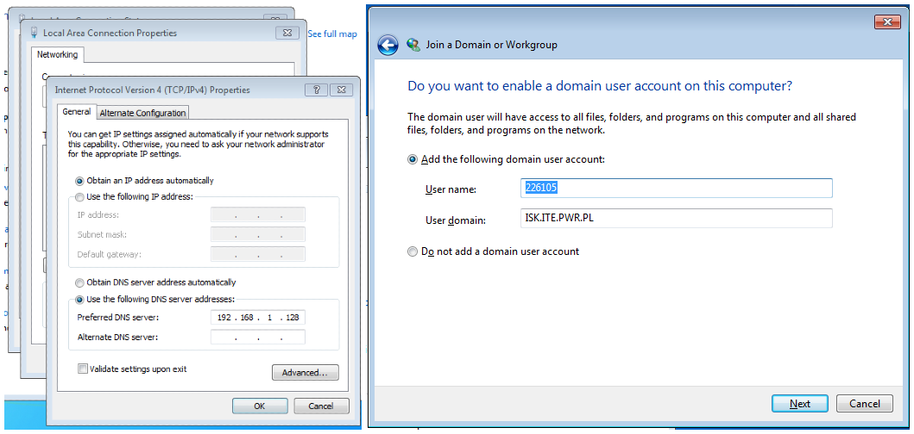
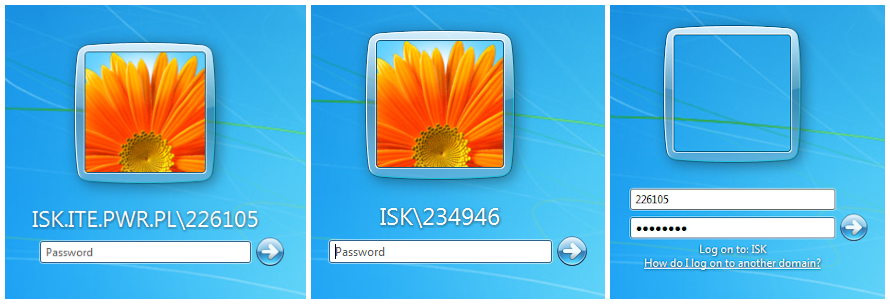
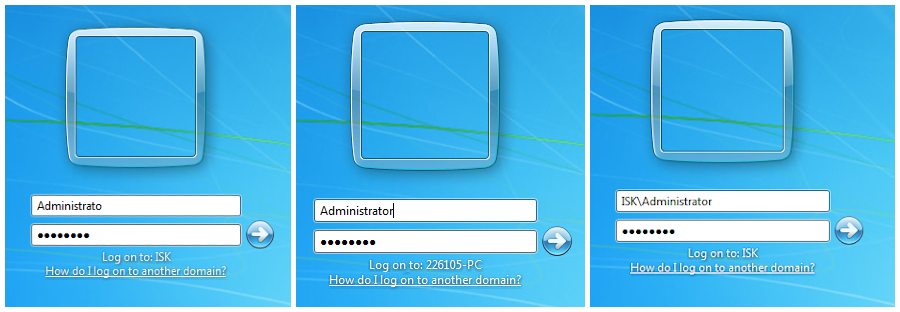
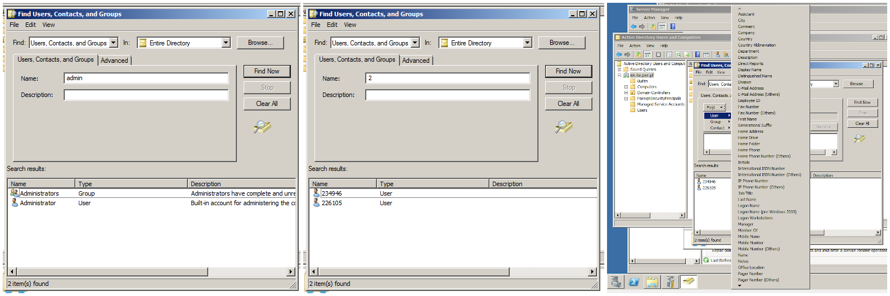
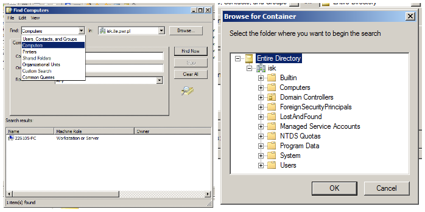
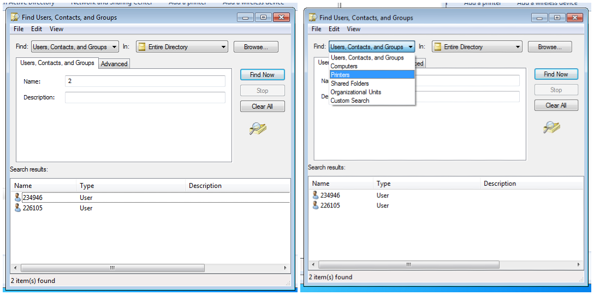
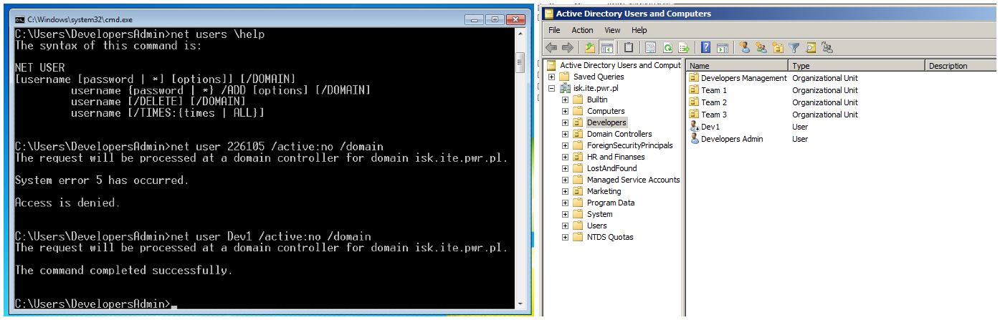
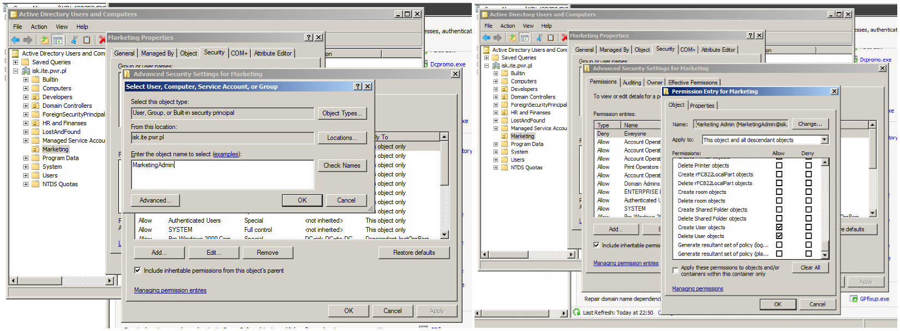

# Administrowanie systemami sieciowymi

## Sprawozdanie z laboratorium

Data | Tytuł zajęć | Uczestnicy
:-: | :-: | :-:
14.10.2020 11:15 | Podstawy środowiska Windows oraz podstawy Active Directory | Bartosz Rodziewicz (226105) Przemysław Skoneczny (234946)

### Opis środowiska
Zadania z zajęć laboratoryjnych zostały wykonane w dwóch maszynach wirtualnych postawionych z wykorzystaniem VirtualBox. Jedna maszyna posiadała system Windows 7, druga Windows Server 2008 R2. Połączone były za pomocą adapterów ustawionych w tryb bridge z wykorzystaniem fizycznej sieci lokalnej. Do zajęć użyte zostały czyste instalacje systemów Windows po doinstalowaniu aktualnych update'ów.

### Przebieg laboratorium
#### Przedstawić proces dodania komputera do domeny.
Aby przedstawić proces dodania komputera do domeny, konieczne było najpierw stworzenie domeny i ustawienie instalacji Windows Server jako kontrolera domeny.

Za pomocą kreatora "Add roles" konieczne było doinstalowanie "Active Directory Domain services".

Później za pomocą kreatora instalacji AD DS wymagana była instalacja domeny.

Po reboocie konieczne również było stworzenie użytkownika domenowego.

Z poziomu maszyny z systemem Windows 7 wymagane było ustawienie serwera DNS na adres maszyny serwera oraz wykonanie kreatora dodania do domeny.

#### Przedstawić zmiany w grupach lokalnych komputera "Administratorzy" oraz "Użytkownicy", dokonujące się po dodaniu komputera do domeny

Do grupy "Administrators" dodana zostaje domenowa grupa Domain Admins.

Do grupy Users dodane zostają grupa Domain Users oraz domenowy użytkownik 226105.

#### Przedstawić i opisać różne sposoby logowania, tzn. wykorzystujące konta lokalne komputera oraz domenowe.

Do komputera będącego w domenie można logować się na dwa sposoby - na konta lokalne komputera oraz na konta domenowe.

Domyślnie logując się komputer zakłada, że logujemy się do domeny. Aby mieć dostęp do zasobów domeny konieczne jest zalogowanie do konta domenowego.

Aby zalogować się na lokalne konto użytkownika konieczne jest poprzedzenie jego nazwy `.\` lub `<nazwa_komp>\`.

Wyjątek stanowi konto administratora, przy którym system zakłada, że logujemy się do lokalnej maszyny, a aby zalogować się na konto administratora domeny trzeba to zaznaczyć poprzedzając je nazwą domeny.

#### Przedstawić przypisywanie konta użytkownika do grup wbudowanych (domenowych i lokalnych).

W momencie stworzenia konta domenowego jest ono przypisywane automatycznie do domenowej grupy "Domain Users".

Tak samo jak stworzenie konta lokalnego powoduje przypisanie go do grupy lokalnej komputera "Users" (konto niedomenowe).

Możliwe jest ręczne przypisanie konta domenowego do domenowej grupy adminów z poziomu zarządzania domeną.

Możliwe jest również przypisanie konta domenowego jako administrator na tylko jednej maszynie poprzez dodanie go do lokalnej grupy adminów.

Oczywista jest również możliwość przypisania lokalnego konta do lokalnej grupy. Nie możliwe natomiast jest przypisanie lokalnego konta do globalnej grupy.

#### Tworzenie własnych grup – domenowych i lokalnych. W formie tabeli przedstawić stworzone konta podczas laboratorium oraz podać ich zakres (domenowe {lokalne, globalne, uniwersalne}, lokalne komputera).

Nazwa konta | Zakres
--- | ---
Administrator | lokalne komputera
226105 | lokalne komputera
ISK\\Administrator | domenowe globalne
ISK\\226105 | domenowe globalne
ISK\\234946 | domenowe globalne

#### Przedstawić przypisanie praw użytkownikom domenowym poprzez przynależność do grup lokalnych komputera. Stworzyć użytkownika w domenie, takiego który będzie miał np. uprawnienia tworzenia użytkownika lokalnego w systemie XP/Vista.

Przedstawione przeze mnie w punkcie 4 dodanie użytkownika domenowego ISK\\234946 powoduje, że po zalogowaniu się na niego mamy uprawnienia administratora na lokalnym komputerze i możemy tworzyć użytkownika lokalnego.

#### Przedstawić proces przeszukiwania bazy Active Directory – różne kryteria, po zalogowaniu do stacji roboczej.

Bazę AD można przeszukiwać z poziomu AD Users and Computers na serwerze. Przeszukiwać można po wszystkich polach.

Można też przeszukiwać inne zasoby niż konta użytkowników i grupy, a także można zawęzić zakres przeszukiwania, wybierając gdzie chcemy szukać.

Przeszukiwanie AD jest możliwe również z poziomu komputerów w domenie.

#### Przedstawić proces dodania do AD folderu udostępnionego.

Pierwszym etapem jest przygotowanie folderu i jego udostępnienie.

A następnie dodanie go jako shared folder in AD Users and Computers.

W ten sposób udostępnione zasoby można znaleźć za pomocą wyszukiwarki AD.

#### Stworzyć hierarchię jednostek organizacyjnych. Stworzyć hierarchię zgodnie ze strategią podziału zasobów, strukturą organizacyjną lub inną wraz z uzasadnieniem.

NA potrzeby realizacji tego zadania założyliśmy, że sieć znajduje się w małej firmie na kilkadziesiąt komputerów. Proponowany przez nas podział uwzględnia działy firmy, budynki oraz zespoły pracowników w zależności od konieczności.

Podział wygląda następująco:
* Developers
	* Developers Management
	* Team 1
	* Team 2
	* Team 3
* Marketing
* HR and Finances
	* Building A
		* Team 11
		* Team 12
	* Building B
		* Team 13
		* Team 14
	* HR Management

Uzasadnieniem takiego podziału jest struktura organizacyjna firmy oraz to, że w zależności od ważności przetwarzanych danych konieczna jest większa lub mniejsza kontrola dostępu do zasobów przez pracowników w różnych działach.

#### Wykonać delegowanie kontroli administracyjnej za pomocą kreatora oraz sprawdzić, czy działa wykonana delegacja.

Do wykonania tego zadania stworzyliśmy dwóch użytkowników w jednostce Developers - DevelopersAdmin i Dev1.

Następnie korzystając z kreatora przekazaliśmy kontu DevelopersAdmin uprawnienia do zarządzania użytkownikami w tej jednostce.

Za pomocą narzędzia `net users` można pokazać, że uprawnienia działają poprawnie - 226105 to konto nie będące w żadnej jednostce, natomiast Dev1 znajduje się w jednostce Developers.

#### Przedstawić delegowanie kontroli administracyjnej bez użycia kreatora (zadanie dodatkowe).

Delegacja bez użycia kreatora wymaga aktywacji Advanced Features w menu View, a następnie wejścia w zaawansowane ustawienia zabezpieczeń danej jednostki organizacyjnej - z menu kontekstowego danej OU należy wybrać Properties -> Security -> Advanced -> Add -> podanie nazwy konta -> OK i teraz należy z listy wybrać konieczne uprawnienia.

