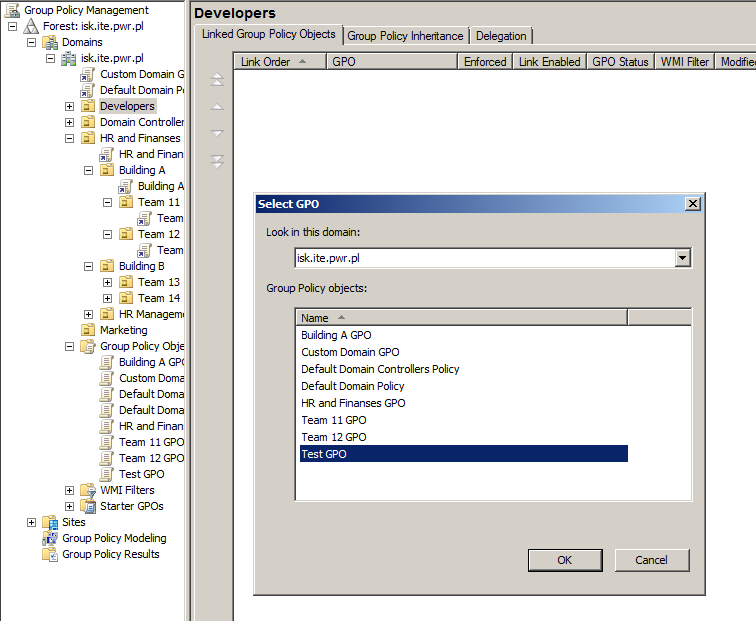
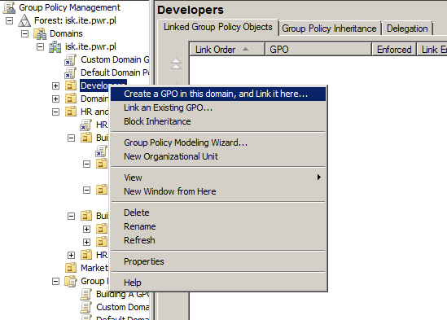
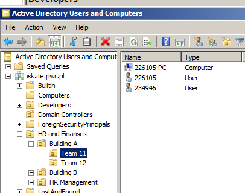
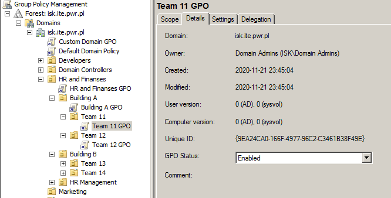
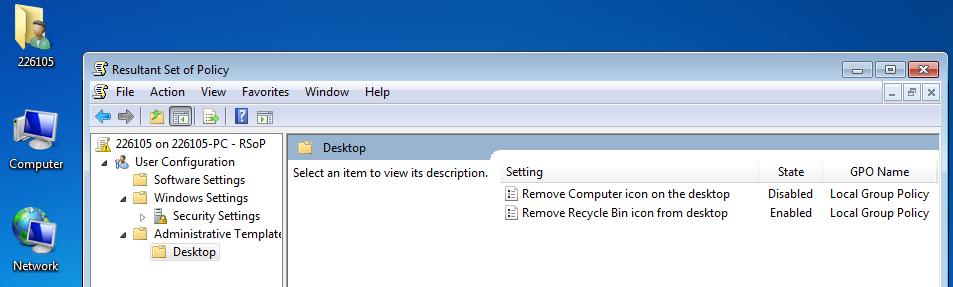
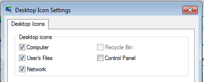
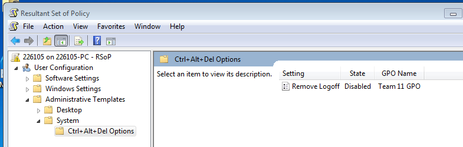
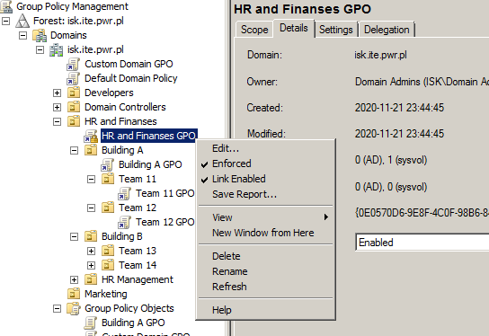
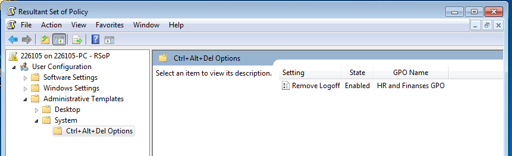

# Administrowanie systemami sieciowymi

## Sprawozdanie z laboratorium

Data | Tytuł zajęć | Uczestnicy
:-: | :-: | :-:
14.10.2020 11:15 | Zasady grupowe | Bartosz Rodziewicz (226105) Przemysław Skoneczny (234946)

### Przebieg laboratorium
#### Przedstawić na przykładzie opcje zawarte w tzw. lokalnym obiekcie GPO

Każdy GPO posiada ustawienia dwóch typów - Computer Configuration oraz User Configuration. Niektóre ustawienia należą do obu tych typów, a niektóre tylko do jednego z nich.

Komputer niebędący w domenie posiada jeden GPO nałożony na komputer i wszystkich użytkowników. Możliwe jest stworzenie dodatkowych GPO przypisanych do specyficznych użytkowników, administratorów/nie-administratorów lub całego komputera. Komputery/użytkownicy będący w domenie mogą posiadać przypisane dodatkowe GPO na poziomie domeny lub jednostek organizacyjnych dowolnego szczebla.

##### dla węzła "konfiguracja komputera"

Computer Configuration zawiera ustawienia skupiające się na komputerze i dotyczy wszystkich użytkowników danego komputera (lub komputerów jeśli GPO dotyczy kilku maszyn). Ustawienia z tego węzła aplikowane są w momencie uruchomienia komputera oraz odświeżane są co zdefiniowany okres czasu.

##### dla węzła "konfiguracja użytkownika"

User Configuration zawiera ustawienia skupiające się na użytkowniku i jego możliwościach. Gdy dany GPO jest na (jakimkolwiek) poziomie domeny dotyczy on każdego komputera na którym dany użytkownik się zaloguje w czasie gdy używa go ten użytkownik. Ustawienia z tego węzła aplikowane są w momencie logowania użytkownika oraz odświeżane są co zdefiniowany okres czasu.

#### Przedstawić jak tworzyć obiekt GPO dla jednostki organizacyjnej oraz domeny

Zarządzanie GPO wykonuje się w Group Policy Management. Proces tworzenia GPO dzieli się na stworzenie obiektu oraz przypisanie go do poziomu na którym ma obowiązywać - domena, jednostka organizacyjna, itd.

Aby stworzyć nowy obiekt należy wybrać las i domenę oraz kliknąć prawym na Group Policy Objects i wybrać New.

Podłączenie GPO polega na wybraniu odpowiedniej JO (lub domeny) i wybranie Link an Existing GPO.

Istnieje również uproszczona metoda umożliwiająca wybranie odpowiedniego poziomu w domenie i wybranie Create a GPO in this domain and Link it here. Uruchamiane jest okienko identyczne jak przy tworzeniu nowego GPO, ale po stworzeniu jest on automatycznie linkowany do tej JO.

#### Dla hierarchicznej struktury 3 jednostek organizacyjnych przedstawić:
##### domyślne przetwarzanie obiektów GPO – opcje "nie skonfigurowane", "włączone", "wyłączone"

Każda zasada grupy może być ustawiona w jednym z trzech stanów:
* włączone
* wyłączone
* nie skonfigurowane

Dwie pierwsze chyba są oczywiste, natomiast "nie skonfigurowane" oznacza, że przetwarzając dany GPO dana zasada nie jest zmieniana, czyli jeśli któryś z wcześniej przetwarzanych GPO miał daną zasadę ustawioną to pozostaje tamto ustawienie, a jeśli każdy miał "nie skonfigurowane" to dana zasada jest ustawiana na swoją domyślną wartość (z reguły podaną w opisie zasady).

Przetwarzanie GPO odbywa się w następującej kolejności: lokalny GPO komputera, lokacja, domena, jednostki organizacyjne zgodnie z hierarchią od góry do dołu (od nadrzędnych do podrzędnych). Jeśli jeden poziom posiada kilka GPO są one przetwarzane zgodnie z listą od góry do dołu, czyniąc te na dole "ważniejszymi" - przetwarzany GPO nadpisuje poprzednie ustawienie danej zasady wynikające z wcześniej przetworzonego GPO.

Działanie poszczególnych ustawień i zasady dziedziczenia zostaną przedstawione na przykładowej strukturze JO - domena -> HR and Finances -> Building A -> Team 11 (Team 11 zawiera obiekt komputera wirtualki oraz dwóch przykładowych użytkowników domenowych).

Domena poza swoim domyślnym GPO dostała dodatkowy, oraz każda JO z wymienionej wyżej hierarchii również posiada swój GPO.

Praktyczne działanie zasad zostanie przedstawione na podstawie zasad dotyczących usuwania ikon z pulpitu komputera (węzeł konfiguracja użytkownika).

Gdy żadne ustawienia w GPO nie są zmienione Resultant Set of Policy (RSoP) nie pokazuje niczego, dlatego też zostały ustawione dwie rzeczy w lokalnym GPO komputera. Po ustawieniu widać, że z pulpitu zniknęła ikona kosza, a włączenie go przez Panel Sterowania jest nie możliwe (opcja jest wyszarzona).

Następnie w poszczególnych GPO domeny włączone zostały następujące zasady:

Poziom | Nazwa zasady | Ustawienie
--- | --- | ---
domena | Remove Computer icon on the desktop | enabled
HR and Finances | Hide Network Locations icon on desktop | enabled
Building A | Desktop Wallpaper | enabled (i ścieżka do pliku tapety)

Widać, że poszczególne zasady działają oraz że ustawienie "Remove Computer icon on the desktop" ustawione na poziomie domeny nadpisuje lokalną zasadę. Tak samo działało by to z zasadami z dwóch GPO domenowych, gdzie później przetwarzana zasada (niżej w hierarchii, bardziej szczegółowo) by nadpisała ustawienie wyżej.

Co do zmiany tapety widać, że ustawienia Windowsa wykryły ścieżkę tapety i ją zmieniły, niestety z jakiegoś powodu nie załadowała się ona poprawnie i faktyczna tapeta zrobiła się czarna. Nie jest to jednak istotne teraz dlaczego ten plik się nie ładuje, a na screenshocie wyżej widać, że sama zasada grupy działa (ustawienia pulpitu pokazują poprawną tapetę).

##### działanie opcji "nie zastępuj"

Działanie opcji "nie zastępuj" zaprezentuje na zasadzie "Remove Logoff" z menu Ctrl+Alt+Delete.

Gdy żadna zasada nie jest skonfigurowana menu wygląda tak:

Na poziomie JO "HR and Finances" włączona jest zasada "Remove Logoff". Na poziomie Team 11 zasada ta jest wyłączona. Menu nie ulega zmianie, log off wciąż jest na nim obecne.

Po zaznaczeniu opcji Enforced przy "HR and Finances GPO" komputer użytkownika zmienił wartość w RSoP oraz menu już nie zawiera opcji Log off.

##### działanie opcji "zablokuj dziedziczenie"

Do przedstawienia opcji zablokuj dziedziczenie dodane zostało kilka dodatkowych zasad w GPO dla Building A i Team 11. Dziedziczenie wyłączone zostało na poziomie Building A.

Na powyższym zrzucie ekranu widać, że zasady z Custom Domain GPO zniknęły. Zasady z HR and Finances nadal są jednak obecne, ponieważ w dalszym ciągu jest on ustawiony jako Enforced. Po wyłączeniu tej opcji widać, że zostają tylko zasady z Building A i niżej oraz lokalne komputera.

#### Jak przypisać obiekt GPO do grupy zabezpieczeń – filtrowanie obiektu GPO

Każdy GPO poza byciem przypisanym do danego poziomu hierarchii domeny może być wybiórczo nakładany poprzez wykorzystanie filtrowania i grup. Dla tego przykładu w JO Team 11 stworzona została grupa Team 11.1 do której przypisany został użytkownik 226105.

Team 11 GPO zawiera następujące zasady:

Poziom | Nazwa zasady | Ustawienie
--- | --- | ---
Team 11 GPO | Remove Lock Computer | enabled
Team 11 GPO | Remove Logoff | disable

_(zrzuty ekranu z poprzedniego zadania to pokazują)_

Teraz Team 11 GPO zostaje przefitrowany by nakładany był tylko na użytkowników grupy Team 11.1.

Po takich ustawieniach użytkownikowi 226105 (będącego częścią Team 11.1) wynik RSoP nie powinien się zmienić, jednak zasady wynikające z Team 11 GPO przestały obowiązywać. Stało się to dlatego, że maszyna na której użytkownik się zalogował nie miała uprawnień by czytać zasady tego GPO. Po dodaniu komputera w karcie Delegation zasady dla użytkownika 226105 wróciły. _Wydaje nam się, że istnieje bardziej elegancka metoda niż listowanie wszystkich maszyn w ten sposób jednak nie udało nam się jej znaleźć._

Po zalogowaniu się na użytkownika 234946 widać, że jego zasady nie obowiązują pomimo bycia w tej samej JO.

_(wynik RSoP dla użytkownika 234946 zawiera zasady dotyczące komputera, ponieważ użytkownik ten jest częścią lokalnej grupy Administratorów tej maszyny)_

#### Pokazać dla węzła "przypisywanie praw użytkownika" nadpisywanie uprawnień z lokalnego GPO przez ustawienia skonfigurowane na poziomie domeny

Zaprezentowane zostało to już wykonując punkt 2, jednak powtórzone to zostanie tutaj na bardziej widocznym przykładzie. Wykorzystana do tego będzie zasada Prohibit access to Control Panel. Zasada ta zostaje włączona w ustawieniach lokalnego GPO.

Teraz w GPO domeny (na poziomie JO Building A) ta sama zasada zostaje wyłączona.

Po odświeżeniu zasad użytkownik z powrotem ma dostęp do Panelu Sterowania.

#### Pokazać wielokrotne linki do jednego GPO

Wielokrotne linki zostaną pokazane na przykładzie 3 kont użytkownika "test1", "test2" i "test3", będących odpowiednio w JO "HR and Finances", "Developers" oraz "Marketing" i wykorzystując GPO o nazwie "HR and Finances GPO".

Do każdej z wymienionych JO przypisany zostaje ten GPO.

Ten GPO przestawia następujące zasady i są one widoczne również z poziomu RSoP po zalogowaniu na wspomniane wcześniej konta użytkowników.

#### Skonfigurować autorski zestaw GPO (np. prawo do przejęcia obiektów, zamykanie systemu, przekierowanie folderów, filtrowanie GPO itp.)

Wydaje nam się, że w trakcie realizacji tych zadań przygotowaliśmy dość unikalny i autorski zestaw wykorzystanych przez nas zasad. Dodatkowo prawie każdy zrzut ekranu zawiera coś co pozwala na określenie, że został wykonany na naszych maszynach (nazwy użytkowników i komputerów będące naszymi nr indeksu).
