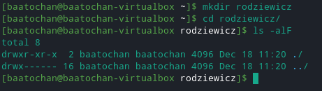
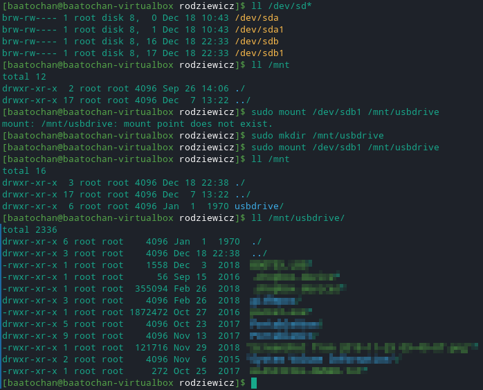
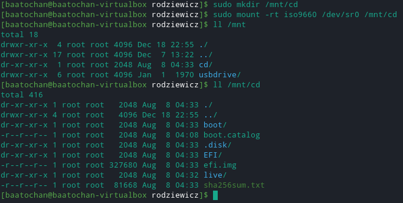

# Administrowanie systemami sieciowymi

## Sprawozdanie z laboratorium

Data | Tytuł zajęć | Uczestnicy
:-: | :-: | :-:
09.12.2020 11:15 | System plików | Bartosz Rodziewicz (226105)

### Opis środowiska
Zajęcia laboratoryjne z części nt. systemu Linux zostały wykonane na maszynie wirtualnej postawionej z wykorzystaniem VirtualBox. Zainstalowana w maszynie dystrybucja to Manjaro 20.2 ze środowiskiem (DE) KDE Plasma. Do zajęć użyta została czysta instalacja systemu po doinstalowaniu najnowszych aktualizacji pakietów. W wielu miejscach używany jest alias `ll`, który jest aliasem `ls -alF`.

### Przebieg laboratorium
#### Porównać działanie polecenia `ls` z opcja `-a` i bez tej opcji. Czy są jakieś różnice, a jeżeli tak to jakie?
Komenda `ls` służy do wypisania na terminal zawartości katalogu w którym aktualnie się znajdujemy. Domyślnie wypisywane są pliki i katalogi, które nie są plikami ukrytymi (zaczynającymi się od `.`). Flaga `-a`/`--all` powoduje że wypisane zostaną wszystkie pliki/katalogi, w tym ukryte, wraz z katalogami `.` oraz `..` reprezentującymi odpowiednio katalog w którym się aktualnie znajdujemy oraz katalog nadrzędny.

#### Utworzyć w swoim katalogu domowym nowy katalog o takiej nazwie jak swoje nazwisko.
Tworzenie katalogu odbywa się poprzez komendę `mkdir <nazwa>`.

#### Utworzyć nowy plik p1.txt i spróbować wykorzystać polecenie `chown` do zmiany jego właściciela. Co się dzieje i dlaczego?

Do wykonania zadania stworzony został nowy użytkownik `user1`.

Najprostszą metodą na utworzenie pliku jest użycie komendy `touch <nazwa>`.

Przy próbie zmiany właściciela otrzymujemy komunikat o braku uprawnień. Dzieje się tak dlatego, że w systemie Linux, aby możliwa była zmiana właściciela muszą być spełnione dwa warunki:
* trzeba być właścicielem danego pliku,
* trzeba być "odbiorcą" uprawnień pliku.

Jak widać, powyższe warunki się wykluczają. Pierwszy z nich jest dość oczywisty i nie trzeba chyba tłumaczyć dlaczego trzeba być właścicielem pliku którego chcemy zmodyfikować.

Drugi natomiast wynika z faktu, że większość dystrybucji blokuje możliwość "oddawania" plików (można tylko przyjmować). Jest to spowodowane kilkoma powodami, gdzie dwa najważniejsze z nich to:
* Możliwość przekazania komuś pliku powoduje, że w systemie nie ma dowodu, że dany "obdarowany" użytkownik tego pliku nie stworzył. Mogłoby to być użyte by "podrzucić" komuś kompromitujące bądź nielegalne materiały.
* Możliwość przekazania komuś pliku powoduje problemy z działaniem quote'y na pliki danego użytkownika (limitu na zajęcie powierzchni dyskowej przez danego użytkownika). Możliwa byłaby sytuacja, gdy użytkownik tworzy plik w katalogu dostępnym tylko dla niego i przekazuje ten plik innej osobie. W efekcie plik zajmuje quote innego użytkownika, ale może być używany tylko przez pierwszego właściciela.

Oczywiście root posiada uprawnienia by zmieniać i przekazywać pliki każdemu.

#### Spróbować wykorzystać polecenie `chgrp` do zmiany grupy utworzonego w poprzednim punkcie pliku. Co się dzieje i dlaczego?

Do tego zadania wykorzystane zostaną dwie grupy - grupa `user1` stworzona wraz z użytkownikiem `user1` w poprzednim zadaniu oraz grupa `group1` stworzona dodatkowo. Grupa `user1` zawiera użytkownika `user1`, natomiast `group1` użytkownika `baatochan` i `user1`.

Ja widać na powyższym zrzucie zmiana grupy na `user1` się nie powiodła z powodu braku uprawnień, natomiast zmiana na `group1` się powiodła. Stało się to z tego samego powodu o którym pisałem w zadaniu powyżej. Zamiana uprawnień jest możliwa tylko w dwóch przypadkach, dla grup będzie to:
* trzeba być właścicielem pliku,
* trzeba być "odbiorcą" uprawnień pliku, czyli trzeba być członkiem "obdarowanej" grupy.

Powody drugiego warunku pozostają takie jak w zadaniu wyżej. Tak samo jak dla `chown` root może zmieniać grupę bez żadnych przeciwskazań.

#### Ustalić następujące uprawnienia do pliku prawa do p1.txt:
* właściciel ma możliwość tylko czytania pliku i jego wykonywania (dokładnie te dwa prawa)
* odebrać grupie wszelkie prawa za wyjątkiem możliwości wykonywania pliku
* pozostali nie mają żadnych uprawnień

Powyższe uprawnienia można zapisać w skrócie jako `510`. Kolejne cyfry oznaczają odpowiednio uprawnienia właściciela, grupy i innych. Cyfry to tak naprawdę liczby o wielkości 3 bitów, gdzie każdy bit odpowiada od lewej odczytowi, zapisowi i wykonywaniu. W dziesiętnym zapis to 4, odczyt 2, a wykonywanie 1. Poszczególne bity w zapisie dziesiętnym należy zsumować w naszym wypadku 4+0+1, 0+0+1, 0+0+0. Do zmiany uprawnień służy komenda `chmod`.

#### Przywrócić właścicielowi pliku p1.txt komplet praw do pliku.

#### Umieścić w pliku p1.txt następujący tekst: `plik1 <Imię Nazwisko> <numer indeksu>`.

#### Utworzyć dwa twarde dowiązania do pliku p1.txt pod nazwami p2.txt i p3.txt.

Do tworzenia linków służy komenda `ln`. Komenda `ln` bez żadnych parametrów tworzy link twardy.

#### Wyświetlić zawartość plików p1.txt i p3.txt. Czy jest ona taka sama? Dlaczego?

Link twardy to bezpośrednia referencja do pliku poprzez jego inode. Każdy plik posiada inode zawierający swoje metadane oraz wskaźnik do fizycznego miejsca na dysku z danymi. Tworząc link symboliczny tworzona jest druga referencja do tego samego inode. Przeniesienie lub skasowanie jednej referencji nie ma wpływu na pozostałe. Twarde linki można tworzyć tylko do plików, nie można do katalogów.

Na powyższych zrzutach widać, że każdy z plików ma ten sam inode (pierwsza kolumna `ll -i`).

#### Usunąć plik p1.txt i ponownie wyświetlić zawartość pliku p3.txt.

Skasowanie jednej referencji nie ma wpływu na inne. Aby zdealokować plik na dysku konieczne jest usunięcie wszystkich referencji.

#### Zmienić zawartość pliku p2.txt na: `plik2 <Nazwisko Imię> <numer indeksu>`. W kolejnym kroku wyświetlić zawartość plików p2.txt i p3.txt. Co się stało i dlaczego?

Modyfikacja zawartości pliku przez jedną referencję powoduje modyfikacje pliku widzianego przez każdą referencję.

#### Utworzyć twarde dowiązanie o nazwie p1.txt wskazujące na zawartość pliku p2.txt, a następnie usunąć pliki p2.txt i p3.txt. Jaka jest zawartość p1.txt i dlaczego?

Skasowanie jednej referencji nie ma wpływu na inne. Aby zdealokować plik na dysku konieczne jest usunięcie wszystkich referencji. Nie ma znaczenia czy referencja jest tworzona do oryginalnego pliku (oryginalnej referencji) czy do którejś innej. Każda referencja (twardy link) jest równa innej referencji.

#### Utworzyć link symboliczny do pliku p1.txt pod nazwą p2.txt.

Symboliczne linki również można utworzyć komendą `ln`, należy użyć flagi `-s`.

#### Wyświetlić zawartość pliku p2.txt Czy jest taka sama jak pliku p1.txt?

Na powyższym zrzucie widzimy, że zawartość obu plików jest identyczna. Link symboliczny to osobny plik (typu link) będący wskaźnikiem do ścieżki oryginalnego pliku. Oznacza to, że podmiana oryginalnego pliki zmieni jego zawartość. Korzystając z symbolicznego linku korzystamy tak jakby ze skrótu do oryginalnego pliku. Link symboliczny może być używany również do katalogów, jak i do plików/katalogów znajdujących się na innym woluminie.

#### Usunąć plik p1.txt, a następnie wyświetlić zawartość pliku p2.txt (co się dzieje i dlaczego?). Usunąć plik p2.txt.
Próba wyświetlenia zawartości kończy się informacją, że taki plik nie istnieje. Jest to tak zwany dangling link, czyli sytuacja w której link symboliczny wskazuje na plik, który nie istnieje. Stworzenie nowego pliku o nazwie na którą wskazuje link spowodowałoby, że link zacząłby działać z powrotem. Link symboliczny zawiera jedynie wskaźnik na plik oryginalny.

#### Wykorzystując polecenie `mount` oraz `fdisk` sprawdzić jakie systemy plików są aktualnie zamontowane. Porównać informację dostarczane przez oba polecenia.

Na powyższym zrzucie widać output obu tych komend. Komenda `mount` wyświetla wszystkie zamontowane systemy plików, gdzie większość z nich jest wirtualna lub systemowa. Komenda `fdisk` pokazuje fizyczne urządzenia, z podziałem na partycje, które można zamontować. Jedyna partycja dostępna w systemie (`/dev/sda1` - partycja 1 dysku `/dev/sda`) jest zamontowana jako `/`.

#### Zamontować pendrive podłączony do portu USB. Sprawdzić, czy operacja się powiodła.

Po podłączeniu pendrive'a i przekazaniu go do VM wyświetliło się stosowne powiadomienie z GUI, które umożliwiało automatyczne montowanie nowego urządzenia. Montowanie z poziomu terminala jest możliwe przy użyciu komendy `mount <urządzenie> <miejsce>`. Katalog w którym chcemy zamontować musi już istnieć. Montowanie w `/mnt/` wymaga uprawnień roota. Komenda `mount` od jakiegoś czasu nie wymaga podawania typu systemu plików. Aby zamontować dane urządzenie w trybie read-only konieczne jest użycie flagi `-r`, domyślnie następuje mount read-write.

_Z uwagi na podłączenie prywatnego pendrive'a pozwoliłem sobie zablurować jego zawartość._

#### Zamontować CD-rom w sposób "pedantyczny", tzn. jawnie podając odpowiedni system plików.

Montowanie płyty CD odbywa się w podobny sposób co powyżej z wyjątkiem flagi `-t`, która służy do jawnego specyfikowania typu plików urządzenia, które montujemy.

#### Co oznaczają poszczególne pola `fstab` z poniższego przykładu:
`/dev/hda1 /mnt/dysk ntfs rw,uid=1000,codepage=852,iocharset=iso8859-2,auto 0 2`

| Fragment wpisu | Znaczenie |
| --- | --- |
| /dev/hda1 | Nazwa urządzenia/partycji |
| /mnt/dysk | Miejsce montowania |
| ntfs | Typ systemu plików |
| rw | Montowanie w trybie read-write (odczyt-zapis) |
| uid=1000 | Montowanie z ustawieniem użytkownika o uid 1000 jako właściciela wszystkich plików na danym wolumenie. Używane głównie do systemów ntfs i fat i innych systemów nie definiujących właściciela każdego pliku w sposób linuxowy. |
| codepage=852,iocharset=iso8859-2 | Definicja kodowania znaków. `codepage` jest używany w krótkich nazwach, `iocharset` w dłuższych. |
| auto | Automatyczne montowanie przy starcie systemu |
| 0 | Wykorzystywane przez komendę `dump` do backupów. 0 oznacza pominięcie |
| 2 | Wykorzystywane przez komendę `fsck` by określić czy dany system plików ma być sprawdzony przy uruchamianiu i w jakiej kolejności. 0 oznacza brak sprawdzenia, 1 jest zarezerwowany dla partycji root, 2 dla wszystkich innych. |

#### Odmontować systemy plików zamontowane w poprzednich ćwiczeniach oraz usunąć ewentualne wpisy w `fstab`.

Powyższy zrzut pokazuje odmontowanie obu urządzeń. W pliku `/etc/fstab` nie były dokonywane żadne modyfikacje.
