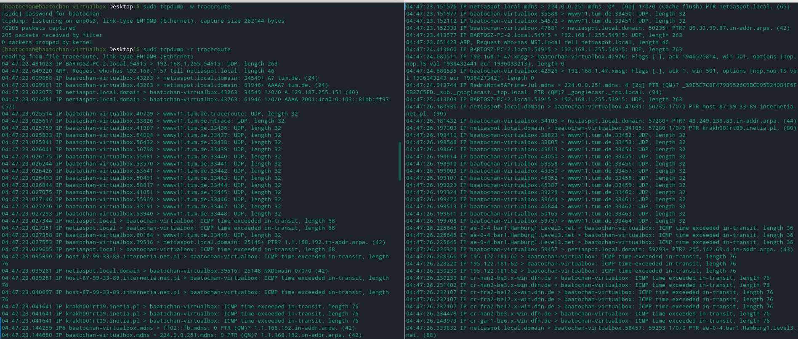
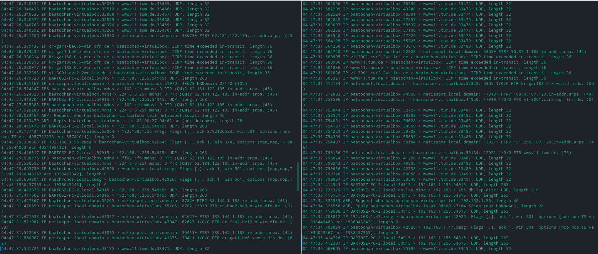

# Administrowanie systemami sieciowymi

## Sprawozdanie z laboratorium

Data | Tytuł zajęć | Uczestnicy
:-: | :-: | :-:
22.12.2020 11:15 | Konfiguracja i monitorowanie sieci; zdalny dostęp | Bartosz Rodziewicz (226105)

### Opis środowiska
Zajęcia laboratoryjne z części nt. systemu Linux zostały wykonane na maszynie wirtualnej postawionej z wykorzystaniem VirtualBox. Zainstalowana w maszynie dystrybucja to Manjaro 20.2 ze środowiskiem (DE) KDE Plasma. Do zajęć użyta została czysta instalacja systemu po doinstalowaniu najnowszych aktualizacji pakietów. W wielu miejscach używany jest alias `ll`, który jest aliasem na `ls -alF`.

### Przebieg laboratorium
#### Zainstalować i uruchomić serwer (demona) `ssh`.

Po instrukcji laboratoryjnej nr 1 w systemie jest zainstalowany pakiet `openssh`. Poniżej widać uruchomienie serwera.

#### Określić adres sprzętowy interfejsu sieciowego (karty sieciowej) i bazując na tej informacji ustalić jego producenta.

Adres sprzętowy (MAC) odpowiedniego interfejsu można sprawdzić za pomocą komendy `ifconfig`, co widać na poniższym zrzucie.

Producenta interfejsu sieciowego można sprawdzić korzystając z 6 pierwszych cyfr adresu MAC, w tym wypadku `08:00:27`. Sprawdzenie producenta jest możliwe na wielu stronach internetowych, np. [macvendors.com](https://macvendors.com/).

"Producentem" karty o adresie `08:00:27` jest firma PCS Systemtechnik GmbH. Trzeba wziąc jednak pod uwagę, że jest to karta wirtualna, wygenerowana przez VirtualBox i jej adres MAC jest najprawdopodobniej losowy.

#### Zapoznać się z konfiguracją interfejsu sieciowego (karty sieciowej). Dodać i skonfigurować nowy pseudointerfejs (wraz z adresem, żeby odpowiadał na 'pingi').

Konfigurację interfejsu można poznać za pomocą komendy `ifconfig`, której zrzut jest widoczny w poprzednim zadaniu.

Aby dodać pseudointerfejs można użyć komendy `ifconfig`. Dodanie interfejsu bazującego na innym wymaga użycia komendy: `ifconfig <nazwa_int>:<nr> <adres ip>`. Wykonanie tej komendy widać na poniższym zrzucie.

Na powyższym zrzucie widać też, że interfejs odpowiada na pingi oraz komendę na wyłączenie takiego interfejsu. Taki pseudointerfejs odpowiadał również na pingi z innego hosta co widać poniżej (WSL na komputerze będącym hostem VM). Pingi zostały oczywiście wysłane przed wyłączeniem interfejsu.

#### Dla trzech wybranych węzłów w sieci Internet (Polska, Europa, Świat):
* określić średni czas potrzebny na osiągnięcie węzła przez pakiet
* zbadać trasę jaką są przesyłane pakiety do podanego węzła
* określić maksymalny rozmiar pakietu, dla jakiego węzeł docelowy “odpowiada”

##### Węzeł Polska - Radio [rmf.fm](https://www.rmf.fm/)
###### Określić średni czas potrzebny na osiągnięcie węzła przez pakiet

Można to określić za pomocą komendy `ping` lub wspomnianego przeze mnie w kolejnym punkcie pakietu `mtr`.

Po komendzie `ping` widać, że średni czas to 10.65s.

###### Zbadać trasę jaką są przesyłane pakiety do podanego węzła

Trasę do konkretnego węzła można sprawdzić za pomocą komendy `traceroute` lub `mtr`. Zalecaną metodą jest komenda `mtr`, ponieważ dzięki temu, że łączy ona w sobie funkcjonalność `ping` to wyniki z niej często prezentują więcej informacji (pakiety rzadziej są blokowane przez firewalle).

Powyżej widzimy trasę do serwera rmf.fm. Cała trasa znajduje się w obrębie sieci Netii (futuro.pl to sieć Netii, przedostatni węzeł się nie zidentyfikował).

###### Określić maksymalny rozmiar pakietu, dla jakiego węzeł docelowy “odpowiada”

Do określenia rozmiaru maksymalnego pakietu na który dany serwer odpowiada, można użyć komendy `ping` z parametrem `-s`.

Serwer rmf.fm odpowiada na pakiet o wielkości 65535, czyli największy rozmiar jaki może mieć pakiet IP.

##### Węzeł Europa - Technische Universität Berlin [tu.berlin](https://www.tu.berlin/)

###### Określić średni czas potrzebny na osiągnięcie węzła przez pakiet

Z powyższego zrzutu widać, że średni czas pakietu to 33.3s.

###### Zbadać trasę jaką są przesyłane pakiety do podanego węzła
Trasa do węzła tu.berlin prowadzi przez sieć operatora Netia (mój ISP), przez Pragę i Hamburg (sieć amerykańskiej korporacji telekomunikacyjnej Lumen Technologies), później przez sieć DFN (Niemiecka Sieć Uniwersytecka), aż do bramy uniwersytetu TU, który zdaje się samemu hostować swoją stronę.

###### Określić maksymalny rozmiar pakietu, dla jakiego węzeł docelowy “odpowiada”

Serwer tu.berlin odpowiada na pakiet o wielkości 65535, czyli największy rozmiar jaki może mieć pakiet IP.

##### Węzeł Świat - [amtrack.com](https://www.amtrack.com/)

_Planowałem opisać ścieżkę do strony amerykańskich kolei Amtrak, jednak dopiero po skończeniu opisywania całego zadania zobaczyłem, że opisałem stronę amtrack.com, która przekierowuje na pustą stronę [railroad-usa.com](http://www.railroad-usa.com/)._

###### Określić średni czas potrzebny na osiągnięcie węzła przez pakiet

Z powyższego zrzutu widać, że średni czas pakietu to 172.1s.

###### Zbadać trasę jaką są przesyłane pakiety do podanego węzła

Trasa do serwera amtrack.com odbywa się bez użycia CDN. Najpierw oczywiście jest sieć Netii, później pakiety idą przez Pragę oraz Phoenix (sieć Lumen Technologies), następnie przez sieć GoDaddy, kończąc w sieci Wild West Domains (które może być powiązane z GoDaddy), która hostuje stronę amtrack.

###### Określić maksymalny rozmiar pakietu, dla jakiego węzeł docelowy “odpowiada”

#### Zarejestrować i zapisać do pliku (za pomocą `tcpdump`) wszystkie pakiety związane z:
##### testowaniem za pomocą polecenia ping nieistniejącego hosta (np. niematakiegohosta.pl)

Do tego testu wykorzystana została wspomniana wyżej domena `niematakiegohosta2.pl`.

Powyżej widać pakiety wysyłane przy pingowaniu nieistniejącego hosta, a dokładniej pakiety DNS - zapytanie o adres hosta oraz odpowiedź _NXDomain_ wysłaną przez router.

##### testowaniem za pomocą polecenia ping dowolnego istniejącego hosta

Do tego testu wykorzystana została domena `tu.berlin` użyta w poprzednim ćwiczeniu. Do ćwiczenia użyta została komenda `ping` z parametrem `-c 1` by wysłany został tylko jeden pakiet ICMP.

W tym wypadku widać pakiety DNS - zapytanie o adres oraz pakiet z adresem. Później widać pakiety ICMP (żądanie i odpowiedź) oraz odwrotne zapytanie DNS i odpowiedź na nie.

##### rejestrowaniem trasy do dowolnego istniejącego hosta (nie odwiedzanego wcześniej) za pomocą `traceroute`.

Do tego ćwiczenia wykorzystana została domena `tum.de`, będąca domeną uczelni Technische Universität München.

Zrzuty są w kolejności najpierw pierwszy wiersz lewo, później prawo, następnie drugi wiersz lewo i prawo.

Na powyższych zrzutach duża liczba pakietów się powtarza jednak w gruncie rzeczy widać tam następujące pakiety - zapytanie DNS o hosta docelowego wraz z odpowiedzią, pakiety UDP kierowane na adres hosta z coraz większym TTL, odpowiedzi o przekroczeniu TTL wysyłane przez kolejne hosty na trasie oraz odwrotne zapytania DNS o adres hosta. Poniżej widzimy też sam efekt wykonania `traceroute`.

#### Za pomocą `tcpdump` ustalić, czy korzystanie z e-Portalu jest bezpieczne, tzn.:

Do tego ćwiczenia wykorzystane zostały parametry `-A`, który wyświetla zawartość każdego pakietu oraz filtr, który wyświetla tylko pakiety na oraz z konkretnego adresu.

Powyżej widać, że komunikacja pomiędzy ePortalem ([eportal.pwr.edu.pl](https://eportal.pwr.edu.pl)) oraz serwisem autoryzaycjnym ([oauth.pwr.edu.pl](https://oauth.pwr.edu.pl)) jest zabezpieczona SSL i nie można nic przeczytać (ani haseł, ani nazw kursów).

#### Wyświetlić bieżącą tablice tras, usunąć ścieżkę domyślną dla pakietów (sprawdzić czy jest dostęp do Internetu), a następnie dodać ją ponownie.

Do wyświetlania oraz edycji tablicy tras można użyć polecenia `route`.

Na powyższym zrzucie widać aktualną tablicę oraz sprawdzenie, że internet działa. Następnie widać usunięcie domyślnej trasy oraz sprawdzenie, czy internet działa. Oczywiście połączenie nie może zostać nawiązane.

Powyżej widać dodanie trasy oraz to, że połączenie internetowe z powrotem zaczęło działać.

#### Korzystając z polecenia `netstat` wyświetlić listę połączeń opartych na protokole TCP. Następnie nawiązać sesję z dowolnym serwerem WWW. Ponownie wyświetlić listę połączeń - dwa razy: raz z nazwami hostów i portów, a drugi raz numerami IP hostów i portów. Przeanalizować wyniki odpowiadające nawiązanym sesjom, wyjaśnić znaczenie pól.

Do wyświetlania aktywnych połączeń tcp można użyc komendy `netstat`, parametr `-t` powoduje ograniczenie wyników do samych połączeń TCP.

Powyżej widać pusty wynik `netstat` przed nawiązaniem połączenia do serwera.

Powyżej widać połączenia nawiązane przez przeglądarkę po połączeniu z serwerem ePortalu.

Kolejne kolumny znaczą odpowiednio:
* protokół połączenia,
* ilość bajtów odebrana przez komputer, ale nie odebrana przez program, który otworzył to połączenie,
* ilość bajtów nie potwierdzona przez serwer,
* adres i port lokalny,
* adres i port zdalnego serwera,
* stan połączenia

5 pozycji na liście `netstat` znaczy kolejno:
* linijka 2 - połączenie na porcie 80 do serwera ePortalu, używane do rozpoczęcia szyfrowanej transmisji SSL i wymiany certyfikatów,
* linijka 3 - połączenie na porcie 443 do serwera ePortalu już po SSL
* pozostałe linijki - połączenia SSL do innych serwerów, by pobrać dodatkowe zasoby wymagane przez ePortal do działania.

#### Korzystając z polecenia `nmap`:
##### ustalić jakie komputery w sieci laboratorium (lub domowej) są dostępne (wykorzystać pakiety ICMP, wyniki zapisać do pliku XML).

Aby wykonać skanowanie sieci lokalnej użyte zostały następujące flagi:
* `-sP` - tryba skanowania, który pomija skanowanie otwartych portów (tylko pingiem sprawdza, które urządzenia są w sieci)
* `-oX <file>` - flaga włączająca eksport danych do pliku typu XML

##### przeskanować porty jednego z komputerów (można uruchomić wirtualną maszynę z Windows lub Linux). Przeanalizować wyniki dla jednego z otwartych portów.

Do skanowania użyta została tylko jedna flaga `-sV`, która włącza dodatkowo skanowanie jakie usługi i ich wersje są dostępne na otwartych portach.

Komputer użyty do skanowania to prywatna maszyna mojego współlokatora. Jedyny otwarty port to port 22 (czyli dokładnie tak jak powinno być).

Poszczególne kolumny o porcie przedstawiają następujące info:
* numer portu oraz protokół
* jego stan (domyślnie printowane są tylko otwarte)
* do jakiej usługi port należy
* dokładna wersja usługi działająca na tym porcie (dzięki fladze `-sV`)

#### Za pomocą `scp`:
* skopiować plik na zdalny komputer
* skopiować plik ze zdalnego komputera
* skopiować poddrzewo katalogów ze zdalnego komputera

Do wykonania tego zadania wymagane było stworzenie klucza do uwierzytelniania połączeń SSH (każdy komputer w mojej sieci lokalnej posiada zablokowane logowanie hasłem po SSH) oraz skonfigurowanie klienta `ssh` na maszynie wirtualnej.

Gdy połączenie SSH działało użycie `scp` wiązało się z bardzo prostą składnią: `scp <origin> <destination>`, uwzględniając, że lokalna część to po prostu ścieżka, a zdalna - `username@ip:path`, gdzie ścieżka może być absolutna lub relatywna do `~`. Do kopiowania folderu, konieczne było użycie flagi `-r`.

Do wykonania tego zadania również została użyta maszyna mojego współlokatora, z założonym kontem użytkownika na rzecz tego zadania.

Powyżej widać transfery zakończone sukcesem. Wynik transferu został przycięty z uwagi na za dużą liczbę plików, by zmieścić na zrzucie.

#### Wyświetlić tablicę `arp`, przeanalizować wybrany wpis.

Do analizy wybrany został pierwszy wpis (ta sama maszyna co w poprzednich zadaniach). Po kolei widać następujące informacje:
* Nazwa hosta
* Adres IP
* Adres MAC
* Typ urządzenia (ARP wspiera nie tylko urządzenia Ethernet)
* Interfejs, którego dotyczy wpis
