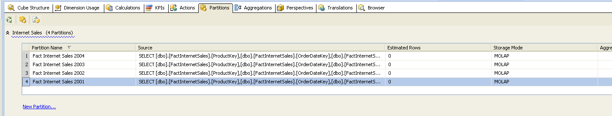
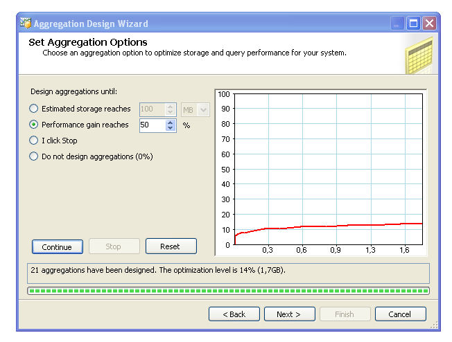
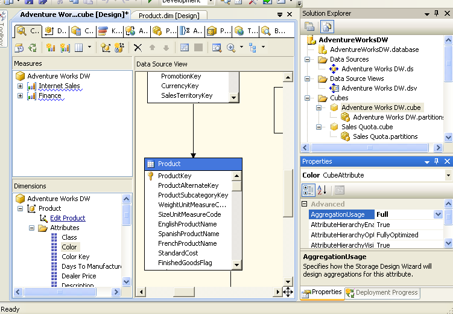

# Metody przetwarzania dużych ilości danych

## Sprawozdanie z laboratorium

Data | Tytuł zajęć | Uczestnicy
:-: | :-: | :-:
01.12.2020 18:55 | Zaawansowana analiza danych | Adam Hyjek (234987) Bartosz Rodziewicz (226105)

### Streszczenie laboratorium
Instrukcja laboratoryjna nr 5 przedstawia metodę definiowania nowego wymiaru z wykorzystaniem tabeli pośredniej oraz metodę definiowania wymiaru wykorzystując tabelę faktów. Przedstawiony tam jest również proces tworzenia tłumaczenia (translacji) na inny język opisów kostki danych oraz wymiarów. Opisana również jest metoda definiowania własnych partycji w kostkach danych oraz tworzenia własnych agregacji danych w tych partycjach. Wszystkie te zadania (podstawowe) są przedstawione poniżej w tym sprawozdaniu.

### Różne rodzaje wymiarów
#### Definiowanie wymiaru połączonego przez tabelę pośrednią

  
_Dodanie brakujących tabeli Product Category i Product Subcategory._

  
_Tworzenie nowego wymiaru Product Subcategory._

  
_Dodanie nowego wymiaru do measure grupy i ustawienie jego parametrów._

#### Tworzenie wymiaru z tabeli faktów

  
_Dodanie nowego wyliczania._

  
_Tworzenie nowego wymiaru._

  
_Dodanie atrybutu z kolumny oraz zmiana parametru._

  
_Dodanie wymiaru do measure grupy._

### Definiowanie translacji
#### Definiowanie nowej translacji

  
_Dodanie nowej translacji na j. polski._

#### Definiowanie nazw dla nowej translacji

  
_Uzupełnienie tłumaczeń kostki dla tłumaczenia na j. polski (mamy nadzieję, że nie będzie oceniana jakość tłumaczenia)._

#### Wypełnianie translacji dla wymiaru

  
_Uzupełnienie tłumaczeń wymiaru Time dla tłumaczenia na j. polski (mamy nadzieję, że nie będzie oceniana jakość tłumaczenia)._

#### Translacja dla wymiaru Product

  
_Uzupełnienie tłumaczeń wymiaru Produkt dla tłumaczenia na j. polski._

#### Weryfikacja translacji

  
_Polskie nazwy widoczne w zakładce Browser._

### Partycje w kostkach danych
#### Sprawdzanie dostępnych partycji dla każdej grupy agregacji

  
_Domyślne partycje przypisane do grup pomiarów. Grupa Internet Sales posiada tylko jedną partycję._

#### Utworzenie nowych partycji

  
_Do utworzenia ręcznych partycji konieczne jest usunięcie domyślnej._

  
_Tworzenie nowej partycji - dane źródła._

  
_Tworzenie nowej partycji - zapytanie ograniczające._

  
_Tworzenie nowej partycji - ustalenie poprawnej nazwy partycji._

#### Zadanie utworzenia partycji

  
_Tworzenie 3 kolejnych partycji._

  
_Utworzone 4 partycje._

#### Zmiana agregacji dla partycji

  
_Zmiana trybu agregacji danych._

W programie dostępne są następujące presety:
* MOLAP
	* dane measure grup oraz agregacji przechowywane są w formacie wielowymiarowym
	* powiadomienia są pokazywane, gdy dane ulegną zmianie
	* wczytywanie nowych danych jest wykonywane ręcznie
* Scheduled MOLAP
	* różni się tym od MOLAP, że wczytywanie nowych danych jest wykonywane automatycznie co 24h
* Automatic MOLAP
	* różni się tym od MOLAP, że powiadomienia o zmianie danych wyzwalają automatyczne wczytywanie danych, co powoduje, że nowe dane są wczytywane bez opóźnień
* Medium-latency MOLAP
	* różni się tym od Automatic MOLAP, że dane nie są wczytywane bez opóźnienia, a z opóźnieniem maksymalnie kilku godzinnym.
* Low-latency MOLAP
	* różni się tym od Automatic MOLAP, że dane nie są wczytywane bez opóźnienia, a z opóźnieniem maksymalnie 30 minutowym.
* Real-time HOLAP
	* różni się tym od MOLAP, że dane measure grup przechowywane są w formacie relacyjnym, natomiast agregacje w formacie wielowymiarowym; dane zawsze oddają stan rzeczywisty
* Real-time ROLAP
	* różni się tym od Real-time HOLAP, że i measure grupy, jak i agregacje są przechowywane w formacie relacyjnym

Zmiana z MOLAP na Scheduled MOLAP powoduje, że hurtownia danych będzie automatycznie co 24h aktualizowała swoje dane.

  
_Szczegółowe ustawienia Scheduled MOLAP._

  
_Nieskonfigurowane szczegółowe ustawienia Medium-latency MOLAP._

  
_Konfiguracja zapytania powiadamiającego o zmianie, po zapisaniu zapytania zapytanie rozwinęło `*`._

#### Konfiguracja opcji agregacji

  
_Konfiguracja agregacji - liczność poszczególnych wymiarów._

  
_Konfiguracja agregacji - ustawienie szacowanej liczności poszczególnych wymiarów._

#### Strojenie agregacji

  
_Konfiguracja agregacji - domyślne szacunki strojenia agregacji dla 50% zysku wydajności. Zostało wykonane 28 agregacji._

  
_Konfiguracja agregacji - domyślne szacunki strojenia agregacji dla 30% zysku wydajności. Również zostało wykonane 28 agregacji._

  
_Konfiguracja agregacji - szacunki strojenia agregacji po zwiększeniu ilości Produktów. Zostało wykonane 21 agregacji._

#### Przegląd agregacji utworzonych w zbiorze `AdventureWorks.partition`

  
_Definicja agregacji w kodzie źródłowym._

#### Zmiana agregacji dla poziomów

  
_Zmiana metody agregacji dla atrybutu Color wymiaru Product._

  
_Przy tworzeniu nowej agregacji atrybut Color automatycznie ustawiony jest na full._
