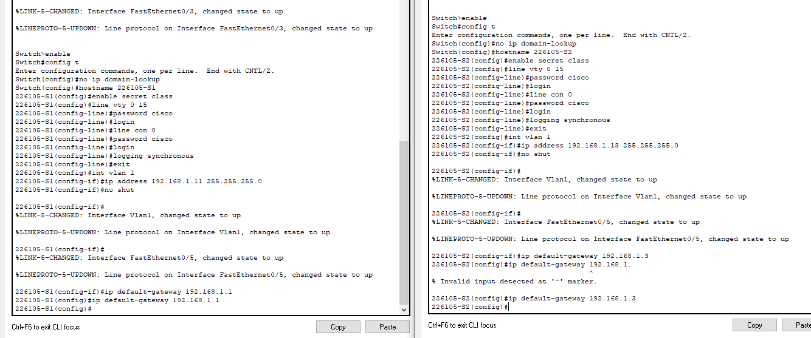

# Lokalne sieci komputerowe

## Sprawozdanie z laboratorium

Data | Tytuł zajęć | Uczestnicy
:-: | :-: | :-:
10.03.2021 9:15 | Redundancja w sieciach LAN | Bartosz Rodziewicz (226105)

### Budowa sieci przełączanej z połączeniami nadmiarowymi
#### Budowanie sieci oraz konfiguracja podstawowych ustawień urządzeń
##### Okabluj sieć zgodnie z topologią


##### Jeśli to konieczne, zainicjuj i uruchom ponownie przełączniki
Nie było takiej potrzeby.

##### Wykonaj podstawową konfigurację przełączników


Dodatkowo, aby vlan 99 działał konieczna była zmiana vlanu dla każdego używanego portu w każdym switchu:


##### Test łączności


#### Określenie mostu głównego
##### Wyłącz wszystkie porty przełączników


##### Skonfiguruj podłączone porty jako porty trunk


#### Aktywuj porty F0/2 i F0/4 na wszystkich przełącznikach


#### Wyświetl informacje o drzewie opinającym


#### Pytania


* Który przełącznik jest mostem głównym?  
	S1
* Dlaczego drzewo opinające wybrało ten przełącznik jako most główny?  
	Algorytm wybiera główny przełącznik na podstawie Priority number (priority + vlan id). Gdy numer jest taki sam (tak jak tutaj) algorytm wybiera ten przełącznik, który ma najniższy adres MAC.
* Które porty są portami głównymi na przełącznikach?
	* S2 - F0/2
	* S3 - F0/4
* Które porty są portami wyznaczonymi na przełącznikach?
	* S1 - F0/2, F0/4
	* S2 - F0/4
* Który port jest wyświetlany jako port alternatywny i jest obecnie blokowany?
	* S3 - F0/2
* Dlaczego drzewo opinające wybrało ten port jako port nie-wyznaczony (blokowany)?
	Algorytm używa głównego przełącznika jako referencji i na jego podstawie wyznacza które porty blokować uwzględniając koszt ścieżki. Gdy koszt ścieżki jest taki sam algorytm bierze pod uwagę Bridge ID. Połączenie pomiędzy S2 i S3 ma najwyższy koszt do przełącznika głównego (nie jest bezpośrednie). Blokowany port (który koniec tego połączenia ma być zablokowany) wybrany jest na podstawie Bridge ID (S3 ma wyższy BID).

#### Obserwacja wyboru portów STP w oparciu ich koszt
Nie byłem w stanie wykonać tego ćwiczenia. Wydaję mi się, że jest to błąd Packet Tracera (używam najnowszej wersji - 8.0.0.0212). Mimo zmiany kosztu na interfejsie (komenda przechodzi) koszt nigdy nie jest aktualizowany (mimo odczekania kilku minut).


##### Pytania
_Odpowiedzi na pytania udzielę więc na podstawie wpisów z instrukcji laboratoryjnej._

* Dlaczego spanning tree zmieniło wcześniej blokowany port na port wyznaczony i zablokowało port, który wcześniej był portem wyznaczonym na drugim przełączniku?  
	Ponieważ algorytm najpierw bazuje na koszcie, dopiero później na Bridge ID. W dalszym ciągu połączenie S1 - S3 (wg. topologii z instrukcji, u mnie byłoby to połączenie S2 - S3) jest nieopłacalne bo najdroższe, jednak w tym momencie to połączenie z S3 ma wyższy koszt do przełącznika głównego, więc następuje zmiana, który koniec tego połączenia jest blokowany.

#### Obserwacja wyboru portów STP w oparciu ich priorytet
##### Aktywuj porty F0/1 i F0/3 na wszystkich przełącznikach


##### Wynik zmian w spanning tree po aktywacji portów


##### Pytania
* Jaki port wybrał STP na port główny na każdym przełączniku nie będącym przełącznikiem głównym?  
	* S2 - F0/1
	* S3 - F0/3
* Dlaczego STP wybrał te porty na tych przełącznikach na porty główne?
	Poza kosztem połączenia algorytm bierze pod uwagę jeszcze priorytet danego łącza. Każdy port domyślnie ma wartość 128, jednak dopisywany do niego jest numer portu, aby uniknąć takiego samego priorytetu. W tym wypadku algorytm wybrał te połączenia, które są bezpośrednie do przełącznika głównego, a następnie te które mają niższy priorytet (czyli tutaj numer portu).

##### Do przemyślenia
* Co jest pierwszą wartością, której STP używa do wyboru portu po wybraniu mostu głównego?  
	Koszt ścieżki
* Jeśli pierwsza wartość jest równa na obu portach, co jest następną wartością, której protokół STP używa do wyboru portu?  
	Bridge ID
* Jeśli obie wartości są równe na obu portach, co jest następną wartością, którą STP używa do wyboru portu?   
	Priorytet ścieżki

### Konfigurowanie Rapid PVST+, PortFast i BPDU Guard
#### Budowanie sieci oraz konfiguracja podstawowych ustawień urządzeń
##### Okabluj sieć zgodnie z topologią


##### Skonfiguruj komputery PC


Taka sama konfiguracja została wykonana na `PC-C`.

##### Jeśli to konieczne, zainicjuj i uruchom ponownie przełączniki
Instrukcja nie wspomina nic o podstawowej konfiguracji switchy, jednak dla ułatwienia dalszej pracy ustawiłem synchroniczne  wypisywanie na konsolę (oraz hostname zamiast S1, S2, ... na zawierający mój indeks - 226105-1, 226105-2, ...; w poprzednim zadaniu o tym zapomniałem).


Taki sam config został wykonany na S2 i S3.

#### Konfigurowanie sieci VLAN, natywnych sieci VLAN i łączy trunk
##### Stwórz sieci VLAN


Taki sam config został wykonany na S2 i S3.

##### Włącz porty użytkowników w trybie dostępu i przydziel sieci VLAN


##### Skonfiguruj porty trunk i przydziel je do natywnej sieci VLAN 99
Instrukcja nie wspomina nic o konieczności stworzenia VLANu 99, jednak bez tego wykonanie tego zadania jest nie możliwe.


##### Skonfiguruj interfejs zarządzania na wszystkich przełącznikach


##### Sprawdź konfigurację i łączność
* Jakie są domyślne ustawienia dla trybu drzewa opinającego na przełącznikach Cisco?  
	PVST
* Sprawdź połączenie pomiędzy PC-A i PC-C. Czy komunikacja była pomyślna?  
	tak  
	

#### Konfigurowanie mostu głównego i badanie konwergencji PVST+
##### Określ bieżący most główny
* Jakie polecenie pozwala użytkownikowi na określenie stanu drzewa opinającego przełącznika Cisco Catalyst dla wszystkich sieci VLAN? Zapisz użyte polecenia w przewidzianym miejscu poniżej  
	`show spanning-tree`  
	
* Jaki jest priorytet mostu przełącznika S1 dla sieci VLAN 1?  
	32769
* Jaki jest priorytet mostu przełącznika S2 dla sieci VLAN 1?  
	32769
* Jaki jest priorytet mostu przełącznika S3 dla sieci VLAN 1?  
	32769
* Który przełącznik jest mostem głównym?  
	S3
* Dlaczego ten przełącznik został wybrany na most główny?  
	Algorytm wybiera główny przełącznik na podstawie Priority number (priority + vlan id). Gdy numer jest taki sam (tak jak tutaj) algorytm wybiera ten przełącznik, który ma najniższy adres MAC.

##### Skonfiguruj podstawowy i drugorzędowy most główny dla wszystkich sieci VLAN
* Skonfiguruj przełącznik S2 jako podstawowy most główny dla wszystkich istniejących sieci VLAN. Zapisz użyte polecenia w przewidzianym miejscu poniżej.  
	`spanning-tree vlan 1,10,99 root primary`
* Skonfiguruj przełącznik S1 jako drugorzędowy most główny dla wszystkich istniejących sieci VLAN. Zapisz użyte polecenia w przewidzianym miejscu poniżej.  
	`spanning-tree vlan 1,10,99 root secondary`
* Jaki jest priorytet mostu S1 dla sieci VLAN 1?  
	28673
* Jaki jest priorytet mostu S2 dla sieci VLAN 1?  
	24577
* Który interfejs w sieci jest w stanie blokowania?  
	S3 - F0/3


##### Zmień topologię warstwy 2. i zbadaj konwergencję


Komenda `debug spanning-tree` jest nie obsługiwana w Packet Tracerze. Zadanie wykonam na podstawie outputu podanego w instrukcji laboratoryjnej.

* Przez które stany portu przechodzi każda sieć VLAN na F0/3 podczas konwergencji sieci?  
	Listening, learning i forwarding
* Korzystając ze znacznika czasu debugowania STP z pierwszej i ostatniej wiadomości, oblicz czas (z dokładnością co do sekundy), jaki zajęła sieci konwergencja.  
	30s

#### Konfigurowanie Rapid PVST+, PortFast, BPDU Guard i badanie konwergencji
##### Skonfiguruj Rapid PVST+
* Skonfiguruj S1 dla Rapid PVST+. Zapisz użyte polecenia w przewidzianym miejscu poniżej.  
	`spanning-tree mode rapid-pvst`
* Sprawdź konfiguracje za pomocą polecenia `show running-config | include spanning-tree mode`
	

##### Skonfiguruj PortFast i BPDU Guard na portach dostępowych
* Skonfiguruj interfejs F0/6 na S1 z PortFast. Zapisz użyte polecenia w przewidzianym miejscu poniżej.  
	```
	(config)#int f0/6
	(config-if)#spanning-tree portfast
	```
* Skonfiguruj interfejs F0/6 na S1 z BPDU guard. Zapisz użyte polecenia w przewidzianym miejscu poniżej.  
	```
	(config)#int f0/6
	(config-if)#spanning-tree bpduguard enable
	```
* Skonfiguruj globalnie wszystkie porty nie będące portami trunk na przełączniku S3 z PortFast. Zapisz użyte polecenia w przewidzianym miejscu poniżej.  
	`spanning-tree portfast default`
* Skonfiguruj globalnie BPDU guard na wszystkich portach PortFast nie będących portami trunk na przełączniku S3. Zapisz użyte polecenia w przewidzianym miejscu poniżej.  
	`spanning-tree portfast bpduguard default`  
	_Note: Wykonanie tej komendy w Packet Tracerze spowodowało błędy na interfejsach ustawionych jako trunk. Wydaje mi się, że jest to błąd Packet Tracera._


##### Zbadaj konwergencję Rapid PVST+
Tak samo jak poprzednio z powodu braku wsparcia dla `debug spanning-tree` to zadanie muszę wykonać na outpucie z instrukcji laboratoryjnej.

* Korzystając ze znacznika czasu debugowania RSTP z pierwszej i ostatniej wiadomości, oblicz czas, jaki zajęła sieci konwergencja.  
	4s

#### Do przemyślenia
* Jaka jest główna zaleta korzystania z Rapid PVST+?  
	Znacząco szybszy czas konwergencji warstwy 2.
* W jaki sposób skonfigurowanie portu z PortFast pozwala na szybszą konwergencję?  
	PortFast pozwala portu skonfigurowanemu jako port dostępu na natychmiastową zmianę do stanu forwarding.
* Jaką ochronę zapewnia BPDU guard?  
	Zabezpiecza sieć wykorzystującą STP poprzez wyłączenie portów w trybie dostępowym, które otrzymałyby BPDU. BPDU mogłyby zostać użyte w ataku DoS, którego celem byłaby zmiana głównego mostu i przestawienie STP.

#### Wynik `show vlan brief`


### Konfigurowanie HSRP i GLBP
#### Tworzenie sieci i weryfikacja połączeń
##### Okabluj sieć zgodnie z topologią


##### Skonfiguruj komputery PC


##### Jeśli to konieczne, zainicjuj i uruchom ponownie przełączniki oraz routery
Nie było to wymagane.

##### Skonfiguruj podstawowe ustawienia dla każdego routera


##### Wykonaj podstawową konfigurację przełączników


##### Sprawdź łączność pomiędzy PC-A i PC-C
* Wykonaj ping z PC-A do PC-C. Czy test zakończył się sukcesem?  
	tak  
	

##### Skonfiguruj routing


##### Sprawdź łączność
* PC-A powinien być w stanie pingować się z każdym interfejsem na R1, R2, R3 i PC-C. Czy wszystkie pingi zakończyły się pomyślnie?  
	tak
* PC-C powinien być w stanie pingować się z każdym interfejsem na R1, R2, R3 i PC-A. Czy wszystkie pingi zakończyły się pomyślnie?  
	tak

  
_Wybrane pingi, które zmieściły się na screenie._

#### Konfiguracja First Hop Redundancy przy pomocy HSRP
##### Określ ścieżkę dla PC-A i PC-C


* Jaką ścieżkę z PC-A do 209.165.200.225 dobrały pakiety?  
	przez 192.168.1.1
* Jaką ścieżkę z PC-C do 209.165.200.225 dobrały pakiety?  
	przez 192.168.1.3

##### Rozpocznij sesję ping na PC-A i przerwij połączenie pomiędzy S1 i R1


* W trakcie trwania pingowania, odłącz kabel Ethernet z F0/5 na S1. Możesz również wyłączyć interfejs S1 F0/5, co powoduje ten sam rezultat. Co stało się z ruchem ping?  
	Ping został przerwany i każdy pakiet timeoutował. Dopiero ponowne włączenie portu spowodowało przywrócenie komunikacji, i to po odczekaniu jakiegoś czasu.
* Powtórz kroki 2a i 2b na PC-C i S3. Odłącz kabel z F0/5 na S3. Jakie były wyniki?  
	Takie same.

##### Skonfiguruj HSRP na R1 i R3


* Który router jest routerem aktywnym?  
	R1
* Jaki jest adres MAC dla wirtualnego adresu IP?  
	0000.0C07.AC01
* Jaki jest adres IP i priorytet routera w trybie gotowości?  
	192.168.1.3; priorytet domyślny czyli 100
* Zmień adres bramy domyślnej dla PC-A, PC-C, S1 i S3. Jaki adres należy użyć?  
	192.168.1.254
* Sprawdź nowe ustawienia. Wydaj polecenie ping z PC-A i PC-C na adres sprzężenia zwrotnego R2. Czy wyniki są pomyślne?  
	tak

##### Rozpocznij sesję ping na PC-A i przerwij połączenie pomiędzy przełącznikiem, który jest połączony z aktywnym routerem HSRP (R1).


* W trakcie trwania pingowania, odłącz kabel Ethernet z F0/5 na S1 lub wyłącz interfejs F0/5. Co stało się z ruchem ping?  
	Następuje chwilowe przerwanie połączenie (2 pakiety utracone), jednak połączenie po chwili samo wraca i ping dalej działa.

##### Sprawdź ustawienia HSRP na R1 i R3
* Który router jest routerem aktywnym?  
	Po wyłączeniu F0/5 routerem aktywnym stał się R3.

#### Konfiguracja First Hop Redundancy przy pomocy GLBP
##### Skonfiguruj GLBP na R1 i R3


Wygląda, że Packet Tracer nie wspiera protokołu GLBP. Na pytania odpowiem bazując na informacjach o tym jak ten protokół powinien działać.

##### Wygeneruj ruch z PC-A i PC-C do interfejsu zwrotnego R2
Powyższa konfiguracja powoduje, że wybrany router do obsługi naszego zapytania będzie losowy, więc raz jeden, a raz drugi router będzie wybrany.

* Wprowadź polecenie `arp –a` na PC-A. Który adres MAC jest używany dla adresu 192.168.1.254?  
	Będzie to adres MAC protokołu GLBP dla interfejsu G0/1 na R1 lub R3 w zależności od losowania.
* Wygeneruj większy ruch do interfejsu zwrotnego R2. Wprowadź kolejne polecenie `arp –a`. Czy zmienił się adres MAC dla adresu bramy domyślnej z 192.168.1.254?  
	Adres jest wybierany losowo, więc po którymś razie raczej nastąpi zmiana.

##### Rozpocznij sesję ping na PC-A i przerwij połączenie pomiędzy przełącznikiem, który jest połączony z R1
* W trakcie trwania pingowania, odłącz kabel Ethernet z F0/5 na S1 lub wyłącz interfejs F0/5. Co stało się z ruchem ping?  
	Tak jak w przypadku HSRP ruch po chwili jest samoczynnie przywracany. W trakcie przełączania routera kilka pakietów może zostać zdropowanych.

#### Do przemyślenia
* Dlaczego istnieje potrzeba nadmiarowości w sieci LAN?  
	Ponieważ niesprawna sieć może spowodować wiele problemów oraz narazić firmy czy osoby na spore koszty. Nadmiarowość w sieci zapewnia możliwość szybkiego poradzenia sobie z awarią jakiegoś elementu i zapewnienie jak najmniejszego czasu niedziałania sieci.
* Gdybyś miał wybór, który protokół wdrożyłbyś do swojej sieci? HSRP czy GLBP? Wyjaśnij swój wybór.  
	GLBP zapewnia lepsze zarządzanie dostępnym sprzętem. Gdy zapewniamy w sieci nadmiarowość sprzętu warto abyśmy mogli skorzystać z niego do czegoś więcej niż tylko zapewnienia bezpieczeństwa na wypadek awarii, a np wykorzystali go do load balancingu i zwiększyli możliwości naszej sieci.
