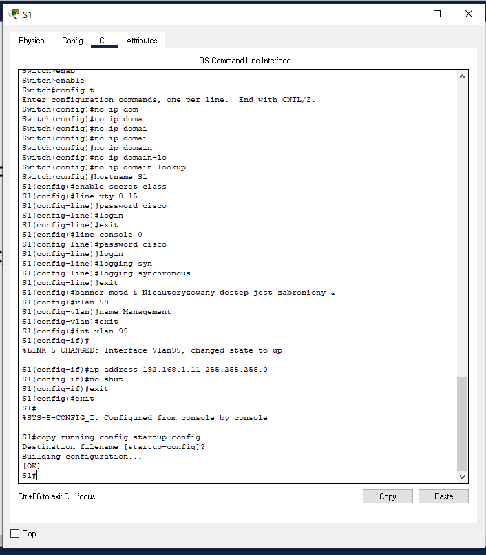

# Lokalne sieci komputerowe

## Sprawozdanie z laboratorium

Data | Tytuł zajęć | Uczestnicy
:-: | :-: | :-:
10.03.2021 9:15 | Redundancja w sieciach LAN | Bartosz Rodziewicz (226105)

### Budowa sieci przełączanej z połączeniami nadmiarowymi
#### Budowanie sieci oraz konfiguracja podstawowych ustawień urządzeń
##### Okabluj sieć zgodnie z topologią

##### Jeśli to konieczne, zainicjuj i uruchom ponownie przełączniki
Nie było takiej potrzeby.

##### Wykonaj podstawową konfigurację przełączników

Dodatkowo, aby vlan 99 działał konieczna była zmiana vlanu dla każdego używanego portu w każdym switchu:

##### Test łączności

#### Określenie mostu głównego
##### Wyłącz wszystkie porty przełączników

##### Skonfiguruj podłączone porty jako porty trunk

#### Aktywuj porty F0/2 i F0/4 na wszystkich przełącznikach

#### Wyświetl informacje o drzewie opinającym

#### Pytania

* Który przełącznik jest mostem głównym?  
	S1
* Dlaczego drzewo opinające wybrało ten przełącznik jako most główny?  
	Algorytm wybiera główny przełącznik na podstawie Priority number (priority + vlan id). Gdy numer jest taki sam (tak jak tutaj) algorytm wybiera ten przełącznik, który ma najniższy adres MAC.
* Które porty są portami głównymi na przełącznikach?
	* S2 - F0/2
	* S3 - F0/4
* Które porty są portami wyznaczonymi na przełącznikach?
	* S1 - F0/2, F0/4
	* S2 - F0/4
* Który port jest wyświetlany jako port alternatywny i jest obecnie blokowany?
	* S3 - F0/2
* Dlaczego drzewo opinające wybrało ten port jako port nie-wyznaczony (blokowany)?
	Algorytm używa głównego przełącznika jako referencji i na jego podstawie wyznacza które porty blokować uwzględniając koszt ścieżki. Gdy koszt ścieżki jest taki sam algorytm bierze pod uwagę Bridge ID. Połączenie pomiędzy S2 i S3 ma najwyższy koszt do przełącznika głównego (nie jest bezpośrednie). Blokowany port (który koniec tego połączenia ma być zablokowany) wybrany jest na podstawie Bridge ID (S3 ma wyższy BID).

#### Obserwacja wyboru portów STP w oparciu ich koszt
Nie byłem w stanie wykonać tego ćwiczenia. Wydaję mi się, że jest to błąd Packet Tracera (używam najnowszej wersji - 8.0.0.0212). Mimo zmiany kosztu na interfejsie (komenda przechodzi) koszt nigdy nie jest aktualizowany (mimo odczekania kilku minut).

##### Pytania
_Odpowiedzi na pytania udzielę więc na podstawie wpisów z instrukcji laboratoryjnej._

* Dlaczego spanning tree zmieniło wcześniej blokowany port na port wyznaczony i zablokowało port, który wcześniej był portem wyznaczonym na drugim przełączniku?  
	Ponieważ algorytm najpierw bazuje na koszcie, dopiero później na Bridge ID. W dalszym ciągu połączenie S1 - S3 (wg. topologii z instrukcji, u mnie byłoby to połączenie S2 - S3) jest nieopłacalne bo najdroższe, jednak w tym momencie to połączenie z S3 ma wyższy koszt do przełącznika głównego, więc następuje zmiana, który koniec tego połączenia jest blokowany.

#### Obserwacja wyboru portów STP w oparciu ich priorytet
##### Aktywuj porty F0/1 i F0/3 na wszystkich przełącznikach

##### Wynik zmian w spanning tree po aktywacji portów

##### Pytania
* Jaki port wybrał STP na port główny na każdym przełączniku nie będącym przełącznikiem głównym?  
	* S2 - F0/1
	* S3 - F0/3
* Dlaczego STP wybrał te porty na tych przełącznikach na porty główne?
	Poza kosztem połączenia algorytm bierze pod uwagę jeszcze priorytet danego łącza. Każdy port domyślnie ma wartość 128, jednak dopisywany do niego jest numer portu, aby uniknąć takiego samego priorytetu. W tym wypadku algorytm wybrał te połączenia, które są bezpośrednie do przełącznika głównego, a następnie te które mają niższy priorytet (czyli tutaj numer portu).

##### Do przemyślenia
* Co jest pierwszą wartością, której STP używa do wyboru portu po wybraniu mostu głównego?  
	Koszt ścieżki
* Jeśli pierwsza wartość jest równa na obu portach, co jest następną wartością, której protokół STP używa do wyboru portu?  
	Bridge ID
* Jeśli obie wartości są równe na obu portach, co jest następną wartością, którą STP używa do wyboru portu?   
	Priorytet ścieżki
