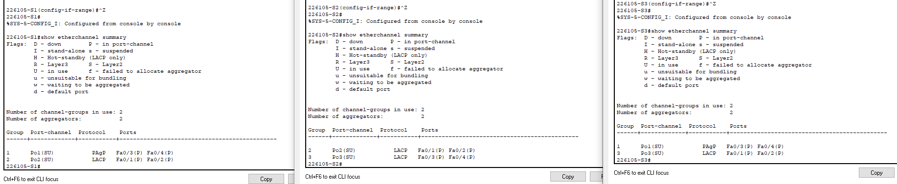

# Lokalne sieci komputerowe

## Sprawozdanie z laboratorium

Data | Tytuł zajęć | Uczestnicy
:-: | :-: | :-:
17.03.2021 9:15 | Agregacja łączy | Bartosz Rodziewicz (226105)

### Konfiguracja EtherChannel
#### Podsumowanie konfiguracji EtherChannel

#### Do przemyślenia
* Co może przeszkadzać w tworzeniu się kanałów EtherChannel?  
	Błędy w konfiguracji, takie jak ustawienie portu jako trunk po jednej stronie zostawiając port w trybie access po drugiej, różne protokoły agregacji po obu stronach, czy różne prędkości portów.
