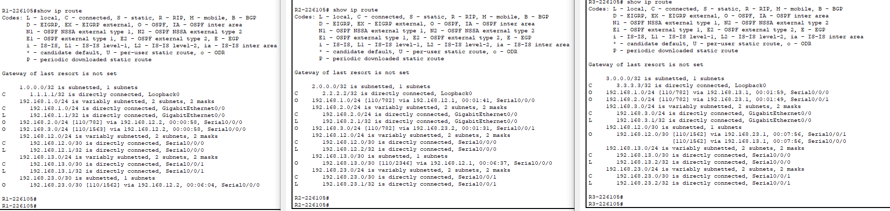
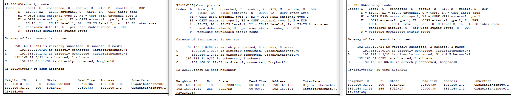
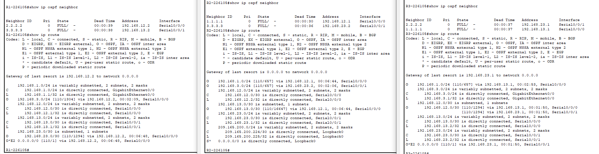

# Lokalne sieci komputerowe

## Sprawozdanie z laboratorium

Data | Tytuł zajęć | Uczestnicy
:-: | :-: | :-:
07.04.2021 9:15 | Dostrojenie i rozwiązywanie problemów OSPF jednoobszarowego | Bartosz Rodziewicz (226105)

### Podstawowa konfiguracja protokołu OSPFv2 w sieci z pojedynczym obszarem
#### Tabela routingu

#### Do przemyślenia
* Dlaczego ważna jest kontrola nad przydziałem ID routera przy używaniu protokołu OSPF?  
	Router ID decyduje o wyborze DR i BDR w sieci. Jeśli router ID jest powiązany z interfejsem może on ulec zmianie, gdy dany interfejs zostanie wyłączony i zmienić aktywny DR/BDR.
* Dlaczego proces elekcji DR/BDR nie był istotny w tym ćwiczeniu?  
	Proces elekcji DR/BDR ma znaczenie tylko w sieciach wielodostępowych. Wykorzystywane w tym ćwiczeniu połączenia szeregowe są połączeniami point-to-point, stąd DR/BDR nie ma znaczenia.
* Dlaczego ważne jest ustawianie pasywnych interfejsów OSPF?  
	Zapobiega zbędnemu ruchu w sieci powodowanym informacjami OSPF na interfejsach, które ich nie potrzebują.

### Konfiguracja OSPFv2 w sieci wielodostępowej
#### Tabela routingu

#### Do przemyślenia
* Wypisz kryteria, od najważniejszego do najmniej ważnego, używane przy wyborze routera DR w sieci OSPF.
	* najwyższy priorytet interfejsu,
	* najwyższy sprecyzowany router ID,
	* najwyższy adres IP interfejsów (gdy router ID nie jest sprecyzowany, jest on ustawiany na podstawie adresów IP przypisanych do interfejsów routera).
* Jakie jest znaczenie priorytetu interfejsu równego 255?  
	Najwyższa możliwa wartość priorytetu.

### Konfiguracja zaawansowanych właściwości protokołu OSPFv2
#### Tabela routingu

#### Do przemyślenia
* Jaka jest najprostsza i preferowana metoda manipulowania kosztem trasy OSPF.  
	Komenda `ip ospf cost`, która pozwala całkowicie manualnie podać koszta danej trasy.
* Co spowoduje użycie polecenia default-information originate w sieci, w której uruchomiony został protokół OSPF?  
	Powoduje, że OSPF staje się świadom domyślnej trasy i propaguje ją do innych routerów.
* Dlaczego dobrym pomysłem jest używanie uwierzytelnienia OSPF?  
	Aby zapobiec wprowadzeniu do sieci niepoprawnych lub celowo fałszywych danych routingu, które mogłyby zmienić działanie routingu sieci np przekierowując ruch do podstawionego przez atakującego routera.
