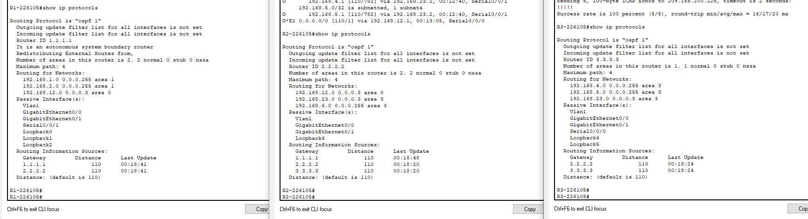
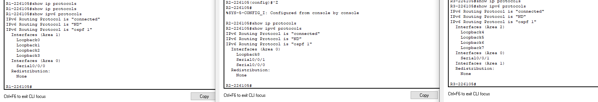

# Lokalne sieci komputerowe

## Sprawozdanie z laboratorium

Data | Tytuł zajęć | Uczestnicy
:-: | :-: | :-:
14.04.2021 9:15 | Konfiguracja wieloobszarowego OSPF | Bartosz Rodziewicz (226105)

### Konfigurowanie wieloobszarowego OSPFv2
#### Podsumowanie ćwiczenia

#### Do przemyślenia
* Jakie są trzy zalety projektowania wieloobszarowej sieci OSPF?
	* Mniejsze tabele routingu
	* Zmniejszona częstotliwość obliczania SPF
	* Zmniejszona nadmiarowość aktualizacji statusu łączy

### Konfigurowanie wieloobszarowego OSPFv3
#### Podsumowanie ćwiczenia

#### Do przemyślenia
* Dlaczego używany jest wieloobszarowy protokół OSPFv3?  
	Wieloobszarowy OSPFv3 może być użyty w dużych sieciach, aby ulepszyć proces routingu, zmniejszyć rozmiar tablic routingu oraz zmniejszyć użycie mocy obliczeniowej oraz pamięci routerów.
* Jaka jest korzyść z konfiguracji międzyobszarowej sumaryzacji tras?  
	Konfiguracja międzyobszarowej sumaryzacji tras zmniejsza rozmiar tablic routingu w całej sieci i zmniejsza ilość wysyłanych LSA typu 3 z routerów skrajnych (ABR) do szkieletowego obszaru. Jeśli jedna z sumaryzowanych sieci staje się wyłączona nie powoduje to automatycznie ponownego uruchomienia algorytmu SPF na routerach należących do innych obszarów.
