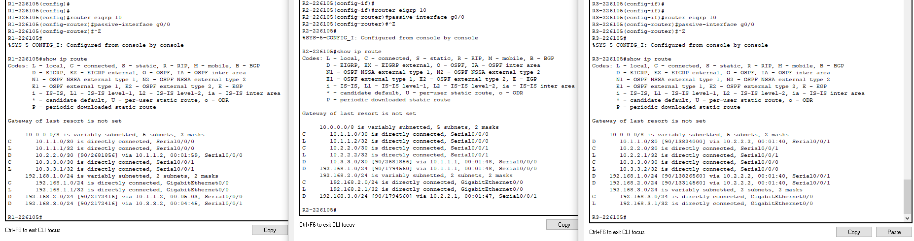
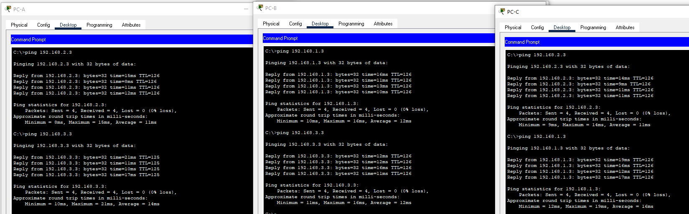
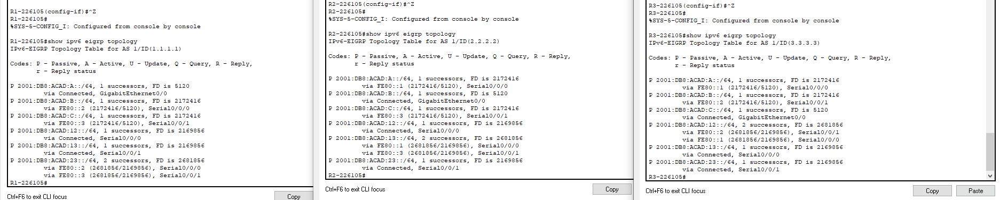
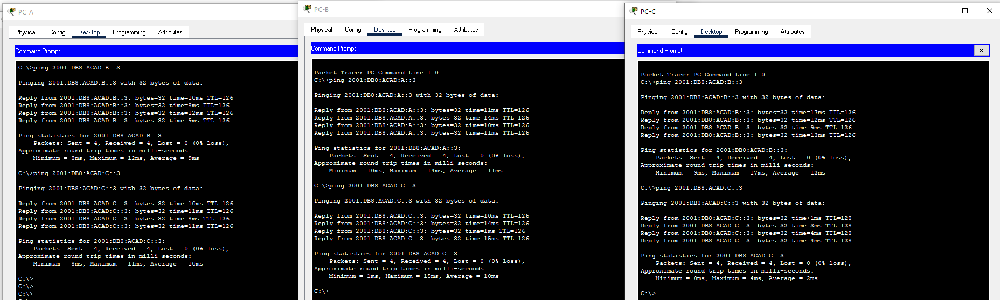

# Lokalne sieci komputerowe

## Sprawozdanie z laboratorium

Data | Tytuł zajęć | Uczestnicy
:-: | :-: | :-:
07.04.2021 9:15 | Podstawowa konfiguracja protokołu EIGRP | Bartosz Rodziewicz (226105)

### Podstawowa konfiguracja protokołu EIGRP dla IPv4
#### Tabela routingu

#### Pingi pomiędzy komputerami

#### Do przemyślenia
* Mogłeś wykorzystać tylko routing statyczny w tym laboratorium. Jakie są zalety korzystania z EIGRP?  
	EIGRP jest w stanie automatycznie dopasowywać się do zmian topologii sieci, jak dodanie czy odłączenie jakiejś sieci. Dodatkowo EIGRP automatycznie wybiera najlepszą trasę gdy następuje zmiana szerokości pasma oraz posiada automatyczny load balancing w przypadku istnienia dwóch lub więcej tras o takim samym koszcie.

### Podstawowa konfiguracja protokołu EIGRP dla IPv6
#### Tabela routingu

#### Pingi pomiędzy komputerami

#### Do przemyślenia
* Gdzie można skonfigurować interfejsy pasywne? Dlaczego?  
	Interfejsy pasywne najczęściej ustawia się na portach które nie są i nie będą wykorzystywane do podłączenia do innych routerów. Wykorzystanie pasywnego interfejsu powoduje że na danym interfejsie nie będą rozgłaszane komunikaty protokołu routingu powodując zmniejszenie niepotrzebnego ruchu w sieci, ponieważ takie komunikaty są istotne tylko dla routerów. Dodatkowo zastosowanie pasywnych interfejsów zwiększa bezpieczeństwo sieci uniemożliwiając wpięcie dodatkowego routera do sieci, który mógłby zostać wykorzystany do przejęcia ruchu w sieci.
* Jakie są korzyści z korzystania z EIGRP jako protokołu routingu w twojej sieci?  
	EIFRP może być wykorzystany w sieciach każdego rozmiaru od bardzo małych do bardzo dużych, wymaga mniej mocy obliczeniowej niż inne protokoły dynamicznego routingu (jak np OSPF) oraz powoduje niewielkie obciążenie sieci swoimi komunikatami routingu.
