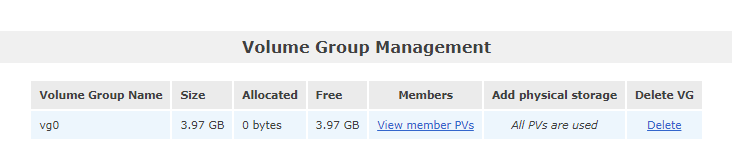

# Technologie chmury obliczeniowej i centrum danych

## Sprawozdanie z laboratorium

Data | Tytuł zajęć | Uczestnicy
:-: | :-: | :-:
15.03.2021 11:15 | Storage & Authentication Configuration | Bartosz Rodziewicz (226105)

### Configuring Openfiler Storage
#### Software RAID
##### Create RAID Partitions
Na początku konieczne było skonfigurowanie obrazu maszyny wirtualnej oraz stworzenie dodatkowych dysków. Do wykonania zadań stworzone zostały 4 dyski, każdy o powierzchni 2GB.

  
_Utworzenie partycji RAID z poziomu WEBowego interfejsu Openfilera._

##### Create RAID-5 Array

  
_Utworzona macierz RAID._

##### Question 1: How does RAID-5 differ from RAID-6? What are the main advantages and disadvantages of each?
RAID-6 oferuje większe bezpieczeństwo danych niż RAID-5 (możliwość odzyskania danych w przypadku awarii 2 dysków, a nie tylko jednego) z uwagi na podwójną parzystość. RAID-6 do działania wymaga minimum 4 dysków (z czego dwa są używane do parzystości), podczas, gdy RAID-5 minimum 3 (jeden dysk używany do parzystości) (dyski używane do parzystości to skrót myślowy oznaczający ilość miejsca zajętego przez parzystość, in fact parzystość jest przechowywana w partiach na każdym dysku, najlepiej wyjaśnić to na rysunku poglądowym). RAID-6 wymaga do działania sprzętowego kontrolera, podczas gdy RAID-5 może zostać zrealizowany za pomocą przełącznika softwarowego. Z uwagi na to oraz na konieczność posiadania jednego dysku więcej implementacja RAID-6 jest bardziej kosztowna. Prędkość odczytu danych w obu przypadkach będzie taka sama, podczas gdy zapis będzie wolniejszy w przypadku RAID-6 (konieczność wyliczenia dwóch parzystości).

#### Storage Volumes
##### Create Volume Group

  
_Utworzona grupa wolumenów._

##### Create Logical Volumes

  
_Utworzone wolumeny logiczne zgodnie z podziałem. Z uwagi na posiadanie dwa razy mniejszej tablicy RAID rozmiar wolumenów również zmniejszyłem dwukrotnie._

### Configuring Openfiler Authentication
#### LDAP Authentication
##### Enable Local LDAP Server

  
_Akrywowany serwer LDAP._

##### Configure LDAP Server

  
_Konfiguracja serwera LDAP._

  
_Poprawna aktywacja serwera._

##### Question 2: What are some of the advantages of using LDAP or Active Directory authentication for Openfiler instead of local authentication?
Wykorzystanie jakiejś usługi katalogowej do zarządzania logowaniem do Openfilera powoduje, że użytkownik nie potrzebuje dodatkowego konta użytkownika, do którego musi spamiętać dodatkowe hasło. Jeżeli w danej organizacji wykorzystywana jest usługa katalogowa dodatkowo nie potrzeba tworzyć specjalnych zasad dotyczących dostępu do konkretnych danych (można wykorzystać istniejące grupy i użytkowników). Dodatkowo administratorzy Openfilera nie muszą przejmować się wszystkim związanym z bezpieczeństwem kont (przechowywanie haseł, czy zarządzanie nimi). Jest to po prostu wygodniejsze, jak i bezpieczniejsze rozwiązanie.

#### Users & Groups
##### Create Groups

  
_Utworzone grupy._

Z niewiadomego powodu podczas tworzenia grup obie grupy zostały stworzone z takim samym GID. Aby rozwiązać ten problem konieczne było stworzenie drugiej grupy z ręcznym podaniem GID.

  
_Poprawione grupy._

##### Create Users

  
_Stworzeni użytkownicy._

  
_Użytkownicy z podziałem na grupy._
