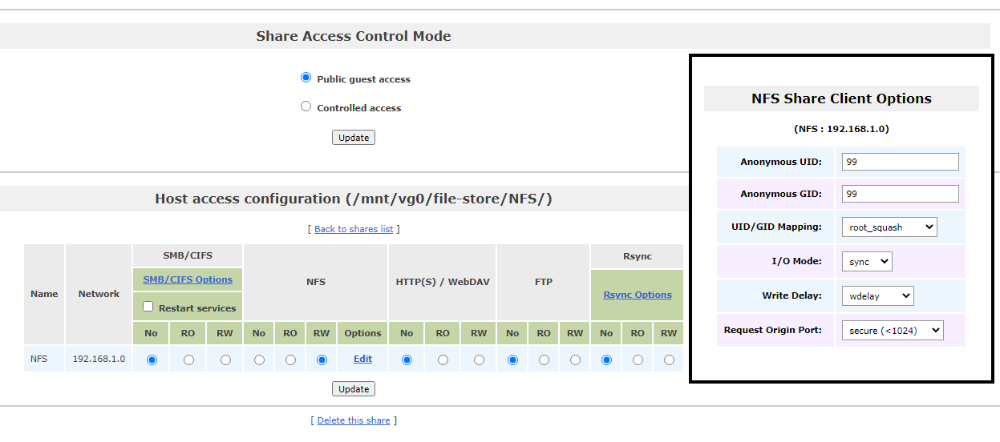
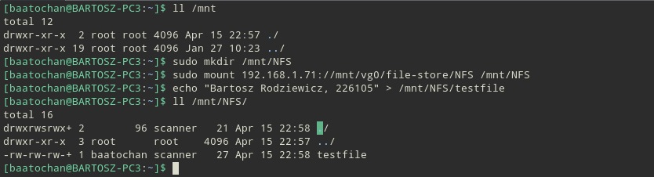
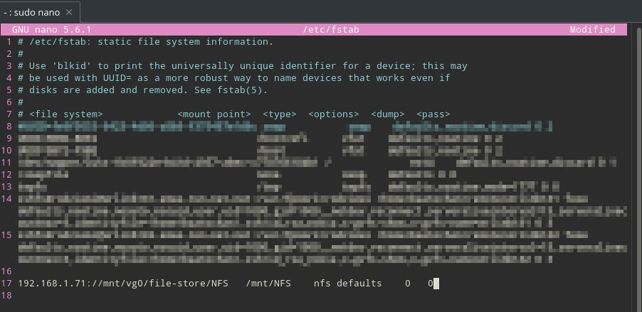
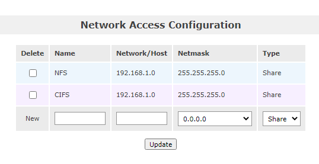
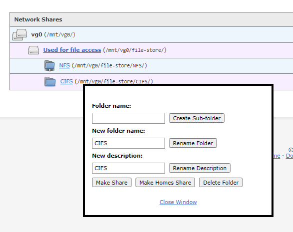
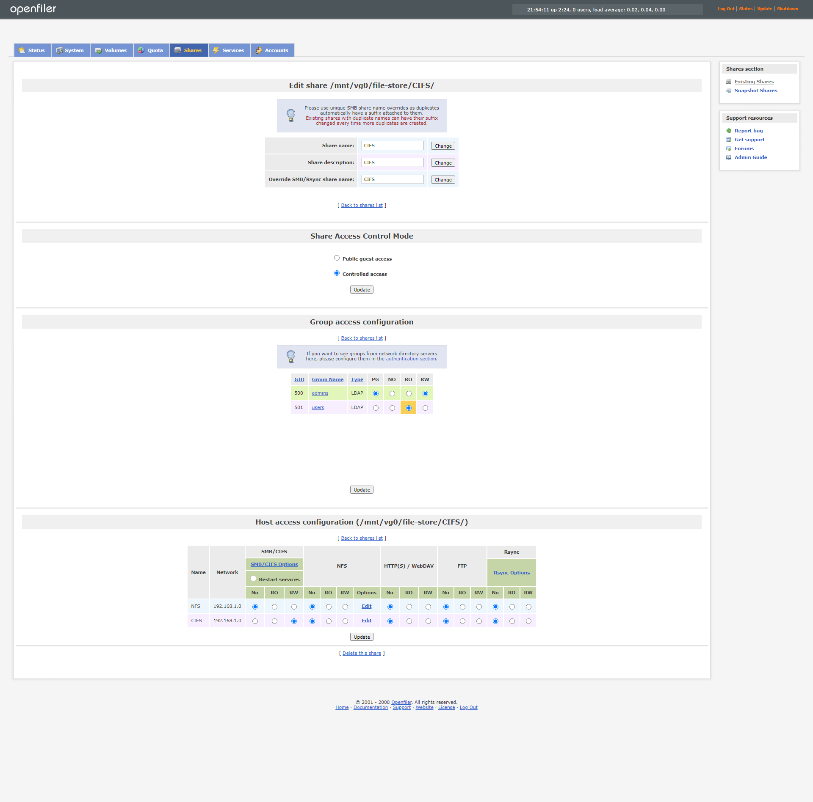
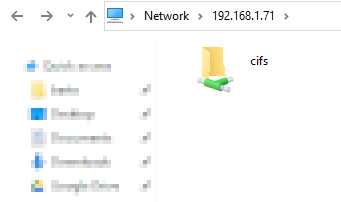
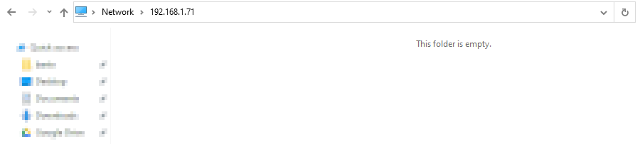
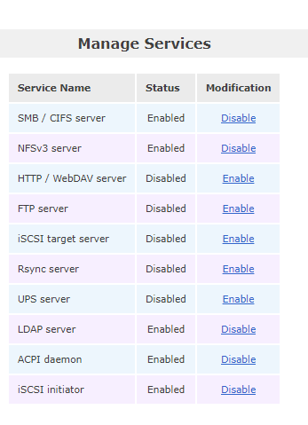

# Technologie chmury obliczeniowej i centrum danych

## Sprawozdanie z laboratorium

Data | Tytuł zajęć | Uczestnicy
:-: | :-: | :-:
15.03.2021 11:15 | Configuring NAS Shares | Bartosz Rodziewicz (226105)

### Configuring NFS for Linux Client Access
Aby wykonać część Linuxową zdecydowałem się "wpuścić" maszynę wirtualną z Openfilerem do mojej sieci lokalnej (zmiana adaptera sieciowego z trybu host-only na bridged) by zminimalizować sobie możliwe problemy. Jedyny komputer, który posiadam z Linuxem to mój laptop, podczas, gdy Openfiler jest uruchomiony w maszynie wirtualnej na komputerze z Windowsem.

#### Openfiler NFS
##### Create NFS Network ACL
  
_Dodanie ACL odpowiedniego do sieci lokalnej._

Powyższa lista ACL umożliwia podłączenie do serwera jedynie hostom z podsieci 192.168.1.0/24, czyli każdemu urządzeniu w mojej domowej sieci lokalnej.

##### Create NFS Share
  
_Dodanie nowego udostępnionego zasobu wewnątrz `file-store`._

  
_Ustawienia udostępniania dla zasobu NSF._

##### Question 1: What is the significance of the NFS `root_squash` option? What are the advantages of setting the option?
Opcja `root_squash` zapewnia, że pliki stworzone z UID i GID roota mają zmieniony UID i GID na inny (użytkownik `nsfnobody`), aby użytkownik mający roota na lokalnej maszynie nie mógł przejąć uprawnien roota na serwerze (za pomocą plików z setuid).

##### Start NFS Service
  
_Uruchomiona usługa NSFv3._

#### Linux Client Access
##### Test NFS Access
  
_Poprawnie działające ręczne zamontowanie zasobu pod Linuxem (dystrybucja Manjaro)._

##### Make Mount Point Persistent
  
_Dodanie do pliku `fstab` wpisu punktu montowania zasobu z Openfilera (reszta pliku `fstab` zamazana z uwagi na nieistotność tych wpisów do tego zadania)._

  
_Poprawne zamontowanie zdalnego zasobu za pomocą danych z `fstab`._

### Configuring CIFS for Windows Client Access
#### Openfiler CIFS
##### Create CIFS Network ACL
  
_Dodanie identycznego jak poprzednio ACL dla zasobu CIFS._

##### Create CIFS Share
  
_Utworzenie zasobu CIFS._

  
_Konfiguracja zasobu CIFS zgodnie z danymi w instrukcji._

##### Question 2: Click SMB/CIFS Options under the Host access configuration section. What does the Browseable option control?
  
_Funkcja browseable włączona._

  
_Funkcja browseable wyłączona._

Funkcja browseable kontroluje, czy zasób jest widoczny na liście wszystkich zasobów danego urządzenia. Gdy browseable jest wyłączona, aby dostać się do zasobu konieczna jest znajomość jego nazwy.

##### Start CIFS Service
  
_Aktywacja usługi CIFS._

#### Windows Client Access
Do połączenia się z zasobem CISF z poziomu Windows 10 konieczna była aktywacja usługi SMBv1, która od jakiegoś czasu jest wyłączona domyślnie w Windows.

  
_Aktywacja usługi SMBv1._

#### Test Access & Mount CIFS Share
  
_Próbne połączenie z folderem sieciowym W polu login konieczne było wpisanie `openfiler\admin1`._

  
_Stworzenie przykładowego pliku w folderze sieciowym._

  
_Utworzenie mapowania sieciowego dysku._

  
_Sieciowy dysk/zasób widoczny w This PC._
