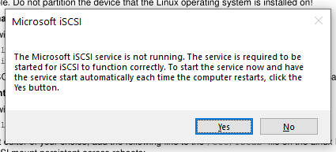

# Technologie chmury obliczeniowej i centrum danych

## Sprawozdanie z laboratorium

Data | Tytuł zajęć | Uczestnicy
:-: | :-: | :-:
12.04.2021 11:15 | SAN Configuration | Bartosz Rodziewicz (226105)

### Configuring Openfiler iSCSI Target
#### Openfiler iSCI Target
##### Create iSCSI Network ACL
  
_Dodanie ACL odpowiedniego do sieci lokalnej._

Powyższa lista ACL umożliwia podłączenie do serwera jedynie hostom z podsieci 192.168.1.0/24, czyli każdemu urządzeniu w mojej domowej sieci lokalnej.

##### Start iSCSI Service
  
_Akrywowana usługa iSCSI._

##### Create iSCSI Target
  
_Utworzony target iSCSI._

  
_Utworzone mapowanie LUN._

  
_ACL przypisane do odpowiedniego targetu._

##### Question 1: Click the CHAP Authentication tab. Why would enabling CHAP authentication for iSCSI be beneficial? Would CHAP protect against unauthorized users intercepting sensitive data? What else should you do in order to secure iSCSI?
Domyślnie protokół iSCSI nie wymaga żadnego uwierzytelniania i wystarcza znajomość adresu IP systemu gdzie działa target. Włączenie CHAP zapewnia podstawowe zabezpieczenie dostępu do systemu wymagając podania przez niego hasła. CHAP nie zabezpiecza jednak przed podsłuchem ruchu sieciowego, ponieważ jedyne co robi to wymaga autoryzacji użytkownika co jakiś czas, pozostawiając ruch sieciowy w żaden sposób nie szyfrowany. W przypadku, gdy musimy postawić zasób iSCSI w sieci, gdzie możemy martwić się o podsłuch transmisji możemy zabezpieczyć dodatkowo same połączenie z iSCSI np. poprzez wykorzystanie SSH.

### Configuring Linux iSCSI Initiator
#### iSCSI Software
##### Install & Start iSCSI Software
  
_Instalacja oprogramowania do iSCSI._

  
_Usługa iSCSI aktywowana pomyślnie._

##### Discover & Configure IQN
  
_Wykryty target iSCSI._

  
_Poprawne połączenie z targetem iSCSI._

#### Configure Storage
##### Partition iSCSI Device
  
_Zasób iSCSI podzielony na partycje._

##### Format iSCSI Device
  
_Zasób iSCSI sformatowany wykorzystując ext3._

##### Mount iSCSI Device
  
_Zasób iSCSI zamontowany jako `/mnt/iscsi`._

### iSCSI Software installation and configuration using Microsoft Windows OS
#### Install & Start iSCSI Software
Próba uruchomienia narzędzia iSCSI Initiator informuje, że usługa nie jest wystartowana - z poziomu tego komunikatu wystarczy kliknąć yes by ją uruchomić. Usługa może być również uruchomiona ręcznie z poziomu zarządzania usługami.

  
_Komunikat o nieaktywnej usłudze iSCSI._

#### Discover & Configure IQN
  
_Poprawne połączenie z targetem iSCSI._

#### Partition iSCSI Device
Po podłączeniu do zasobu widać, że jest on widoczny w Disk Management. Widać tam, też że dysk jest już podzielony na partycję. Jako, że jest on sformatowany ext3 Windows nie potrafi tego wykryć.

  
_Zasób iSCSI podzielony na partycje, jeszcze z poziomu Windowsa._

Aby podzielić na partycję z poziomu Windowsa konieczne jest usunięcie istniejącej partycji oraz uruchomienie kreatora tworzenia nowej partycji.

  
_Kreator tworzenia partycji - wybór litery pod jaką partycja będzie zamontowana._

#### Format iSCSI Device
  
_Kreator tworzenia partycji - wybór systemu plików i szczegółów formatowania partycji_

#### Mount iSCSI Device
Kreator tworzenia partycji po skończeniu domyślnie montuje dysk do wybranej litery w trakcie tworzenia partycji. Wybór litery pokazany był powyżej._

  
_Zamontowany zasób iSCSI widoczny z poziomu My PC._

  
_Domyślna zawartość zasobu iSCSI po sformatowaniu jako NTFS._
