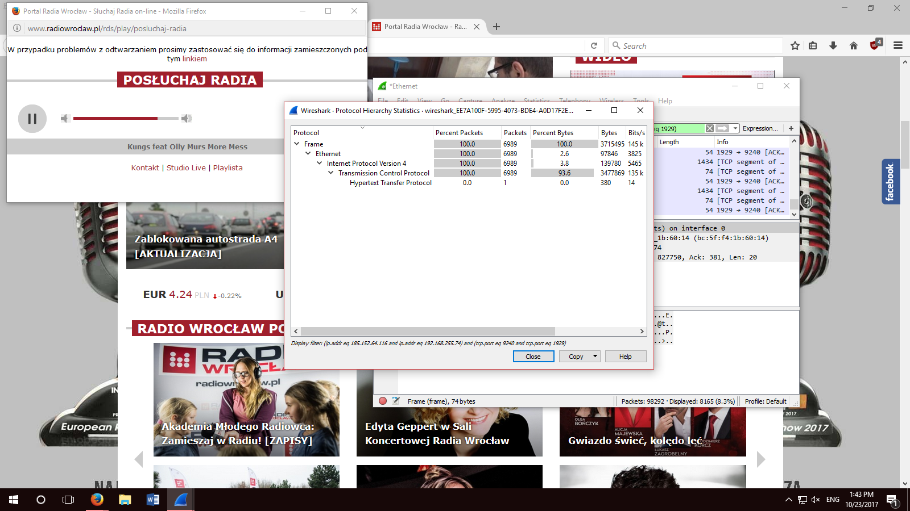
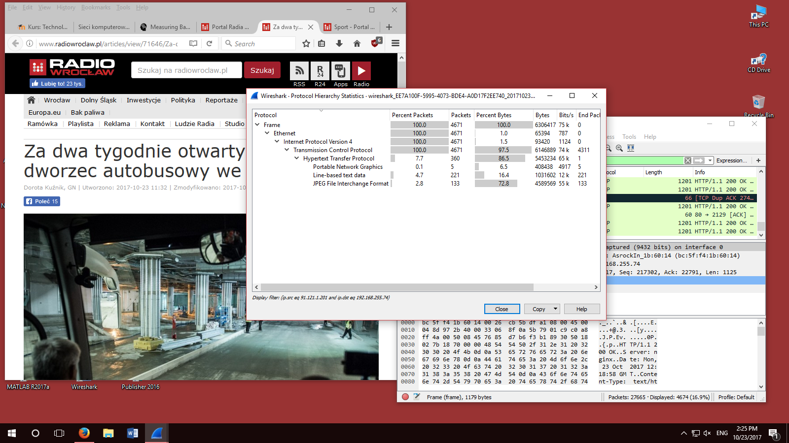
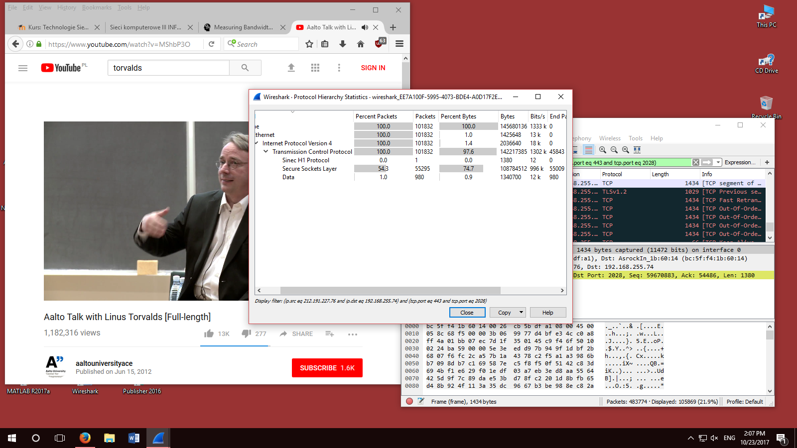
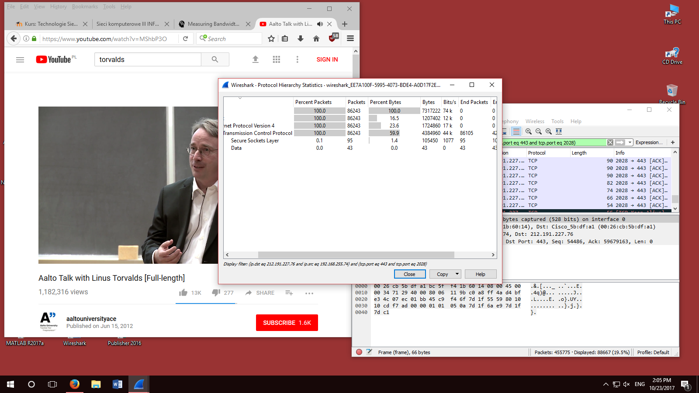
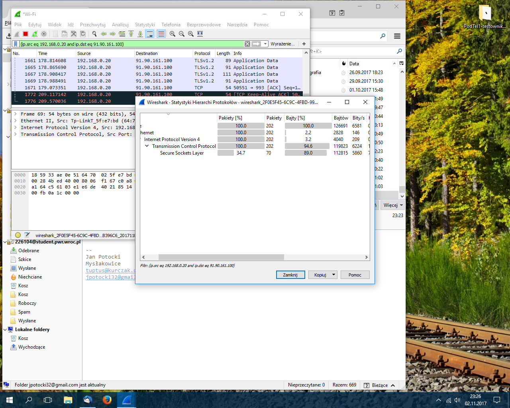
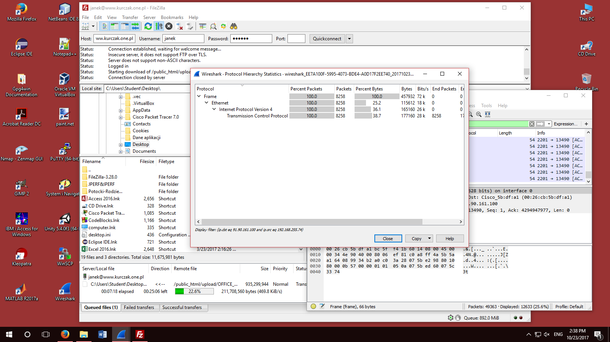

# Technologie sieciowe 2 - sprawozdanie
## Szacowanie wymaganej przepustowości łącza

#### Termin zajęć:
23.10.2017

#### Autorzy:
Grupa nr. 3
* Bartosz Rodziewicz, 226105
* Jan Potocki, 226104

#### Prowadzący:
dr inż. Przemysław Ryba

### Treść zadania

W firmie "Zwariowany Jednorożec" pracuje 40 osób. Pracownicy przez 20% czasu przeglądają
strony WWW. Na 5 stacjach przez cały dzień pracy uruchomione jest radio internetowe,
na jednej stacji TV. Wszyscy pracownicy do komunikacji wykorzystują komunikatory
(wybrać jakie) oraz telefony IP lub softphony (wybrać) oraz pocztę elektroniczną.
2 razy w tygodniu odbywają się dwugodzinne wideokonferencje, w których uczestniczą
2 osoby (2 stacje). Administrator pobiera korzystając z FTP łatki, uaktualnienia,
nowe wersje oprogramowania. Administrator raz w tygodniu przesyła pełny
backup BD na zdalny serwer a codziennie backup 1/5 danych. Rozmiar BD to 14 GB.

### Krótki opis sposobów generowania ruchu
Ruch był sztucznie generowany przez nas poprzez wykonywanie typowych dzialań w
przykładowych aplikacjach. Każda aplikacja była przez nas używana przez 15 minut.
Po 15 minutach zapisywaliśmy całkowite dane pobrane (download) i wysłane (upload)
oraz ruch na sekundę. W trakcie testów obserwowaliśmy co jakiś czas zmienność
użycia w czasie.

W celu określenia ilości danych przesyłanych przez konkretny program wykorzystaliśmy Wiresharka i filtrowanie po źródłowym (ip.src) i docelowym (ip.dst) adresie IP. Po odpowiednim ustawieniu filtrów i wyświetleniu statystyk protokołów (Statistics > Protocol Hierarchy), można było odczytać w bitach na sekundę transfer między naszym komputerem i serwerem (upload) oraz po zamianie filtrów między serwerem i komputerem (download).

### Analiza otrzymanych logów

#### Radio internetowe

* Testowana stacja: Radio Wrocław
* Ruch na sekundę:
  * Download: 141 kbit/s = 18 kBps
  * Upload: 5 kbit/s = 1 kBps
* Zmienność użycia w czasie:
  * Download: ±5 kbit/s
  * Upload: ±2 kbit/s
* Całkowity ruch:
  * Download: 15 MB
  * Upload: 1 MB

#### Przegladanie internetu

* Testowane strony:
  * Onet
  * WP
  * Radio Wrocław
* Ruch na sekundę:
  * Download: 129 kbit/s = 16 kBps
  * Upload: 9 kbit/s = 1 kBps
* Zmienność użycia w czasie:
  * Download: mocno zmienne w czasie
  * Upload: mocno zmienne w czasie
* Całkowity ruch:
  * Download: 14 MB
  * Upload: 1 MB

#### Telewizja internetowa

* Testowana usługa: Youtube
* Ruch na sekundę:
  * Download: 1333 kbit/s = 166 kBps
  * Upload: 74 kbit/s = 9 kBps
* Zmienność użycia w czasie
  * Download: ±100 kbit/s
  * Upload: ±10 kbit/s
* Całkowity ruch:
  * Download: 146 MB
  * Upload: 8 MB

#### Poczta elektroniczna

* Ruch na sekundę:
  * Download: 2834 bit/s = 354 Bps
  * Upload: 6581 bit/s = 823 Bps
* Zmienność użycia w czasie
  * Download: mocno zmienne w czasie
  * Upload: mocno zmienne w czasie
* Całkowity ruch:
  * Download: 311 kB
  * Upload: 723 kB

#### Pobieranie po FTP
* Ruch na sekundę:
  * Download: 3198 kbit/s = 400 kBps
  * Upload: 70 kbit/s = 9 kBps
* Zmienność użycia w czasie:
  * Download: niewielka
  * Upload: niewielka
* Całkowity ruch:
  * Download: 351 MB
  * Upload: 8 MB

#### Wysyłanie po FTP

* Ruch na sekundę:
  * Download: 76 kbit/s = 10 kBps
  * Upload: 2729 kbit/s = 341 kBps
* Zmienność użycia w czasie:
  * Download: niewielka
  * Upload: niewielka
* Całkowity ruch:
  * Download: 9 MB
  * Upload: 300 MB

*Download w trakcie pobierania po FTP i upload w trakcie wysyłania po FTP wykorzystuje całą dostępną przepustowość.*

### Wyliczenia pasma i ruchu związanego z poszczególnymi usługami

### Wyliczenie przepustowości łącza do Internetu dla rozważanej firmy

### Wybór i opis łącza do Internetu dla rozważanej firmy

### Wnioski

### Pytania:

#### Które usługi mają profil ruchu symetryczny, a które asymetryczny?

#### W jakich przypadkach w firmie niezbędne jest symetryczne łącze do Internetu?

#### Co to jest CIR?

#### Czy najważniejszym parametrem dla usługi sieciowej jest pasmo (przepustowość)?

#### Jakie usługi sieciowe wymagają także zapewnienia innych parametrów sieci (wymienić te parametry)?

#### Czy cena za łącza Internetowe rośnie liniowo wraz z przepustowością tego łącza?
