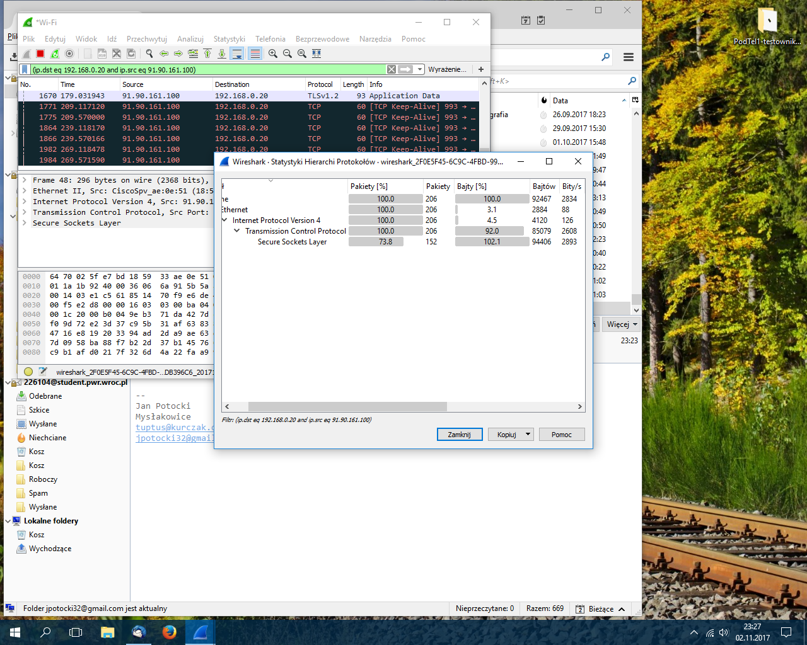

# Technologie sieciowe 2 - sprawozdanie
## Szacowanie wymaganej przepustowości łącza

#### Termin zajęć:
23.10.2017

#### Autorzy:
Grupa nr. 3
* Bartosz Rodziewicz, 226105
* Jan Potocki, 226104

#### Prowadzący:
dr inż. Przemysław Ryba

### Treść zadania

W firmie "Zwariowany Jednorożec" pracuje 40 osób. Pracownicy przez 20% czasu przeglądają
strony WWW. Na 5 stacjach przez cały dzień pracy uruchomione jest radio internetowe,
na jednej stacji TV. Wszyscy pracownicy do komunikacji wykorzystują komunikatory
(wybrać jakie) oraz telefony IP lub softphony (wybrać) oraz pocztę elektroniczną.
2 razy w tygodniu odbywają się dwugodzinne wideokonferencje, w których uczestniczą
2 osoby (2 stacje). Administrator pobiera korzystając z FTP łatki, uaktualnienia,
nowe wersje oprogramowania. Administrator raz w tygodniu przesyła pełny
backup BD na zdalny serwer a codziennie backup 1/5 danych. Rozmiar BD to 14 GB.

### Krótki opis sposobów generowania ruchu
Ruch był sztucznie generowany przez nas poprzez wykonywanie typowych działań w
przykładowych aplikacjach. Każda aplikacja była przez nas używana przez 15 minut.
Po 15 minutach zapisywaliśmy całkowite dane pobrane (download) i wysłane (upload)
oraz ruch na sekundę. W trakcie testów obserwowaliśmy co jakiś czas zmienność
użycia w czasie.

W celu określenia ilości danych przesyłanych przez konkretny program wykorzystaliśmy Wiresharka i filtrowanie po źródłowym (ip.src) i docelowym (ip.dst) adresie IP. Po odpowiednim ustawieniu filtrów i wyświetleniu statystyk protokołów (Statistics > Protocol Hierarchy), można było odczytać w bitach na sekundę transfer między naszym komputerem i serwerem (upload) oraz po zamianie filtrów między serwerem i komputerem (download).

### Analiza otrzymanych logów oraz wyliczenia pasma i ruchu związanego z poszczególnymi usługami

#### Radio internetowe

* Testowana stacja: Radio Wrocław
* Ruch na sekundę:
  * Download: 141 kbit/s = 18 kBps
  * Upload: 5 kbit/s = 1 kBps
* Zmienność użycia w czasie:
  * Download: ±5 kbit/s
  * Upload: ±2 kbit/s
* Całkowity ruch:
  * Download: 15 MB
  * Upload: 1 MB

#### Przegladanie internetu

* Testowane strony:
  * Onet
  * WP
  * Radio Wrocław
* Ruch na sekundę:
  * Download: 129 kbit/s = 16 kBps
  * Upload: 9 kbit/s = 1 kBps
* Zmienność użycia w czasie:
  * Download: mocno zmienne w czasie
  * Upload: mocno zmienne w czasie
* Całkowity ruch:
  * Download: 14 MB
  * Upload: 1 MB

#### Telewizja internetowa

* Testowana usługa: Youtube
* Ruch na sekundę:
  * Download: 1333 kbit/s = 166 kBps
  * Upload: 74 kbit/s = 9 kBps
* Zmienność użycia w czasie
  * Download: ±100 kbit/s
  * Upload: ±10 kbit/s
* Całkowity ruch:
  * Download: 146 MB
  * Upload: 8 MB

#### Poczta elektroniczna

* Ruch na sekundę:
  * Download: 2834 bit/s = 354 Bps
  * Upload: 6581 bit/s = 823 Bps
* Zmienność użycia w czasie
  * Download: mocno zmienne w czasie
  * Upload: mocno zmienne w czasie
* Całkowity ruch:
  * Download: 311 kB
  * Upload: 723 kB

#### Pobieranie po FTP
* Ruch na sekundę:
  * Download: 3198 kbit/s = 400 kBps
  * Upload: 70 kbit/s = 9 kBps
* Zmienność użycia w czasie:
  * Download: niewielka
  * Upload: niewielka
* Całkowity ruch:
  * Download: 351 MB
  * Upload: 8 MB

#### Wysyłanie po FTP

* Ruch na sekundę:
  * Download: 76 kbit/s = 10 kBps
  * Upload: 2729 kbit/s = 341 kBps
* Zmienność użycia w czasie:
  * Download: niewielka
  * Upload: niewielka
* Całkowity ruch:
  * Download: 9 MB
  * Upload: 300 MB

*Download w trakcie pobierania po FTP i upload w trakcie wysyłania po FTP wykorzystuje całą dostępną przepustowość (jeśli pozwala na to serwer wysyłający/odbierający, co ma miejsce w 99% przypadkach).*

Każda z testowanych przez nas usług ma trochę inne zachowanie w kwestii obciążenia łącza.

Radio i TV internetowe w sposób ciągły buforują treść z wyprzedzeniem, dlatego ich zmienność w czasie jest niewielka. Transmisja jest również praktycznie jednostronna dlatego w ich przypadku download jest obciążony o wiele mocniej niż upload.

Przeglądanie internetu to natomiast bardzo ciężka do przewidzenia "usługa". Transfer następuje przy wczytywaniu kolejnych przeglądanych stron. Testowane przez nas strony generowały transmisję jednostronną, jednak w celu komfortowego przeglądania internetu należy zapewnić dobry transfer w obie strony.

Poczta elektroniczna tak naprawdę podchodzi pod przeglądanie internetu, ponieważ większość użytkowników korzysta aktualnie z web klientów, które działają na podobnej zasadzie co zwykłe przeglądanie internetu.

### Wyliczenie przepustowości łącza do Internetu dla rozważanej firmy

| Usługa | Liczba jednoczesnych użytkowników | Częstotliwość użytkowania | Wymagana prędkość down [MBps] | Wymagana prędkość up [MBps] |
| :-: | :-: | :-: | :-: | :-: |
| WWW | 40 | cały 20% dnia | 40\*0.2\*0.016 = 0.128 | 0 |
| Radio | 5 | cały dzień | 5 * 0.018 = 0.09 | 0 |
| TV | 1 | cały dzień | 1  * 0.162 = 0.162 | 0 |
| Poczta | 40 | 20% dnia | 0 | 0 |
| Pobieranie update'ów | 1 | 30% dnia | 1\*0.3\*0.390 = 0.117 | 0 |
| Backup bazy danych (14GB) | 1 | 1x/tydzień całość; 5x/tydzień część | 0 | 0.569; 0.398 |
| **Suma** | | | 0.497 MBps = 4 Mbit/s | 0.967 MBps = 7.7 Mbit/s |

*Wyliczenia do backupu bazy: baza zajmuje 14GB, raz w tygodniu musi zostać w całości wysłana, więc w ciągu max 7h musi nastąpić ten transfer. Daje to prędkość 2GBph co po przeliczeniu wychodzi 0.569MBps. W przypadku częściowego backupu optymalny czas założyłem 2h.*

W naszych obliczeniach nie uwzględniliśmy transmisji komunikatorów tekstowo-audio-wideo co troszkę zaburza nasze szacunki (zwłaszcza pasma up).

Wygląda również, że nasza symulacja przeglądania stron WWW była niezbyt udana, ponieważ uzyskane dane są zbyt niskie do komfortowego przeglądania internetu przez 8 osób jednocześnie.

Uwzględniając te zastrzeżenia uważamy, że najmniejsze spełniające wymagania łącze dla tej firmy powinno mieć parametry 40Mbit/s down i 20Mbit/s up. Z uwagi jednak na niskie koszty szybkich łączy światłowodowych uważamy, że wybranie szybszego łącza będzie lepszym wyborem.

### Wybór i opis łącza do Internetu dla rozważanej firmy

Nasza firma znajduje się przy ulicy Jaracza we Wrocławiu i po przejrzeniu dostępnych operatorów w tamtej okolicy wybraliśmy ofertę firmy Moico. Jest to oferta łącza symetrycznego 100MBit/s za 55zł/miesiąc. Oferta jest bez umowy terminowej (z 3 miesięcznym okresem wypowiedzenia).

Zdajemy sobie sprawę, że takie łącze jest w dużej mierze zbyteczne dla naszej firmy, jednak żaden operator nie oferował łącza za mniej niż 50zł/miesiąc, a ci którzy oferowali (oszczędność ~5zł/mies. i konieczność umowy terminowej) oferowali znacznie gorsze parametry.

| Technologia | Download | Upload | Okres | Aktywacja | Cena na miesiąc |
| :-: | :-: | :-: | :-: | :-: | :-: |
| światłowód | do 100MBit/s | do 100MBit/s | min. 3 mies. | 1zł | 55zł |

### Wnioski
Zbieranie danych do wyliczenia wymaganej przepustowości jest bardzo długim i żmudnym procesem. Mimo to wyliczone wyniki są bardzo mocno szacunkowe, a w trakcie zbierania danych łatwo coś przeoczyć. Uwzględniając niskie ceny łączy w dzisiejszych czasach warto wybrać łącze mocno przewyższające nasze szacunki, aby być zabezpieczonym na niespodziewane użycie i przyszłościowy wzrost użycia.

### Pytania:

#### Które usługi mają profil ruchu symetryczny, a które asymetryczny?
Profil ruchu symetryczny mają usługi typu wideokonferencję, transmisje P2P. Przykładami asymetrycznych są: przeglądanie WWW, radio, telewizja, transmisja FTP.

#### W jakich przypadkach w firmie niezbędne jest symetryczne łącze do Internetu?
Gdy potrzebuje wysyłać bardzo duże ilości danych lub korzystać głównie z usług o profilu symetrycznym.

#### Co to jest CIR?
Gwarantowana przez dostawcę internetu przepustowość łącza.

#### Czy najważniejszym parametrem dla usługi sieciowej jest pasmo (przepustowość)?
Jest to jeden z ważniejszych parametrów, jednak równie ważnym (jak nie ważniejszym) jest opóźnienie generowane na łączu (ping). Poza tym duże znaczenie ma niezawodność i dostępność usługi.

#### Jakie usługi sieciowe wymagają także zapewnienia innych parametrów sieci (wymienić te parametry)?
Gry online wymagają od użytkownika jak najniższego opóźnienia czyli właśnie pingu. Poza tym niektóre usługi wymają statycznego zewnętrznego adresu IP.

#### Czy cena za łącza Internetowe rośnie liniowo wraz z przepustowością tego łącza?
Przepustowość rośnie znacznie szybciej niż cena.
