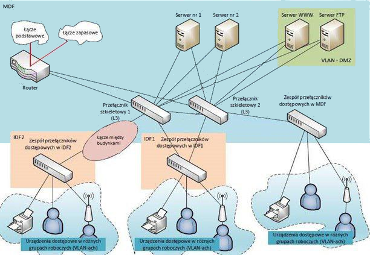

# Technologie Sieciowe 2 - Projekt
*Krzysztof Agieńczuk, 225970*  
*Bartosz Rodziewicz, 226105*

### Terminy oddania etapów:
* Etap 1 - 07.11.2017
* Etap 2 - 05.12.2017
* Etap 3 - 16.01.2018

## Wstęp
Projekt polega na zaprojektowaniu lokalnej sieci komputerowej dla dużego przedsiębiorstwa, w naszym przypadku jest to **Agencja Turystyczna**. W budynkach należących do przedsiębiorstwa zostało zainstalowane okablowanie strukturalne (kat. 6) wraz z niezbędnymi szafami teleinformatycznymi. Przedsiębiorstwo posiada także wszystkie urządzenia końcowe (serwery, drukarki, komputery, kamery IP, itp.), które należy podłączyć do sieci. Zakres projektu obejmuje opracowanie projektu logicznego sieci, projektu VLAN, wybór technologii sieciowej i urządzeń sieciowych oraz podstawową konfigurację urządzeń, tak aby zapewnić prawidłowe i niezawodne działanie sieci.

## Inwentaryzacja zasobów: sprzętu, aplikacji, zasobów ludzkich
### Inwentaryzacja sprzętu
| Liczba komputerów pracowników | Bud. 1 p. 1 | Bud. 1 p. 2 | Bud. 1 p. 3 | Bud. 1 p. 4 | Bud. 2 p. 1 |
| :-: | :-: | :-: | :-: | :-: | :-: |
| Sprzedawcy | 30 | 22 | 43 | 58 | 66 |
| Konsultanci | 53 | 24 | 75 | 9 | 10 |
| Księgowość | 37 | 46 | 63 | 57 | 57 |
| **Liczba drukarek** |
| | 2 |	3 |	1 |	1 |	3 |
| **Liczba punktów dostępowych Wi-Fi** |
| | 0	| 2	| 2 |	0 |	0 |
| **Liczba urządzeń bezprzewodowych** |
| | 0	| 8 |	9 |	0 |	0 |

#### Serwery lokalne
Firma posiada dwa serwery lokalne

#### Punkty dystrybucyjne
| Oznaczenie |	Lokalizacja |	Podłączone punkty abonenckie |
| :-: | :-: | :-: |
| MDF	| Bud. 1, p. 1	| Bud. 1, p. 1 |
| IDF1	| Bud. 1, p. 4	| Bud. 1, p. 2, 3, 4 |
| IDF2 |	Bud. 2, p. 1	| Bud. 2 |

#### Połączenie między budynkami
Firma znajduje się w dwóch budynkach, których odległość od siebie wynosi 274m. Budynki połączone są łączem optycznym wielomodowym.

### Inwentaryzacja aplikacji
Pracownicy będą korzystać z następujących aplikacji:
* Przeglądarka
* Wideokonferencja
* VoIP
* Klient FTP
* Komunikator
* Praca w chmurze
* Poczta

### Inwentaryzacja zasobów ludzkich

| Grupa robocza | Bud. 1 p. 1 | Bud. 1 p. 2 | Bud. 1 p. 3 | Bud. 1 p. 4 | Bud. 2 p. 1 | Razem |
| :-: | :-: | :-: | :-: | :-: | :-: | :-: |
| Sprzedawcy | 30 | 22 | 43 | 58 | 66 | **219** |
| Konsultanci | 53 | 24 | 75 | 9 | 10 | **171** |
| Księgowość | 37 | 46 | 63 | 57 | 57 | **260** |

## Analiza potrzeb użytkowników – wymagania zamawiającego
### Wymagania dot. przepływów pomiędzy pracownikami a serwerami lokalnymi
Transfer do serwerów lokalnych i drukarek (down \ up) [kb/s]

| Grupa rob. / Serwer |	Serwer1 |	Serwer2 |	Drukarka |
| :-: | :-: | :-: | :-: |
| Sprzedawcy |	500\600 |	0\0 |	10\190 |
| Konsultanci |	0\0 |	0\0 |	10\140 |
| Księgowość |	250\900 |	0\0 |	10\120 |
| Wi-Fi |	200\200 |	0\0 |	10\170 |

### Prognozowany ruch do Internetu z posiadanych przez firmę serwerów internetowych
Transfer do\z Internetu na jedną sesję (internautę) [kb/s]

| Serwery internetowe	| Do Internetu	| Z Internetu	| Liczba jednoczesnych sesji |
| :-: | :-: | :-: | :-: |
| Serwer WWW	| 140	| 30	| 44 |
| Serwer FTP	| 380	| 60	| 15 |

### Wymagania dot. przepływów generowanych przez aplikacje użytkownika z\do internetu
Transfer z/do Internetu (down \ up) [kb/s]

| Grupa rob./Aplikacja	| Przeglądarka	|	Wideokonferencja	|	VoIP	|	Klient FTP	|	Komunikator	|	Praca w chmurze	|	Poczta	|
| :-: | :-: | :-: | :-: | :-: | :-: | :-: | :-: |
| Sprzedawcy	|	0\0	|	40\40	|	20\20	|	45\18	|	15\15	|	27\44	|	19\14	|
| Konsultanci	|	0\0	|	40\40	|	20\20	|	51\17	|	15\15	|	25\46	|	23\15	|
| Księgowość	|	0\0	|	40\40	|	20\20	|	0\0	|	15\15	|	0\0	|	22\30	|
| Wi-Fi	|	56\10	|	40\40	|	20\20	|	0\0	|	0\0	|	60\26	|	24\29	|

## Założenia projektowe
1. Projekt zostanie wykonany w technologii GigabitEthernet
1. Zostaną wykonane sieci wirtualne VLAN, w celu ułatwienia komunikacji między pracownikami jednego działu, pracującymi w różnych budynkach
1. Stworzone zostaną 4 punkty dostępowe WiFi, w celu zapewnienia możliwości obsługi bezprzewodowych urządzeń biurowych
1. Infrastruktura zostanie oparta na urządzeniach firmy CISCO, z uwzględnieniem sprzętu będącego już w posiadaniu firmy
1. Oddanie sieci z skonfigurowanymi urządzeniami, gotowymi do użycia
1. Estetyka wykonania projektu - ukrycie kabli pod podłogą, w podwieszonych sufitach i listwach przypodłogowych

## Projekt sieci
### Projekt logiczny sieci wraz z opisem koncepcji rozwiązania i uzasadnieniem

Zaproponowana sieć będzie się składać z 2 przełączników tzw. szkieletowych, łączących punkty dostępowe MDF i IDF 1 oraz 2. Firma posiada 2 łącza internetowe, umieszczone na jednym routerze, przy czym drugie z nich jest łączem zapasowym, operującym na 40% przepustowości pierwszego i jest używane tylko w sytuacji awarii głównego łącza.

Jako przełączniki szkieletowe użyte zostaną przełączniki firmy Cisco model Catalyst WS-C3650-24TS, posiadające po 24 porty. Jest to wystarczająco do ich zastosowania. Przełączniki w punktach dostępowych to, mające po 48 portów, Cisco Catalyst WS-C3650-48TS Gigabit Ethernet, które można dodatkowo spinać w magistralę, tworząc jeden duży przełącznik logiczny. W węźle MDF spięte zostaną 3 przełączniki, w węźle IDF1 - 7 przełączników, w węźle IDF2 spięte będą 3 przełączniki. To rozwiązanie udostępni (z odpowiednim zapasem) odpowiednią ilość portów do połączenia odpowiednich grup pracowników VLANami.

Access Pointy podłączone zostaną do grupy przełączników IDF1, ponieważ mają obsługiwać 1 i 2 piętro budynku nr 1.

### Wybór urządzeń sieciowych

#### Przełączniki:
* Cisco Catalyst WS-C3650-24TS Gigabit Ethernet (x2)
* Cisco Catalyst WS-C3650-48TS Gigabit Ethernet (x13)

#### Router:
* Router Cisco 4451 Gigabit Ethernet (x1)

#### AP:
* Cisco Small Business 500 Series Wireless Access Point (x4)

### Projekt adresacji IP

Sieć zostanie logicznie podzielona na podsieci odpowiadające grupom roboczym i pozostałym zaplanowanym VLAN-om. Wykorzystana zostanie sieć 192.168.0.0/16, podzielona na podsieci o 23 bitowej masce dla grup roboczych, 24 bitowej dla urządzeń oraz 30 bitowej masce dla sieci punkt-punkt. Adresem bramy domyślnej będzie zawsze pierwszy adres urządzenia dostępny w danej podsieci tj. 192.168.X.1. Adresy urządzeń dostępowych będą przydzielane statycznie. Serwery lokalne, punkty dostępowe WiFi, przełączniki konfigurowalne oraz drukarki otrzymają adresy statyczne: serwer nr 1 – 192.168.10.2, serwer nr 2 – 192.168.10.3, drukarki – 192.168.7.2-192.168.7.12, punkty dostępowe Wi-Fi – 192.168.8.2-192.168.8.6, przełącznik szkieletowy nr 1 – 192.168.X+1.253 (w każdej podsieci/VLAN-ie), przełącznik szkieletowy nr 2 – 192.168.X+1.254 (w każdej podsieci/VLAN-ie), przełączniki dostępowe – 192.168.11.2-192.168.11.4, serwery Internetowe, w strefie DMZ, otrzymają adresy prywatne z puli 192.168.9.0/24 – serwer WWW: 192.168.9.2, serwer FTP: 192.168.9.3. Wybrane usługi tych serwerów zostaną udostępnione publicznie, poprzez przekierowanie ruchu sieciowego na wybranych portach z adresów publicznych przypisanych do routera, na w/w adresy prywatne. Routing będzie możliwy pomiędzy wszystkimi podsieciami w sieci lokalnej, za wyjątkiem adresów serwerów znajdujących się w strefie DMZ

#### Przewidziane są następujące podsieci:
**Sprzedawcy** – 219+20% = 262 urządzenia  
VLAN 10 192.168.1.0/23 (brama domyślna: 192.168.1.1)

**Konsultanci** – 171+20%= 205 urządzeń  
VLAN 20 192.168.3.0/23 (brama domyślna: 192.168.3.1)

**Księgowość** – 260+20% = 312 urządzenia  
VLAN 30 192.168.5.0/23 (brama domyślna: 192.168.5.1)

**Drukarki** – 10 drukarek  
VLAN 40 192.168.7.0/24 (brama domyślna: 192.168.7.1)

**Urządzenia bezprzewodowe** (zarówno końcowe jak i dostępowe) – 21 urządzeń  
VLAN 50 192.168.8.0/24 (brama domyślna: 192.168.8.1)

**Serwery internetowe** w strefie zdemilitaryzowanej – 2 urządzenia  
VLAN 60 192.168.9.0/24 (brama domyślna: 192.168.9.1)

**Serwery lokalne** – 2 urządzenia  
VLAN 70 192.168.10.0/24 (brama domyślna: 192.168.10.1)

**Przełączniki dostępowe** (dostęp do ich konfiguracji) – 3 grupy urządzeń  
VLAN 80 192.168.11.0/24 (brama domyślna: 192.168.11.1)

**Połączenie** między przełącznikiem szkieletowym nr 1, a routerem  
192.168.12.0/30 (router: 192.168.12.1, przełącznik: 192.168.12.2)

**Połączenie** między przełącznikiem szkieletowym nr 2, a routerem  
192.168.12.4/30 (router: 192.168.12.5, przełącznik: 192.168.12.6)

**Połączenie** między przełącznikami szkieletowymi: nr 1 i 2  
192.168.12.8/30 (przełącznik1: 192.168.12.9, przełącznik: 192.168.12.10)

<!--TODO: Wpasowac ponizsze elementy we wlasciwy szkielet proejtku -->

### Analiza użycia łącza
#### Download

| Grupa rob. | Ilość urządz. | Przeglądarka | Wideo konferencja | VoIP | Klient FTP | Komunikator | Praca w chmurze | Poczta |
| :-: | :-: | :-: | :-: | :-: | :-: | :-: | :-: | :-: |
| Sprzedawcy | 219 | 0 | 40 | 20 | 45 | 15 | 27 | 19 |
| Konsultanci | 171 | 0 | 40 | 20 | 51 | 15 | 25 | 23 |
| Księgowość | 260 | 0 | 40 | 20 | 0 | 15 | 0 | 22 |
| WiFi | 17 | 56 | 40 | 20 | 0 | 0 | 60 | 24 |
| Całkowite użycie | - | 952 | 26680 | 13340 | 18576 | 9750 | 11208 | 14222 |

Sumarycznie: 106588 kbps

#### Upload

| Grupa rob. | Ilość urządz. | Przeglądarka | Wideo konferencja | VoIP | Klient FTP | Komunikator | Praca w chmurze | Poczta |
| :-: | :-: | :-: | :-: | :-: | :-: | :-: | :-: | :-: |
| Sprzedawcy | 219 | 0 | 40 | 20 | 18 | 15 | 44 | 14 |
| Konsultanci | 171 | 0 | 40 | 20 | 17 | 15 | 46 | 15 |
| Księgowość | 260 | 0 | 40 | 20 | 0 | 15 | 0 | 30 |
| WiFi | 17 | 10 | 40 | 20 | 0 | 0 | 26 | 29 |
| Całkowite użycie | - | 170 | 26680 | 13340 | 6849 | 9750 | 17944 | 13924 |

Sumarycznie: 90877 kbps

Usługę dostarczy firma Moico, zapewniając symetryczne łącze 1 Gbps. Łącze zapasowe zostanie wykupione w firmie REDE, z prędkością 100/100 Mbps
