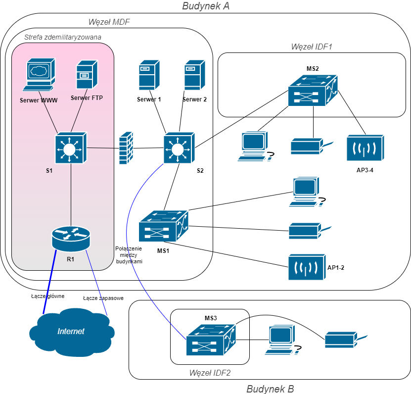

# Technologie Sieciowe 2 - Projekt
*Krzysztof Agieńczuk, 225970*  
*Bartosz Rodziewicz, 226105*

### Terminy oddania etapów:
* Etap 1 - 07.11.2017
* Etap 2 - 05.12.2017
* Etap 3 - 16.01.2018

## Wstęp
Projekt polega na zaprojektowaniu lokalnej sieci komputerowej dla dużego przedsiębiorstwa, w naszym przypadku jest to **Agencja Turystyczna**. W budynkach należących do przedsiębiorstwa zostało zainstalowane okablowanie strukturalne (kat. 6) wraz z niezbędnymi szafami teleinformatycznymi. Przedsiębiorstwo posiada także wszystkie urządzenia końcowe (serwery, drukarki, komputery, kamery IP, itp.), które należy podłączyć do sieci. Zakres projektu obejmuje opracowanie projektu logicznego sieci, projektu VLAN, wybór technologii sieciowej i urządzeń sieciowych oraz podstawową konfigurację urządzeń, tak aby zapewnić prawidłowe i niezawodne działanie sieci.

## Inwentaryzacja zasobów: sprzętu, aplikacji, zasobów ludzkich
### Inwentaryzacja sprzętu
| Liczba komputerów pracowników | Bud. 1 p. 1 | Bud. 1 p. 2 | Bud. 1 p. 3 | Bud. 1 p. 4 | Bud. 2 p. 1 |
| :-: | :-: | :-: | :-: | :-: | :-: |
| Sprzedawcy | 30 | 22 | 43 | 58 | 66 |
| Konsultanci | 53 | 24 | 75 | 9 | 10 |
| Księgowość | 37 | 46 | 63 | 57 | 57 |
| **Liczba drukarek** |
| | 2 |	3 |	1 |	1 |	3 |
| **Liczba punktów dostępowych Wi-Fi** |
| | 0	| 2	| 2 |	0 |	0 |
| **Liczba urządzeń bezprzewodowych** |
| | 0	| 8 |	9 |	0 |	0 |

#### Serwery lokalne
Firma posiada dwa serwery lokalne

#### Punkty dystrybucyjne
| Oznaczenie |	Lokalizacja |	Podłączone punkty abonenckie |
| :-: | :-: | :-: |
| MDF	| Bud. 1, p. 1	| Bud. 1, p. 1 |
| IDF1	| Bud. 1, p. 4	| Bud. 1, p. 2, 3, 4 |
| IDF2 |	Bud. 2, p. 1	| Bud. 2 |

#### Połączenie między budynkami
Firma znajduje się w dwóch budynkach, których odległość od siebie wynosi 274m. Budynki połączone są łączem optycznym wielomodowym.

### Inwentaryzacja aplikacji
Pracownicy będą korzystać z następujących aplikacji:
* Przeglądarka
* Wideokonferencja
* VoIP
* Klient FTP
* Komunikator
* Praca w chmurze
* Poczta

### Inwentaryzacja zasobów ludzkich

| Grupa robocza | Bud. 1 p. 1 | Bud. 1 p. 2 | Bud. 1 p. 3 | Bud. 1 p. 4 | Bud. 2 p. 1 | Razem |
| :-: | :-: | :-: | :-: | :-: | :-: | :-: |
| Sprzedawcy | 30 | 22 | 43 | 58 | 66 | **219** |
| Konsultanci | 53 | 24 | 75 | 9 | 10 | **171** |
| Księgowość | 37 | 46 | 63 | 57 | 57 | **260** |

## Analiza potrzeb użytkowników – wymagania zamawiającego
### Wymagania dot. przepływów pomiędzy pracownikami a serwerami lokalnymi
Transfer do serwerów lokalnych i drukarek (down \ up) [kb/s]

| Grupa rob. / Serwer |	Serwer1 |	Serwer2 |	Drukarka |
| :-: | :-: | :-: | :-: |
| Sprzedawcy |	500\600 |	0\0 |	10\190 |
| Konsultanci |	0\0 |	0\0 |	10\140 |
| Księgowość |	250\900 |	0\0 |	10\120 |
| Wi-Fi |	200\200 |	0\0 |	10\170 |

### Prognozowany ruch do Internetu z posiadanych przez firmę serwerów internetowych
Transfer do\z Internetu na jedną sesję (internautę) [kb/s]

| Serwery internetowe	| Do Internetu	| Z Internetu	| Liczba jednoczesnych sesji |
| :-: | :-: | :-: | :-: |
| Serwer WWW	| 140	| 30	| 44 |
| Serwer FTP	| 380	| 60	| 15 |

### Wymagania dot. przepływów generowanych przez aplikacje użytkownika z\do internetu
Transfer z/do Internetu (down \ up) [kb/s]

| Grupa rob./Aplikacja	| Przeglądarka	|	Wideokonferencja	|	VoIP	|	Klient FTP	|	Komunikator	|	Praca w chmurze	|	Poczta	|
| :-: | :-: | :-: | :-: | :-: | :-: | :-: | :-: |
| Sprzedawcy	|	0\0	|	40\40	|	20\20	|	45\18	|	15\15	|	27\44	|	19\14	|
| Konsultanci	|	0\0	|	40\40	|	20\20	|	51\17	|	15\15	|	25\46	|	23\15	|
| Księgowość	|	0\0	|	40\40	|	20\20	|	0\0	|	15\15	|	0\0	|	22\30	|
| Wi-Fi	|	56\10	|	40\40	|	20\20	|	0\0	|	0\0	|	60\26	|	24\29	|

## Założenia projektowe
1. Projekt zostanie wykonany w technologii GigabitEthernet
1. Zostaną wykonane sieci wirtualne VLAN, w celu ułatwienia komunikacji między pracownikami jednego działu, pracującymi w różnych budynkach
1. Stworzone zostaną 4 punkty dostępowe WiFi, w celu zapewnienia możliwości obsługi bezprzewodowych urządzeń biurowych
1. Infrastruktura zostanie oparta na urządzeniach firmy CISCO, z uwzględnieniem sprzętu będącego już w posiadaniu firmy
1. Oddanie sieci z skonfigurowanymi urządzeniami, gotowymi do użycia
1. Estetyka wykonania projektu - ukrycie kabli pod podłogą, w podwieszonych sufitach i listwach przypodłogowych

## Projekt sieci
### Projekt logiczny sieci wraz z opisem koncepcji rozwiązania i uzasadnieniem

Zaproponowana sieć będzie się składać z 2 przełączników, obsługujących serwery internetowe, lokalne i łączących punkty dostępowe MDF i IDF 1 oraz 2. Firma posiada 2 łącza internetowe, umieszczone na jednym routerze (R1), przy czym drugie z nich jest łączem zapasowym, oferującym 10% przepustowości pierwszego i jest używane tylko w sytuacji awarii głównego łącza.

Jako przełączniki szkieletowe (S1-2) użyte zostaną przełączniki firmy Cisco model Catalyst WS-C3650-24TS, posiadające po 24 porty. Jest to wystarczająco do ich zastosowania. Przełączniki w punktach dostępowych (MS1-3) to, mające po 48 portów, Cisco Catalyst WS-C3650-48TS Gigabit Ethernet, które będą spięte w magistralę, tworząc po jednym dużym przełączniku logicznym w każdym z węzłów. W węźle MDF i IDF2 spięte zostaną 3 przełączniki, a w węźle IDF1 - 7 przełączników. To rozwiązanie udostępni (z odpowiednim zapasem) odpowiednią ilość portów do połączenia odpowiednich grup pracowników VLANami.

Access Pointy podłączone zostaną do grupy przełączników MDF i IDF1, ponieważ mają obsługiwać 1 i 2 piętro budynku nr 1.

### Wybór urządzeń sieciowych

#### Przełączniki:
* Cisco Catalyst WS-C3650-24TS Gigabit Ethernet (x2)
* Cisco Catalyst WS-C3650-48TS Gigabit Ethernet (x13)

#### Router:
* Router Cisco 4451 Gigabit Ethernet (x1)

#### AP:
* Cisco Small Business 500 Series Wireless Access Point (x4)

### Projekt adresacji IP

Sieć zostanie logicznie podzielona na podsieci odpowiadające grupom roboczym i pozostałym zaplanowanym VLAN-om.

Wykorzystana zostanie sieć 192.168.0.0/16, podzielona na podsieci o 23 bitowej masce dla grup roboczych, 24 bitowej dla urządzeń oraz 30 bitowej masce dla sieci punkt-punkt. Adresem bramy domyślnej będzie zawsze pierwszy adres urządzenia dostępny w danej podsieci tj. 192.168.X.1. Adresy urządzeń dostępowych będą przydzielane statycznie. Serwery lokalne, punkty dostępowe WiFi, przełączniki konfigurowalne oraz drukarki otrzymają adresy statyczne: serwer nr 1 – 192.168.10.2, serwer nr 2 – 192.168.10.3, drukarki – 192.168.7.2-192.168.7.12, punkty dostępowe Wi-Fi – 192.168.8.2-192.168.8.6, przełącznik szkieletowy nr 1 – 192.168.X+1.253 (w każdej podsieci/VLAN-ie), przełącznik szkieletowy nr 2 – 192.168.X+1.254 (w każdej podsieci/VLAN-ie), przełączniki dostępowe – 192.168.11.2-192.168.11.4, serwery Internetowe, w strefie DMZ, otrzymają adresy prywatne z puli 192.168.9.0/24 – serwer WWW: 192.168.9.2, serwer FTP: 192.168.9.3. Wybrane usługi tych serwerów zostaną udostępnione publicznie, poprzez przekierowanie ruchu sieciowego na wybranych portach z adresów publicznych przypisanych do routera, na w/w adresy prywatne.

Routing będzie możliwy pomiędzy wszystkimi podsieciami w sieci lokalnej, za wyjątkiem adresów serwerów znajdujących się w strefie DMZ

Wyznacozne przez nas podsieci dzielą się na 3 grupy:
* VLANy konkretnych grup pracowniczych: sprzedawcy, konsultanci, księgowość oraz Wi-Fi  
  (_technicznie nie jest to grupa pracownicza, jednak jest ona przez nas tak traktowana z uwagi na dostęp do innych podsieci_)
* VLANy i LANy dostępu do innych urządzeń: drukarki, serwery internetowe oraz serwery lokalne  
  (dostęp do tych podsieci mają członkowie wszystkich VLAN-ów pracowniczych)
* LANy administracyjne i wymagane do działania sieci

#### Przewidziane są następujące podsieci:
##### VLANy:

**Sprzedawcy** – 219+20% = 262 urządzenia  
VLAN 10 192.168.1.0/23 (brama domyślna: 192.168.1.1)

**Konsultanci** – 171+20%= 205 urządzeń  
VLAN 20 192.168.3.0/23 (brama domyślna: 192.168.3.1)

**Księgowość** – 260+20% = 312 urządzenia  
VLAN 30 192.168.5.0/23 (brama domyślna: 192.168.5.1)

**Drukarki** – 10 drukarek  
VLAN 40 192.168.7.0/24 (brama domyślna: 192.168.7.1)

**Urządzenia bezprzewodowe** (zarówno końcowe jak i dostępowe) – 21 urządzeń  
VLAN 50 192.168.8.0/24 (brama domyślna: 192.168.8.1)

##### LANy:

**Serwery internetowe** w strefie zdemilitaryzowanej – 2 urządzenia  
LAN 10 192.168.9.0/24 (brama domyślna: 192.168.9.1)

**Serwery lokalne** – 2 urządzenia  
LAN 20 192.168.10.0/24 (brama domyślna: 192.168.10.1)

**Przełączniki dostępowe** (dostęp do ich konfiguracji) – 3 grupy urządzeń  
LAN 30 192.168.11.0/24 (brama domyślna: 192.168.11.1)

**Połączenie** między przełącznikiem szkieletowym S1, a routerem  
192.168.12.0/30 (router: 192.168.12.1, przełącznik: 192.168.12.2)

**Połączenie** między przełącznikami szkieletowymi: S1 i S2   
192.168.12.4/30 (router: 192.168.12.5, przełącznik: 192.168.12.6)

**Połączenie** między przełącznikiem logicznym MS1 a przełącznikiem S2  
192.168.12.8/30 (przełącznik1: 192.168.12.9, przełącznik: 192.168.12.10)

**Połączenie** między przełącznikiem logicznym MS2 a przełącznikiem S2  
192.168.12.12/30 (przełącznik1: 192.168.12.13, przełącznik: 192.168.12.14)

**Połączenie** między przełącznikiem logicznym MS3 a przełącznikiem S2  
192.168.12.16/30 (przełącznik1: 192.168.12.17, przełącznik: 192.168.12.18)

### Projekt konfiguracji urządzeń
#### Konfiguracja routera
Do routera doprowadzone są 2 łącza internetowe od dwóch usługodawców. Z uwagi na dużą różnice w ich prędkości (1000/1000 vs 100/100) i bardzo duży zapas na łączu głównym zapewnienie load-balancingu jest zbyteczne. Router zostanie skonfigurowany tak by w momencie wykrycia problemów na głównym łączu automatycznie przełączył się na łącze zapasowe.

#### Konfiguracja serwerów internetowych
Serwery dostępne przez internet znajdują się w sieci lokalnej i dostęp do nich zostaje zapewniony poprzez odpowiednie ustawienie firewalla na switchu S1 wpuszczającego tylko konkretny rodzaj połączeń na odpowiednich portach.

#### Konfiguracja firewalla
Firewall zostanie skonfigurowany na switchu S1, w sposób taki, by przepuszczał tylko konkretne połączenia do serwerów internetowych oraz blokował nieodpowiednie połączenia do reszty sieci.

#### Konfiguracja switchy w konkretnych węzłach
Switche końcowe znajdujące się w węzłach zostaną spięte w magistrale tak by tworzyły jeden duży switch logiczny (MS1-3) i takie magistrale zostaną połączone ze switchem S2 połączeniami typu trunk zapewniając dostęp do VLANów na wszytskich piętrach.

Odpowiednia ilość portów zostanie przypisana do poszczególnych VLANów, a nieużywane porty zostaną wyłączone.

#### Konfiguracja WLANu
W celu zapewnienia bezpieczeństwa, urządzenia bezprzewodowe będą włączone w osobny VLAN, jeden wspólny na całą firmę. Przesył danych będzie chroniony protokołem WPA2-PSK z szyfrowaniem AES. Dodatkowo wprowadzony zostanie wymóg logowania się do sieci unikalnym kontem pracowniczym dla każdego nowego urządzenia podłączonego do sieci (po poprawnym zalogowaniu adres MAC karty urządzenia zostanie zapamiętany i przypisany do danego pracownika).

### Projekt podłączenia do Internetu
#### Analiza użycia łącza
##### Download

| Grupa rob. | Ilość urządz. | Przeglądarka | Wideo konferencja | VoIP | Klient FTP | Komunikator | Praca w chmurze | Poczta |
| :-: | :-: | :-: | :-: | :-: | :-: | :-: | :-: | :-: |
| Sprzedawcy | 219 | 0 | 40 | 20 | 45 | 15 | 27 | 19 |
| Konsultanci | 171 | 0 | 40 | 20 | 51 | 15 | 25 | 23 |
| Księgowość | 260 | 0 | 40 | 20 | 0 | 15 | 0 | 22 |
| WiFi | 17 | 56 | 40 | 20 | 0 | 0 | 60 | 24 |
| Całkowite użycie | - | 952 | 26680 | 13340 | 18576 | 9750 | 11208 | 14222 |

| Serwery internetowe	| Z Internetu	| Liczba jednoczesnych sesji |
| :-: | :-: | :-: |
| Serwer WWW	| 30	| 44 |
| Serwer FTP	| 60	| 15 |

Sumarycznie: 96948 kbps

##### Upload

| Grupa rob. | Ilość urządz. | Przeglądarka | Wideo konferencja | VoIP | Klient FTP | Komunikator | Praca w chmurze | Poczta |
| :-: | :-: | :-: | :-: | :-: | :-: | :-: | :-: | :-: |
| Sprzedawcy | 219 | 0 | 40 | 20 | 18 | 15 | 44 | 14 |
| Konsultanci | 171 | 0 | 40 | 20 | 17 | 15 | 46 | 15 |
| Księgowość | 260 | 0 | 40 | 20 | 0 | 15 | 0 | 30 |
| WiFi | 17 | 10 | 40 | 20 | 0 | 0 | 26 | 29 |
| Całkowite użycie | - | 170 | 26680 | 13340 | 6849 | 9750 | 17944 | 13924 |

| Serwery internetowe	| Do Internetu	| Liczba jednoczesnych sesji |
| :-: | :-: | :-: |
| Serwer WWW	| 140	| 44 |
| Serwer FTP	| 380	| 15 |

Sumarycznie: 100517 kbps

#### Wybór łącza

Prognozowany ruch z Internetu do sieci lokalnej wynosi 94.67 Mb/s (download), zaś z sieci lokalnej do Internetu – 98.16 Mb/s (upload).

Zgodnie z wymaganiami klienta zapewniamy dwa łącza, innych dostawców, w razie gdyby główne łącze dotknęła awaria. Jako podstawowe łącze zostanie wykorzystana usługa firmy Moico sp. z.o.o., która zapewnia symetryczne łącze o prędkości 1 Gbps w cenie 155 złotych miesięcznie przy umowie na 24 miesiące. Jako łącze zapasowe wykorzystana zostanie infrastruktura firmy REDE sp. z.o.o., która dostarczy symetryczne łącze internetowe o prędkości 100 Mbps.

Wybór głównego łącza może wydawać się przesadą, jednak uwzględniając jego cenę, stosunek ceny do innych pakietów u tego dostawcy, jak i u konkurencji, dobrą renomę firmy i niezawodność potwierdzaną przez ich dotychczasowych klientów uznaliśmy, że będzie to najlepszy wybór dla naszej firmy.

Łącze zapasowe posiada bardzo niewielki zapas względem naszych szacunkowych wymagań, jednak z uwagi na to, że będzie ono używane tylko i wyłącznie jako łącze zapasowe powinno wystarczyć.

Oba połączenia są zestawiane przy pomocy technologii Ethernet. Oba łącza zapewniają jest jeden adres IP.

### Analiza bezpieczeństwa i niezawodności sieci

W projekcie wykorzystano adresację prywatną i mechanizmy tłumaczeń NAT PAT – Native Adres Translation Port Adres Translation. Utrudnia to dostęp do sieci z zewnątrz.

Dodatkowo na switchu działa wbudowany firewall, dostarczony przez firmę Cisco. Oprócz tego same urządzenia zostaną zabezpieczone hasłami przed dostępem z terminali. Hasła do plików konfiguracyjnych zostaną zaszyfrowane i będą przechowywane w lokalnej bazie. Dzięki temu ograniczy się możliwość ich wykradzenia przez atak z wykorzystaniem Internetu.

Włączone zostanie zapisywanie (logowanie) zdarzeń, typu próba nieautoryzowanego dostępu do urządzenia. Na wszystkich urządzeniach sieciowych włączone zostaną ostrzeżenia informujące o próbie dokonania nieautoryzowanego dostępu.

Wszystkie punkty dostępowe WiFi zostaną zabezpieczone hasłami, a użytkownicy będą się do nich logować przy pomocy unikalnych loginów dla każdego pracownika. Uniemożliwi to dostęp dla osób postronnych przez sieć bezprzewodową.

Analogicznym działaniem mającym na celu zabezpieczenie sieci Ethernet będzie wyłączenie nieużywanych portów. Na stacjach roboczych zostaną zainstalowane programy antywirusowe.

Dodatkowo, nieprzewidziane  w naszym projekcie, lecz zalecane w dalszej perspektywie jest przeszkolenie pracowników z zakresu niebezpieczeństw sieci i monitoring urządzeń peryferyjnych podłączanych do stacji roboczych.

### Kosztorys

| Nazwa | Ilość | Cena jednostkowa [brutto PLN] | Wartość [brutto PLN] |
| :-: | :-: | :-: | :-: |
| Cisco Catalyst WS-C3650-24TS Gigabit Ethernet | 2 | 10 052.73 | 20105.46 |
| Cisco Catalyst WS-C3650-48TS Gigabit Ethernet | 13 | 18 877.24 | 245404.12 |
| Router Cisco ISR4451-X—VSEC/K9 | 1 | 51 658.52 | 51 658.52 |
| Cisco Small Business WAP 561-E-K9 | 4 | 997.57 | 3990.28 |
| Opłata aktywacyjna - łącze główne | 1 | 99.00 | 99.00 |
| Opłata aktywacyjna - łącze zapasowe | 1 | 199.00 | 199.00 |
| Miesiąc abonamentu - łącze główne | 24 | 155.00 | 3720.00 |
| Miesiąc abonamentu - łącze zapasowe | 24 | 71.00 | 1704.00 |
| **Całość** | | | **326880.38** |

## Karty katalogowe proponowanych urządzeń

| Nazwa | Link |
| :-: | :-: |
| Cisco Catalyst WS-C3650-24TS Gigabit Ethernet | https://www.cisco.com/c/en/us/products/collateral/switches/catalyst-3650-series-switches/datasheet-c78-729449.html |
| Cisco Catalyst WS-C3650-48TS Gigabit Ethernet | https://www.cisco.com/c/en/us/products/collateral/switches/catalyst-3650-series-switches/datasheet-c78-729449.html |
| Router Cisco ISR4451-X—VSEC/K9 | https://www.cisco.com/c/en/us/products/collateral/routers/4000-series-integrated-services-routers-isr/datasheet-c78-732542.html |
| Cisco Small Business WAP 561-E-K9 | https://www.cisco.com/c/en/us/products/collateral/wireless/small-business-500-series-wireless-access-points/data_sheet_c78-727995.html |
