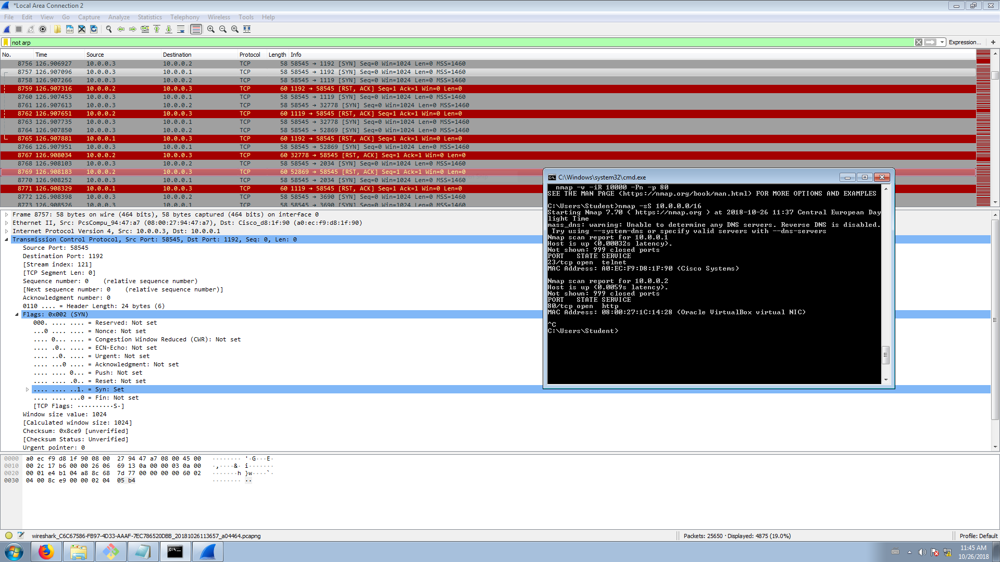

# Wirtualizacja systemów i sieci komputerowych

## Sprawozdanie z laboratorium

Data | Tytuł zajęć | Uczestnicy
:-: | :-: | :-:
26.10.2018 09:15 | Zagrożenia i podatności sieci komputerowych | Iwo Bujkiewicz (226203)<br>Bartosz Rodziewicz (226105)

### Budowa sieci

Połączyliśmy sieć zgodnie z rysunkiem.

Tabela adresacji w sieci:

| Urządzenie | Adres |
| :-: | :-: |
| Router | 10.0.0.1 |
| PC (Linux) | 10.0.0.2 |
| PC (Windows) | 10.0.0.3 |

Niepotrzebnie sieć została stworzona z maską `255.255.0.0`, co utrudniło nam kolejne zadania.

W routerze zostało umożliwione połączenie przez `telnet`. Na komputerze z Linuxem postawiony został serwer WWW - `Apache`.

### `netstat`

Z komputera z Windowsem połączyliśmy się przez `telnet` z routerem oraz z serwerem WWW na komputerze z Linuxem. Wynik polecenia `metstat` widoczny jest na poniższym screenshocie.


```
Active Connections

  Proto  Local Address          Foreign Address        State
  TCP    10.0.0.3:65132         10.0.0.1:telnet        ESTABLISHED
  TCP    10.0.0.3:65134         KSSK4:http             ESTABLISHED
  TCP    127.0.0.1:49190        KSSK:49191             ESTABLISHED
  TCP    127.0.0.1:49191        KSSK:49190             ESTABLISHED
  (...)
```

<!-- W sprawozdaniu opisać znaczenie 3 wybranych wpisów z listy. -->

### Skanowanie sieci za pomocą `nmap`

#### SynScan całej sieci - `nmap -sS 10.0.0.0/16`

Najpierw wykonaliśmy SynScan całej sieci. Skanowanie rozpoczęło się od uzyskania adresów MAC wszystkich hostów w sieci za pomocą pakietów `ARP`.

Po uzyskaniu adresów MAC dostępnych hostów w sieci, komputer wykonujący skanowanie zaczął wysyłać pakiety `SYN` na każdy port znalezionego urządzenia.

Jeśli port był zamknięty to urządzenie zwracało odpowiedź `RST-ACK`

Jeśli port był otwarty otrzymywaliśmy pakiet `SYN-ACK`, po czym my wysyłaliśmy odpowiedź `RST`.


Rozmowa w przypadku zamkniętego portu:
* A: `SYN` - wysyłam zapytanie
* B: `RST-ACK` - dostałem zapytanie, nie nawiązuje połączenia <!-- prosze stad szybko wyjsc -->

Rozmowa w przypadku otwartego portu:
* A: `SYN` - wysyłam zapytanie
* B: `SYN-ACK` - dostałem zapytanie, nawiązuje połączenie
* A: `RST` - rezygnuje z połączenia

#### XmasTreeScan routera - `nmap -sX -p1-65535 10.0.0.1`

Kolejnym skanowaniem było skanowanie sieci za pomocą metody choinkowej. Wysyłaliśmy pakiety `FIN-PSH-URG` na każdy port routera (port 80 na screenach wybrany przykładowo, by pokazać rozmowę).

Gdy port był zamknięty, dostawaliśmy standardową odpowiedź `RST-ACK`.

Dla otwartego portu pakiet powinien zostać zignorowany, jednak `nmap` zwrócił nam informacje, że każdy port na routerze był zamknięty (mimo faktu, że `telnet` został przez nas skonfigurowany i działał).

#### SynScan komputera z linuxem - `nmap -sS -p T:21-25,80,443,2137,8080,27015 10.0.0.2`

Ostatnim naszym skanowaniem był SynScan na komputer z postawionym serwerem `http`. Skanowaliśmy tylko kilka wybranych przez nas portów.

Zasada działania była identyczna, jak wyżej.

`nmap` zwrócił nam ładne podsumowanie:
```
Starting Nmap 7.70 ( https://nmap.org ) at 2018-10-26 11:55 Central European Day
light Time
mass_dns: warning: Unable to determine any DNS servers. Reverse DNS is disabled.
 Try using --system-dns or specify valid servers with --dns-servers
Nmap scan report for 10.0.0.2
Host is up (0.00s latency).

PORT      STATE  SERVICE
21/tcp    closed ftp
22/tcp    closed ssh
23/tcp    closed telnet
24/tcp    closed priv-mail
25/tcp    closed smtp
80/tcp    open   http
443/tcp   closed https
2137/tcp  closed connect
8080/tcp  closed http-proxy
27015/tcp closed unknown
MAC Address: 08:00:27:1C:14:28 (Oracle VirtualBox virtual NIC)

Nmap done: 1 IP address (1 host up) scanned in 2.00 seconds
```

### ARP Poisoning

Kolejnym zadaniem było wykonanie udanego ataku typu ARP Poisoning w celu przechwycenia komunikacji drugiego komputera z routerem za pomocą `telnet`.

Przed przystąpieniem do ataku sprawdziliśmy, że switch blokuje możliwość podsłuchu.


Do ataku wykorzystany został program `Cain & Abel`.

Wynik ataku wraz z przechwyconą treścią rozmowy (brak treści w środku spowodowany za wczesnym wyłączeniem `Caina` - przed pokazaniem efektów prowadzącemu).


Przykładowy przechwycony pakiet:


Dodatkowo przechwyciliśmy pakiety pingu, wysłane z routera na adres komputera.


Aby dokonać analizy pakietów użytych do zatrucia tabeli ART trzeba spojrzeć na adresy MAC kart sieciowych:

| Urządzenie | MAC |
| :-: | :-: |
| Router | A0:EC:F9:D8:1F:90 |
| Linux | 08:00:27:1C:14:28 |
| Windows | 08:00:27:94:47:A7 |

Atak polega na przechwyceniu komunikacji Linuxa z rooterem. Ataku dokonuje Windows.

Pierwszy pakiet zostaje wysłany na adres MAC Linuxa z zapytaniem, kto ma adres IP Linuxa i z prośbą o zwrot na adres IP routera, ale MAC Windowsa.

Odpowiedź na niego zgodnie z planem jest wysłana na adres MAC Windowsa. Wtedy Linux zapisuje sobie w tabeli ARP, że `10.0.0.1` (router) znajduje się pod adresem MAC Windowsa.

Następny pakiet zostaje wysłany na adres MAC routera z pytaniem, kto ma IP routera, z prośbą o odpowiedź na adres IP Linuxa, ale MAC Windowsa.

Odpowiedź, przychodzi na adres MAC, wtedy router zapisuje sobie, że Linux znajduje się pod adresem Windowsa.


### Łamanie haseł

Z uwagi na brak czasu na zajęciach nie udało nam się zrealizować tego punktu.
