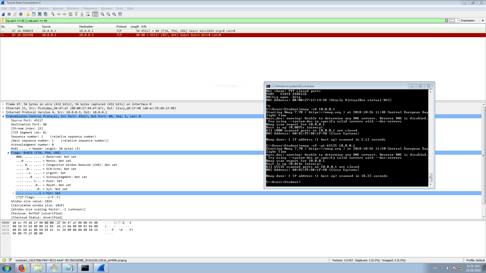

# Bezpieczeństwo sieci komputerowych

## Sprawozdanie z laboratorium

Data | Tytuł zajęć | Uczestnicy
:-: | :-: | :-:
26.10.2018 10:15 | Zagrożenia i podatności sieci komputerowych | Iwo Bujkiewicz (226203)<br />Bartosz Rodziewicz (226105)

### Budowa sieci

Sieć połączono zgodnie z rysunkiem.

Tabela adresacji w sieci:

| Urządzenie | Adres IPv4 |
| :-: | :-: |
| Router | `10.0.0.1/16` |
| PC (Linux) | `10.0.0.2/16` |
| PC (Windows) | `10.0.0.3/16` |

Sieć została niepotrzebnie zaadresowana z maską `255.255.0.0`, co utrudniło nam kolejne zadania.

Umożliwiono łączenie się z CLI routera poprzez Telnet. Na komputerze z Linuxem uruchomiony został serwer WWW Apache 2.

<div class="page-break"></div>

### Netstat

Z komputera z Windowsem połączono się przez Telnet z routerem, oraz, przez przeglądarkę internetową, z serwerem WWW na komputerze z Linuxem. Rezultaty, a także wynik polecenia `netstat`, widoczne są poniżej.


```
Active Connections

  Proto  Local Address          Foreign Address        State
  TCP    10.0.0.3:65132         10.0.0.1:telnet        ESTABLISHED
  TCP    10.0.0.3:65134         KSSK4:http             ESTABLISHED
  TCP    127.0.0.1:49190        KSSK:49191             ESTABLISHED
  TCP    127.0.0.1:49191        KSSK:49190             ESTABLISHED
  (...)
```

Analizując wybrane wpisy:

*	```
	TCP    10.0.0.3:65132         10.0.0.1:telnet        ESTABLISHED
	```
	Otwarte zostało połączenie TCP z lokalnego portu 65132 do portu Telnet (23) routera.
*	```
	TCP    10.0.0.3:65134         KSSK4:http             ESTABLISHED
	```
	Otwarte zostało połączenie TCP z lokalnego portu 65134 do portu HTTP (80) komputera z serwerem WWW.

<div class="page-break"></div>

### Skanowanie sieci za pomocą Nmap

#### SYN scan podsieci - `nmap -sS 10.0.0.0/16`

Najpierw wykonano _SYN scan_ całej ustanowionej podsieci. Skanowanie rozpoczęło się od uzyskania adresów MAC wszystkich hostów w sieci za pomocą pakietów ARP.


Po uzyskaniu adresów MAC dostępnych hostów w sieci, komputer wykonujący skanowanie zaczął wysyłać pakiety `SYN` na każdy port znalezionego urządzenia.


<div class="page-break"></div>

Dla każdego zamkniętego portu urządzenie zwróciło odpowiedź `RST ACK`.


Dla każdego otwartego portu otrzymano pakiet z flagami `SYN ACK`. Komputer inicjujący połączenie wysyłał następnie odpowiedź `RST`.


<div class="page-break"></div>

Rozmowa w przypadku zamkniętego portu:
* A: `SYN` - rozpoczynam próbę połączenia
* B: `RST ACK` - otrzymałem, odmawiam połączenia <!-- prosze stad szybko wyjsc -->

Rozmowa w przypadku otwartego portu:
* A: `SYN` - rozpoczynam próbę połączenia
* B: `SYN ACK` - otrzymałem, gotów do połączenia
* A: `RST` - zamykam połączenie

#### Xmas tree scan routera - `nmap -sX -p1-65535 10.0.0.1`

Kolejnym skanowaniem było skanowanie sieci za pomocą metody choinkowej. Wysłano pakiet `FIN PSH URG` na każdy port routera (port 80 na zrzutach ekranu został wybrany przykładowo, by pokazać rozmowę).



<div class="page-break"></div>

Dla każdego zamkniętego portu otrzymano standardową odpowiedź `RST ACK`.


Dla otwartego portu pakiet powinien zostać zignorowany, jednak `nmap` zwrócił informację, że każdy port na routerze był zamknięty (mimo faktu, że serwer `telnet` został skonfigurowany i port 23 był otwarty).

#### SYN scan komputera z Linuxem - `nmap -sS -p T:21-25,80,443,2137,8080,27015 10.0.0.2`

Ostatnim skanowaniem był _SYN scan_ komputera z uruchomionym serwerem HTTP, ograniczony do wybranej grupy portów.

Zasada działania była identyczna, jak w przypadku pierwszego _SYN scana_.

`nmap` zwrócił poniższe podsumowanie skanowania.

```
Starting Nmap 7.70 ( https://nmap.org ) at 2018-10-26 11:55 Central European Day
light Time
mass_dns: warning: Unable to determine any DNS servers. Reverse DNS is disabled.
 Try using --system-dns or specify valid servers with --dns-servers
Nmap scan report for 10.0.0.2
Host is up (0.00s latency).

PORT      STATE  SERVICE
21/tcp    closed ftp
22/tcp    closed ssh
23/tcp    closed telnet
24/tcp    closed priv-mail
25/tcp    closed smtp
80/tcp    open   http
443/tcp   closed https
2137/tcp  closed connect
8080/tcp  closed http-proxy
27015/tcp closed unknown
MAC Address: 08:00:27:1C:14:28 (Oracle VirtualBox virtual NIC)

Nmap done: 1 IP address (1 host up) scanned in 2.00 seconds
```

<div class="page-break"></div>

### ARP poisoning

Kolejnym zadaniem było wykonanie skutecznego ataku typu _ARP poisoning_ w celu przechwycenia komunikacji Telnet drugiego komputera z routerem.

Przed przystąpieniem do ataku zweryfikowano, że switch nie przekazuje ramek przeznaczonych dla konkretnego, znanego urządzenia do innych urządzeń.


Do ataku wykorzystany został program Cain & Abel.

Wynik ataku wraz z przechwyconą treścią rozmowy <!--(brak treści w środku spowodowany zbyt wczesnym wyłączeniem `Cain`a - przed pokazaniem efektów prowadzącemu)--> udokumentowany został poniżej.


_Udany atak_


_Przykładowy przechwycony pakiet_

Dodatkowo przechwycono pakiety `ping` wysłane z routera na adres komputera.


Aby dokonać analizy pakietów użytych do 'zatrucia' tabeli ARP, należy spojrzeć na adresy MAC kart sieciowych:

| Urządzenie | Adres MAC |
| :-: | :-: |
| Router | `A0:EC:F9:D8:1F:90` |
| PC (Linux) | `08:00:27:1C:14:28` |
| PC (Windows) | `08:00:27:94:47:A7` |

Atak polegał na przechwyceniu komunikacji pomiędzy komputerem z Linuxem i routerem. Ataku dokonywał komputer z Windowsem.

Pierwszy pakiet był wysyłany na adres komputera z Linuxem z zapytaniem, kto zna adres MAC dla jego adresu IP, oraz prośbą o informację zwrotną na adres MAC komputera z Windowsem, ale podpisany adresem IP routera.


Zgodnie z planem, odpowiedź na to zapytanie wysyłana była na adres MAC komputera z Windowsem. Ufając danym o źródle zapytania, komputer z Linuxem zapisywał w swojej tabeli ARP, że adres IP routera (`10.0.0.1`) dostępny jest również pod adresem MAC komputera z Windowsem.


<div class="page-break"></div>

Następnie na adres routera wysyłane było zapytanie ARP o adres MAC dla jego adresu IP, z prośbą o odpowiedź na adres MAC komputera z Windowsem, ale podpisany adresem IP komputera z Linuxem.


Router zapisywał w swojej tabeli ARP, że adres IP komputera z Linuxem (`10.0.0.2`) dostępny jest również pod adresem MAC komputera z Windowsem.


