# Bezpieczeństwo sieci komputerowych

## Sprawozdanie z laboratorium

Data | Tytuł zajęć | Uczestnicy
:-: | :-: | :-:
26.10.2018 09:15 | Kryptografia | Igor Bejnarowicz (218573)<br>Bartosz Rodziewicz (226105)

### Przebieg laboratorium

#### 2. Generacja 3 par kluczy
Oboje wygenerowaliśmy trzy pary kluczy:


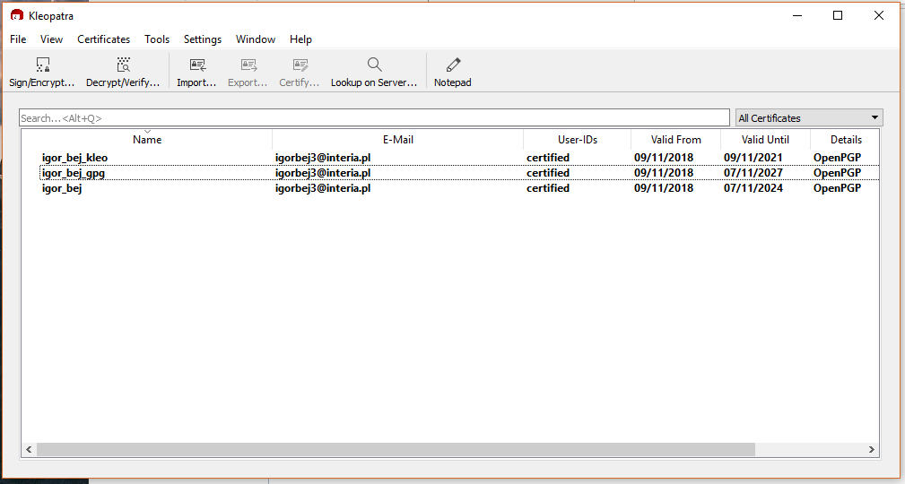

<div class="page-break">

#### 3. Klucze publiczne
Wyeksportowaliśmy klucze do plików tekstowych. Odciski kluczy są następujące:

| Osoba | Odcisk |
| :-: | :-: |
| Igor | 4BE1CA5D520DD702D9CB30283F5BE433401C1FDC |
| Bartosz | 9E4DBBA1772805EA45A6F77719FF00DCEB26EB88 |


#### 4. Serwer kluczy
Oboje wysłaliśmy nasze klucze na serwer kluczy `pgp.mit.edu`.

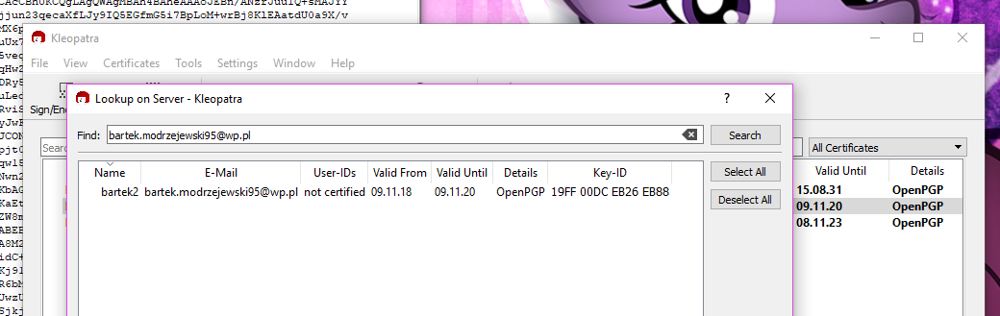

#### 5. Wzajemne podpisanie kluczy
Poprzez serwer kluczy wymieniliśmy się naszymi kluczami i wzajemnie je sobie podpisaliśmy.


#### 6. Podpisanie małego pliku
Utworzyliśmy plik o nazwie `smallfile.txt` o treści:
```
Bejnarowicz, Rodziewicz
09.11; 22:54
```

<div class="page-break">

Został on podpisany z poziomu konsoli:

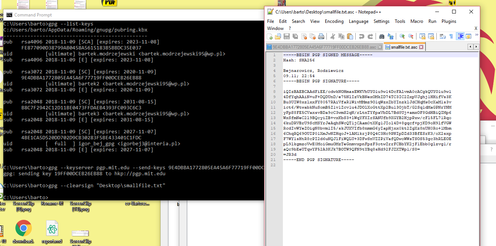

i sprawdzona jego poprawność z poziomu Kleopatry:

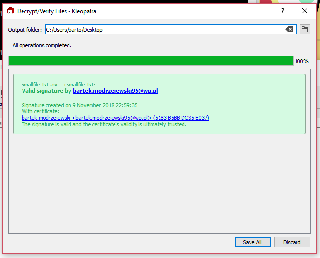

<div class="page-break">

#### 7. Podpisanie pliku binarnego

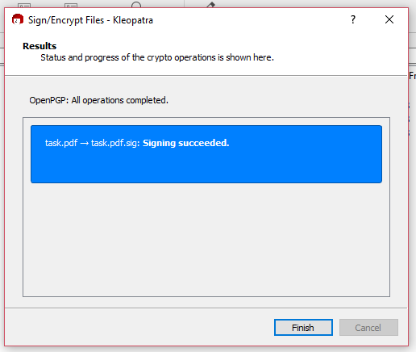

#### 8. Zaszyfrowanie pliku z Kleopatry, odszyfrowanie z konsoli
Użyta komenda:
```
gpg --decrypt-files task.pdf.gpg
```

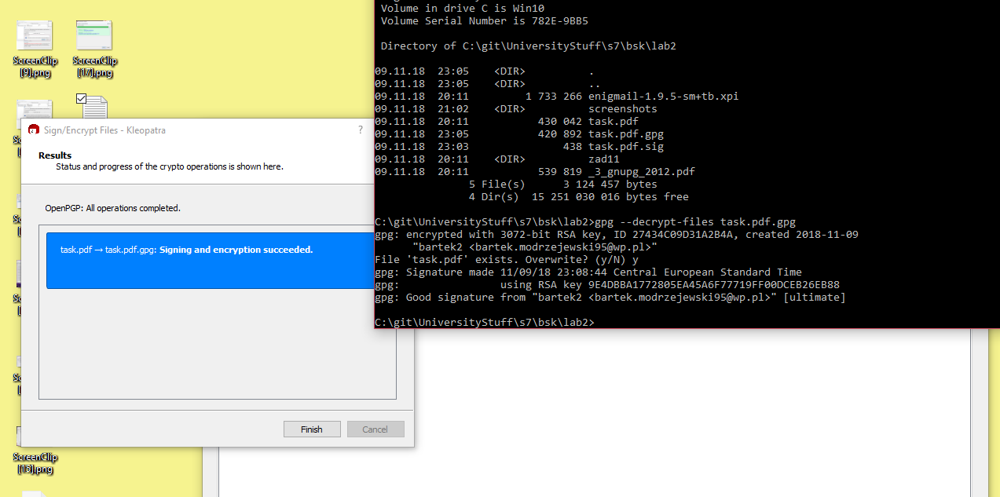

<div class="page-break">

#### 9. Zaszyfrowanie pliku z konsoli, odszyfrowanie z Kleopatry
Użyta komenda:
```
gpg --recipient bartek2 --output _3_gnupg_2012.pdf.gpg --encrypt _3_gnupg_2012.pdf
```

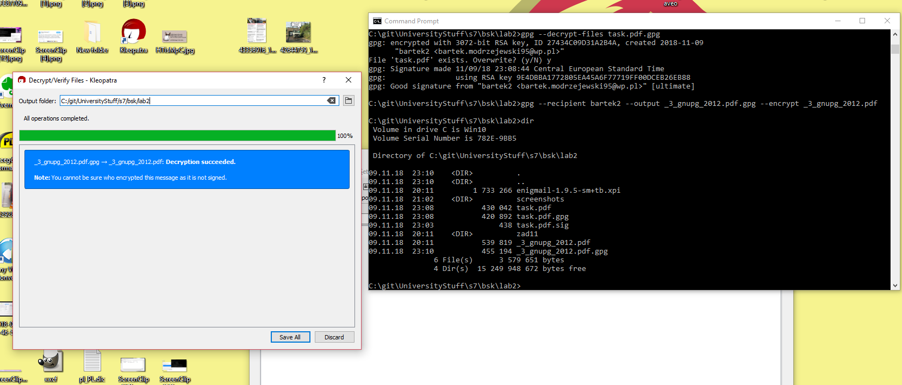

#### 11. Ukryte zadanie
Poprawnym zadaniem było zadanie nr 5.


Jego treść to:
```
Zapisać do pliku tekstowego imiona członków grupy.
Plik zaszyfrować za pomocą gpg algorytmem AES192 (tylko symetrycznym) z kluczem 'LABORKA'.
Obliczyć sumę kontrolną SHA-1 pliku (Kleopatra).
Komendy gpg, treść pliku przed i po zaszyfrowaniu oraz sumę kontrolną umieścić w sprawozdaniu.
```

Stworzony został plik o nazwie `imiona.txt`, z treścią `Igor Bartosz`.

Plik został zaszyfrowany komendą:
```
gpg --recipient "Marcin Markowski" --cipher-algo aes192 --encrypt imiona.txt
```

Nie zrozumieliśmy co znaczy, że mamy użyć kluczu `LABORKA`.

Po zaszyfrowaniu treść pliku to:
```
…¿|˜ô|« —µ)HQ&œ/sþ
´ä@*Û­ÊÖÛDBE>õpŠ‘x1»çëoêu\F?H.¨RþZ
ü¤ù×@s€%¾´Ø¥éjT¬.cAòØÞ´ÒöÒå¦ïs"^û¢Ü	Î]G…¨GâæVÁ~ñžàEöàìÞ`)èôŠ¾ è¨“½¶}Þ·<Í{´Žòx|ÎdµDbÝÓΝû¢)+²Âðˆ“Q
`Ð3	Öá&…£ 1µAÞ”B]	©¶S¶{¨§ÈRÆ)+È;,Î9íG¨JVürµ#˜Ð…3‚ `óÚ!“\W^«²£ßeØì«^IZõå|¿Ë1â@â›ÒQÀ^ÛdÐw=¦!Ÿ˜e\üKh„âea/šp6®+«:U,ËjT\(,0£"§ óó{HA–DU²}Á¼6d¯p\\o„U›G<0ã
```

Suma kontrolna SHA-1: `55f24a0a2ae41f1d68085396f3eb3070`.

#### 12. Zaszyfrowane maile
Przesłaliśmy sobie wzajemnie maile. Aby zachowana była zgodność kluczy potrzebna była zmiana domyślnego klucza w Thunderbirdzie. Przed odszyfrowaniem mail wygląda następująco:


Po odszyfrowaniu wyświetla się wiadomość, że mail jest zaufany:

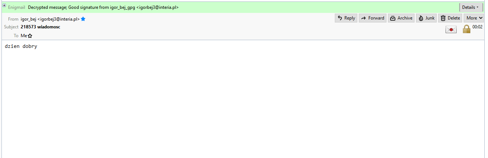


#### 13. Porównanie szyfrowania
Domyślnym algorytmem szyfrowania jest `AES-128` (w `gpg` od wersji 2.1).
Poniżej znajduje się porównanie plików zaszyfrowanych `AES-192`, `3DES` i `TWOFISH`.
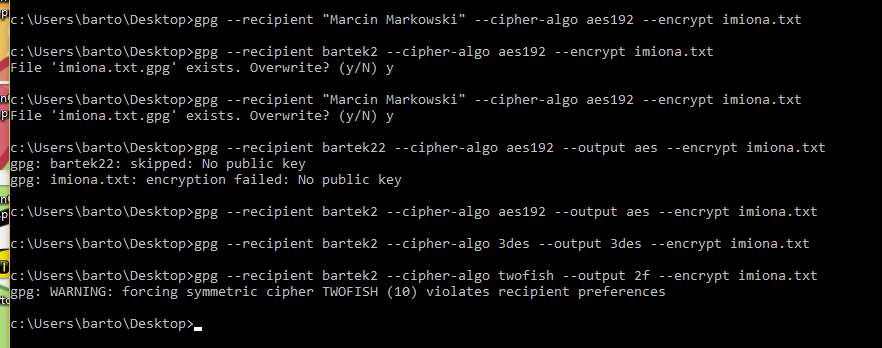
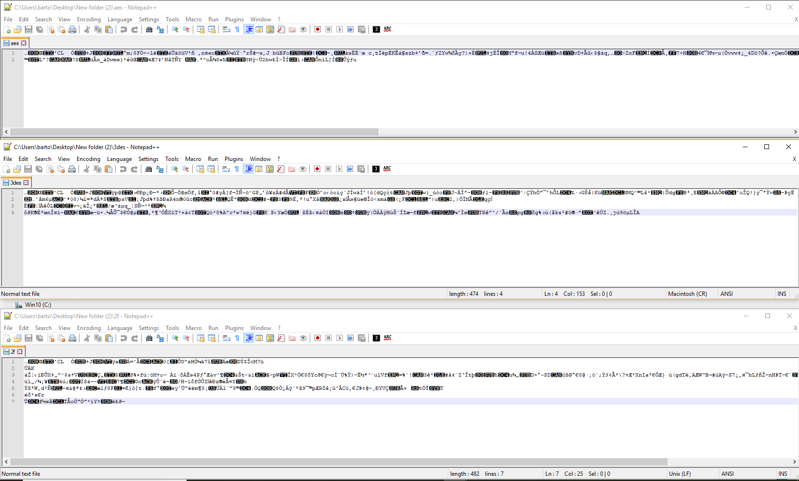
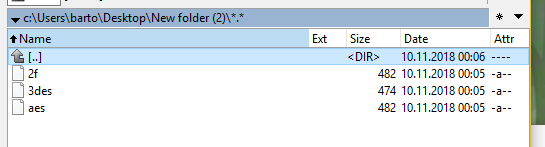
