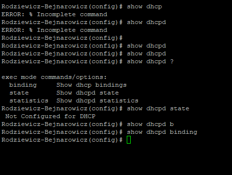
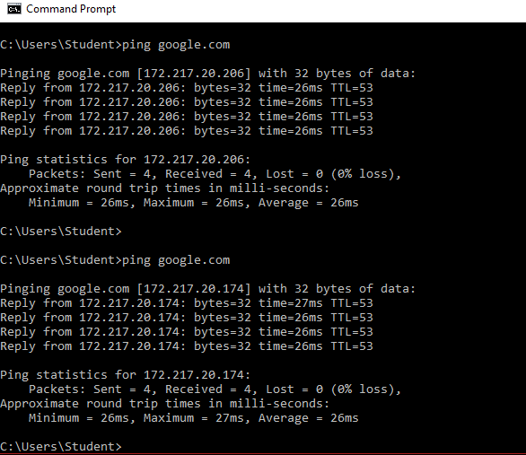
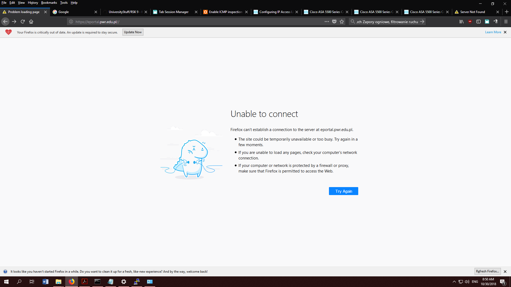

# Bezpieczeństwo sieci komputerowych

## Sprawozdanie z laboratorium

Data | Tytuł zajęć | Uczestnicy
:-: | :-: | :-:
30.10.2018 09:15 | Zapory ogniowe, filtrowanie ruchu | Igor Bejnarowicz (218573)<br>Bartosz Rodziewicz (226105)

### Przebieg laboratorium

Zadanie laboratoryjne udało nam się zrealizować w bardzo ograniczonym zakresie z uwagi na kilka naszych niedopatrzeń. Najpierw mieliśmy problem z niedoczytaniem, że należy zaporę zresetować do ustawień domyślnych, a następnie, że mieliśmy problem z kartą sieciową w Windowsie/maszynie wirtualnej.

Po rozwiązaniu problemu z brakiem domyślnej konfiguracji, połączyliśmy się z czystą zaporą i zapoznaliśmy się z domyślną konfiguracją.

Zapora posiada 8 portów, z czego 7 jest przypisanych do `Vlan1`, o nazwie `inside` (są to porty `e0/1`-`e0/7`) o poziomie bezpieczeństwa `100`, jeden port jest przypisany do `Vlan2`, o nazwie `outside`, poziomie bezpieczeństwa `0` i jest to port `e0/0`.


Z uwagi na taką konfigurację VLanów sieć laboratoryjna została podłączona do portu `e0/0`, a nasze komputery `e0/1` i `e0/2`.

DHCP na zaporze nie jest domyślnie aktywowane, nasze komputery dostały adres od serwera DHCP w pracowni.



Powyższe screenshoty pokazują, że zmieniliśmy nazwę naszej zapory na nasze nazwiska.

Aby jednak nasze komputery otrzymały adres i zaczęło działać nam połączenie internetowe wymagane było zrestartowanie karty sieciowej w Windowsie (znalezienie tego zabrało nam cały pozostały czas po tym jak zresetowaliśmy naszą zaporę, co uniemożliwiło nam wykonanie ćwiczenia).

Po restarcie karty sieciowej działało nam połączenie internetowe, serwer DNS (`nslookup`), nie działał `ping`, ani `tracert`.

`ping` i `trecert` nie działał, ponieważ zapora domyślnie blokuje powracające odpowiedzi `ICMP`.

Działanie pingów aktywowaliśmy za pomocą komend:
```
(config)# policy-map global_policy
(config-pmap)# class inspection_default
(config-pmap-c)# inspect icmp
```
Pingi działały, jednak `tracert` zachowywał się dziwnie.


Blokadę e-portalu i połączeń FTP uzyskaliśmy za pomocą listy ACL:
```
access-list acl_out; 3 elements; name hash: 0x4af10e18
access-list acl_out line 1 extended deny tcp any host 156.17.70.219 (hitcnt=0) 0x330d2669
access-list acl_out line 2 extended deny tcp any any eq ftp (hitcnt=0) 0x4b6342a3
access-list acl_out line 3 extended permit ip any any (hitcnt=0) 0xd85c9d2a
```

Stworzyliśmy ją następująco:
```
(config)# access-list acl_out extended deny tcp any host 156.17.70.219
(config)# access-list acl_out extended deny tcp any any eq ftp
(config)# access-list acl_out extended permit ip any any
```

Założona została przez nas na interfejs `Vlan2`, czyli `outside` w kierunku wyjściowym za pomocą komendy:
```
(config)# access-group acl_out out interface outside
```

Działanie blokady pokazuje poniższy screenshot (inne karty z innymi stronami są załadowane):


Działanie listy ACL zostało zgłoszone prowadzącemu.

Kolejnych punktów instrukcji nie udało nam się zrealizować z powodu zmarnowania czasu na wcześniej wspomniane problemy.
