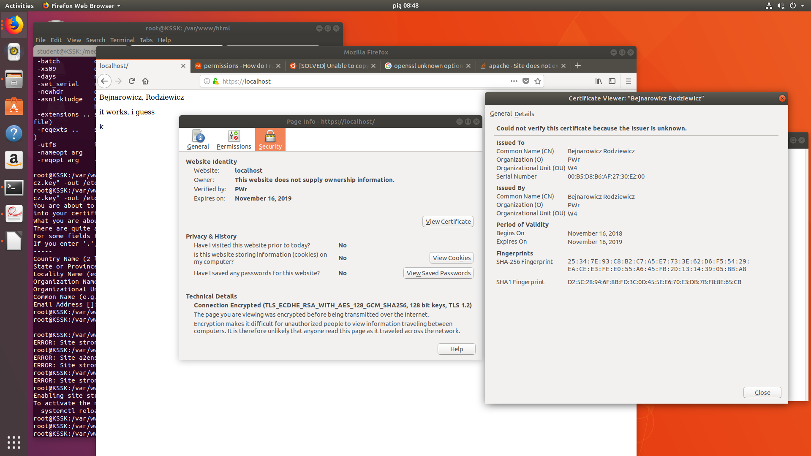
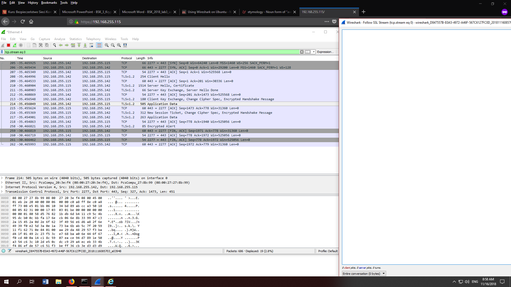
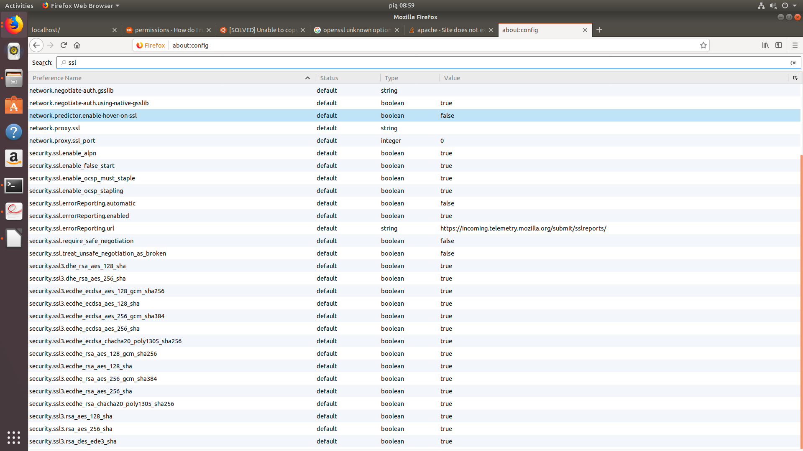
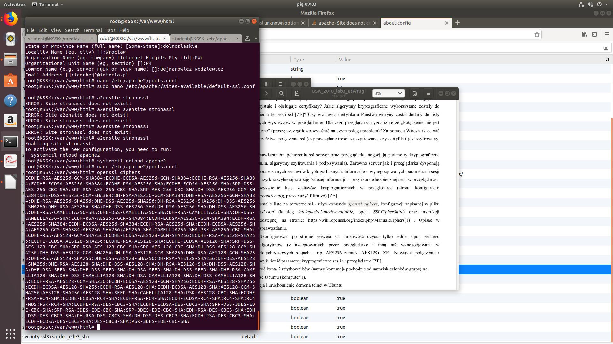
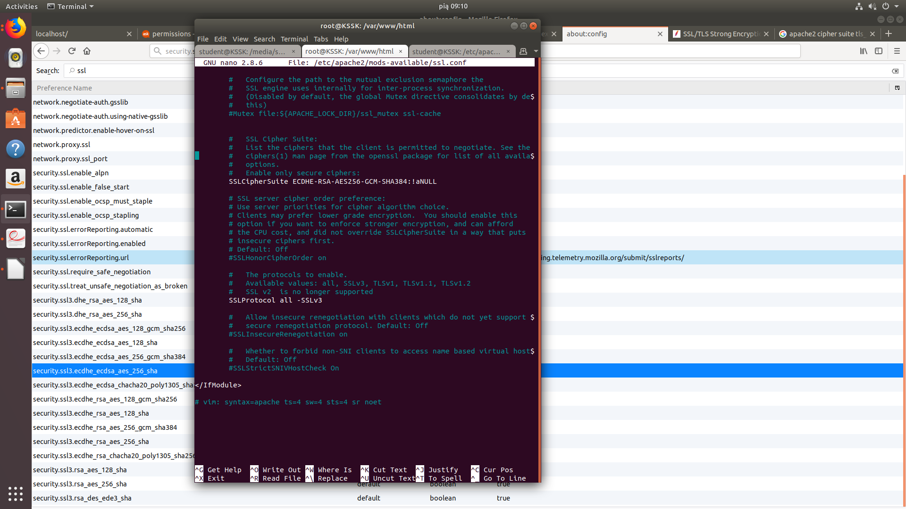
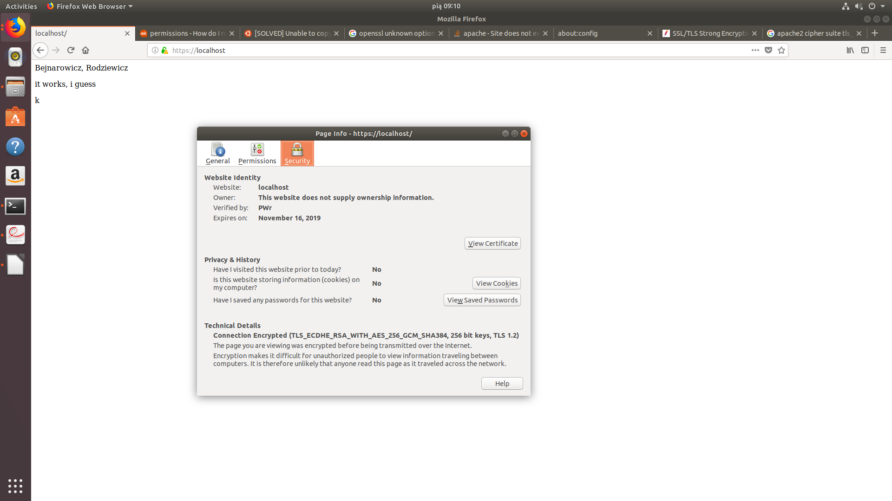
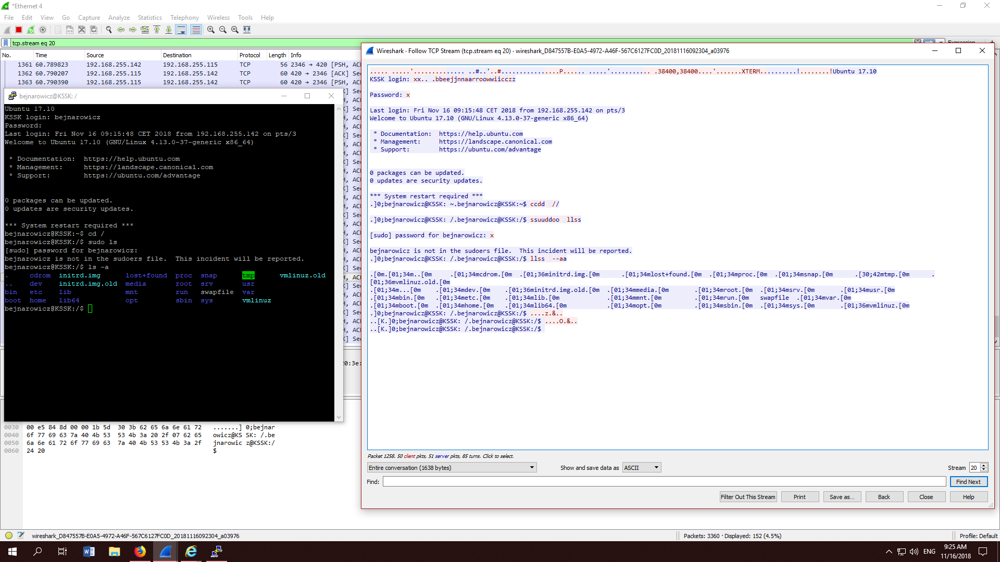
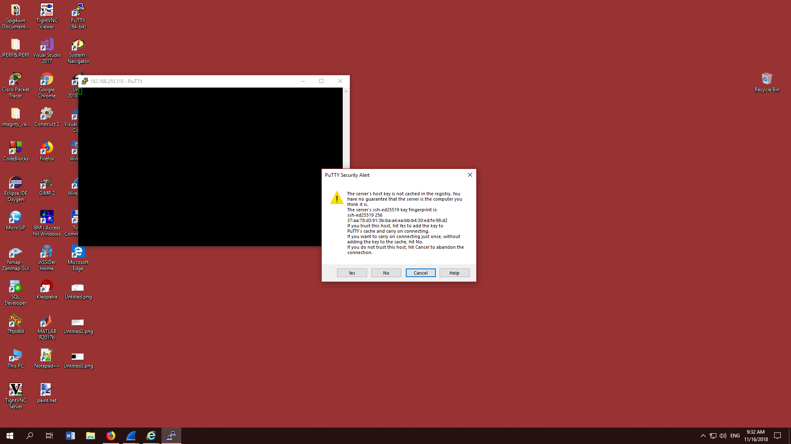
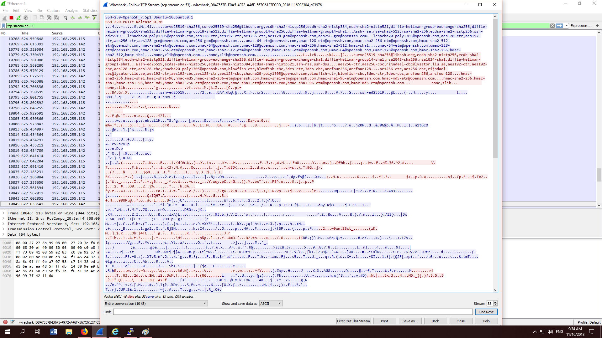

# Bezpieczeństwo sieci komputerowych

## Sprawozdanie z laboratorium

Data | Tytuł zajęć | Uczestnicy
:-: | :-: | :-:
16.11.2018 09:15 | Bezpieczne usługi sieciowe, wirtualne sieci prywatne | Igor Bejnarowicz (218573) Bartosz Rodziewicz (226105)

### 1. Postawienie serwera WWW
Pierwszym zadaniem było postawienie serwera WWW na komputerze z Linuxem. Po zainstalowaniu pakietu `apache2` i przygotowaniu prostej strony sprawdziliśmy, że serwer działa.

Za pomocą drugiego komputera sprawdziliśmy połączenie z tym serwerem i jego bezpieczeństwo za pomocą Wiresharka.

Na screenshocie wyżej widać, że za pomocą Wiresharka byliśmy w stanie przechwycić całą komunikację wraz z treścią dokumentu HTML.

### 2. Konfiguracja protokołu SSL
Zgodnie z krokami w instrukcji wykonaliśmy podstawową konfigurację pakietu `openssl`. Po wykonaniu tych kroków i dodaniu do adresu w przeglądarce przedrostka `https://` udało nam się nawiązać szyfrowane połączenie z serwerem. Fakt ten oczywiście został zgłoszony prowadzącemu.

### 3. Szczegóły certyfikatu
Powyższy screenshot poza nawiązaniem bezpiecznego połączenia pokazuje również szczegóły certyfikatu.

#### Jakie algorytmy kryptograficzne wykorzystane zostały do zestawienia tej sesji ssl?
Widać to na powyższym screenshocie - jest to algorytm `TSL_ECDHE_RSA_WITH_AES_128_GCM_SHA256`.

#### Czy wystawca certyfikatu Państwa witryny został dodany do listy zaufanych wystawców w przeglądarce?
Wystawcą naszego certyfikatu jesteśmy my sami (`--self-signed`), więc ten wystawca nie mógł być na liście zaufanych wystawców. Konieczne było dodanie wyjątku, aby przeglądarka pozwoliła na połączenie.

#### Dlaczego przeglądarka sygnalizuje że „Połączenie nie jest bezpieczne” (proszę szczegółowo wyjaśnić na czym polega problem)?
Tak jak napisałem wyżej - nasz certyfikat został wystawiony bezpośrednio przez nas. W związku z tym przeglądarka nie jest pewna, kto ten nasz certyfikat wystawił i nie wie, czy można ufać co do jego autentyczności. Inaczej mówiąc, taki certyfikat zapewnia poufność połączenia, ale nie zapewnia uwierzytelnienia serwera.

Aby to było możliwe przeglądarka musi wiedzieć, że klucz prywatny użyty do podpisania certyfikatu należy do kogoś, komu można ufać i nie podpisze on certyfikatu dla naszej domeny tak po prostu, byle komu. Do ustalenia tego służy łańcuch zaufania (chain of trust) – potrzebny nam certyfikat jest podpisywany za pomocą jakiegoś klucza, dla którego też został wystawiony certyfikat i też został on podpisany za pomocą jakiegoś klucza. Takich poziomów w górę może być wiele, ale ważne jest, że w końcu na samej górze znajdzie się certyfikat jakiegoś urzędu certyfikacji (Certificate Authority) podpisany samodzielnie. Każda przeglądarka ma bazę takich certyfikatów najwyższego poziomu (tzw. root CA), których wystawcom ufa. Jeżeli używany przez nas certyfikat odwołuje się w końcu do jednego z nich, przeglądarka uzna połączenie za bezpieczne. W naszym przypadku łańcuch zaufania składa się oczywiście tylko z jednego poziomu (self-signed).

#### Za pomocą Wireshark ocenić bezpieczeństwo połączenia ssl (czy przesyłane treści są szyfrowane, czy certyfikat jest szyfrowany, itp.).
Po nawiązaniu połączenia przesyłany jest certyfikat (w formie jawnej, jednak to nie jest problem ponieważ zawiera tylko klucz publiczny) i od tego momentu nawiązane jest szyfrowane połączenie. Sama treść przesyłana jest w formie szyfrowanej.

### 4.1. Zestawy algorytmów obsługiwane przez Firefoxa i `openssl`
Firefox obsługuje następujące algorytmy:

`OpenSSL` obsługuje następujące algorytmy:

### 4.2. Zmiana algorytmu połączenia z serwerem
Za pomocą edycji pliku `ssl.conf` zmieniliśmy wartość pola `SSLCipherSuite` z `HIGH:!aNULL` na `ECDHE-RSA-AES256-GCM-SHA384:!aNULL` co wymusiło na przeglądarce używanie algorytmu `AES256`.

### 5. Stworzenie kont użytkowników w Ubuntu
Na Komputerze 1 stworzyliśmy dwa konta użytkowników.

### 6. Instalacja i połączenie telnet
Deamon `telnet` został zainstalowany na komputerze 1. Połączyliśmy się na standardowy port (23) i połączenie przeszło. Zmieniliśmy port na własny (420) i również połączenie się udało. Analizując pakiety w Wiresharku widać, że połączenie w żaden sposób nie jest zabezpieczone i łatwe do przechwycenia, wraz z hasłami.

### 7. Połączenie ssh
Na komputerze 1 zainstalowaliśmy ssh. Port został zmieniony na 2137. Zmieniliśmy również baner powitalny i ilość dopuszczalnych błędnych logowań.

Połączenie z komputera 2 się powiodło. Potwierdzić autentyczność można weryfikując fingerprint klucza. Przy połączeniu wyświetla się on w komunikacie na komputerze z którego się łączy. Na komputerze do którego się łączy należy użyć komendy ` ssh-keygen -l -E md5 -f SCIEZKA_DO_KLUCZA`.

Sprawdzając połączenie w Wiresharku widać, że jest ono szyfrowane:

### 8. Tunelowanie ssh
Na wykonanie tego punktu zabrakło nam czasu.
