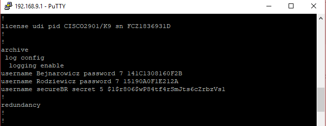

# Bezpieczeństwo sieci komputerowych

## Sprawozdanie z laboratorium

Data | Tytuł zajęć | Uczestnicy
:-: | :-: | :-:
04.12.2018 09:15 | Bezpieczeństwo infrastruktury sieciowej | Igor Bejnarowicz (218573)<br>Bartosz Rodziewicz (226105)

### 1. Bezpieczeństwo przełączników
Zgodnie z poleceniem podłączyliśmy komputery do przełącznika i skonfigurowaliśmy dla jednego portu podane zabezpieczenia.

Z uwagi na problemy z adresami MAC za zgodą prowadzącego ustawiliśmy 2 dozwolone adresy - przy jednym adresie MAC zaraz po ustawieniu zabezpieczeń i wpięciu do niego jednego z komputerów port się wyłączał z komunikatem o przekroczonej liczbie adresów MAC. Wydaje nam się, że było to spowodowane, że Windows na komputerze był maszyną wirtualną i na switchu pojawiał się adres fizycznej i wirtualnej karty sieciowej.

Przy dwóch adresach, po podłączeniu pierwszego komputera wszystko działało w porządku. Konfiguracja wygląda następująco:
```
S09#show port-security address
               Secure Mac Address Table
-----------------------------------------------------------------------------
Vlan    Mac Address       Type                          Ports   Remaining Age
                                                                   (mins)
----    -----------       ----                          -----   -------------
   1    bc5f.f41b.60b6    SecureSticky                  Fa0/4        -
-----------------------------------------------------------------------------
Total Addresses in System (excluding one mac per port)     : 0
Max Addresses limit in System (excluding one mac per port) : 8192
S09#show port-security interface f0/4
Port Security              : Enabled
Port Status                : Secure-up
Violation Mode             : Shutdown
Aging Time                 : 0 mins
Aging Type                 : Absolute
SecureStatic Address Aging : Disabled
Maximum MAC Addresses      : 2
Total MAC Addresses        : 2
Configured MAC Addresses   : 0
Sticky MAC Addresses       : 2
Last Source Address:Vlan   : 0800.2779.8d17:1
Security Violation Count   : 0
```

Po podłączeniu drugiego komputera switch blokuje port:


```
*Mar  1 00:57:08.222: %LINEPROTO-5-UPDOWN: Line protocol on Interface Vlan1, changed state to down
*Mar  1 00:57:09.220: %LINEPROTO-5-UPDOWN: Line protocol on Interface FastEthernet0/4, changed state to down
*Mar  1 00:57:10.227: %LINK-3-UPDOWN: Interface FastEthernet0/4, changed state to down
*Mar  1 00:57:13.213: %LINK-3-UPDOWN: Interface FastEthernet0/4, changed state to up
*Mar  1 00:57:14.220: %LINEPROTO-5-UPDOWN: Line protocol on Interface FastEthernet0/4, changed state to up
*Mar  1 00:57:27.071: %PM-4-ERR_DISABLE: psecure-violation error detected on Fa0/4, putting Fa0/4 in err-disable state
*Mar  1 00:57:27.071: %PORT_SECURITY-2-PSECURE_VIOLATION: Security violation occurred, caused by MAC address bc5f.f41b.60b0 on port FastEthernet0/4.
*Mar  1 00:57:28.078: %LINEPROTO-5-UPDOWN: Line protocol on Interface FastEthernet0/4, changed state to down
*Mar  1 00:57:29.076: %LINK-3-UPDOWN: Interface FastEthernet0/4, changed state to down
```

Po zablokowaniu konfiguracja wygląda następująco:
```
S09#show port-security address
               Secure Mac Address Table
-----------------------------------------------------------------------------
Vlan    Mac Address       Type                          Ports   Remaining Age
                                                                   (mins)
----    -----------       ----                          -----   -------------
   1    0800.2779.8d17    SecureSticky                  Fa0/4        -
   1    bc5f.f41b.60b6    SecureSticky                  Fa0/4        -
-----------------------------------------------------------------------------
Total Addresses in System (excluding one mac per port)     : 1
Max Addresses limit in System (excluding one mac per port) : 8192
S09#show port-security interface f0/4
Port Security              : Enabled
Port Status                : Secure-shutdown
Violation Mode             : Shutdown
Aging Time                 : 0 mins
Aging Type                 : Absolute
SecureStatic Address Aging : Disabled
Maximum MAC Addresses      : 2
Total MAC Addresses        : 2
Configured MAC Addresses   : 0
Sticky MAC Addresses       : 2
Last Source Address:Vlan   : bc5f.f41b.60b0:1
Security Violation Count   : 1
```

### 2. Dostęp do routera
Skonfigurowaliśmy router zgodnie z poleceniem.

Hasła przy domyślnej konfiguracji przechowywane są w plain-text'cie:


Po włączeniu szyfrowania haseł hasła zaszyfrowane zostają algorytmem Type 7, co uniemożliwia ich podejrzenie:


Nasłuch połączenia telnet, również jest bardzo łatwy:


Następnie wyłączyliśmy możliwość dostępu przez telnet i włączyliśmy ssh. Stworzony został nowy użytkownik z hasłem zabezpieczonym MD5:



Następnie połączyliśmy się przez ssh i spróbowaliśmy podejrzeć rozmowę przez Wiresharka. Oczywiście było to nie możliwe i Wireshark wyświetlił nam ciągi losowych znaków:


### 3. Bezpieczeństwo routingu
Zgodnie z poleceniem podłączyliśmy się do wspólnej sieci laboratoryjnej.

Uruchomiliśmy RIP na routerze i dodaliśmy następujące sieci:
```
192.168.9.0
10.10.15.0
```

>  Czy router otrzymuje informacje o trasie do sieci `172.16.16`, oraz o trasach do innych podsieci `192.168`?

Nie, router nie otrzymał tras do żadnej innej podsieci.

> Czy możliwa jest komunikacja komputerów z serwerem?

Nie.

Włączyliśmy podsłuchiwanie pakietów RIP przez Wiresharka i otrzymaliśmy ich sporo:


Następnie interfejs, do którego podłączony był nasz switch, ustawiliśmy jako passive-interface, dzięki czemu router przestał wysyłać pakiety rip do naszych komputerów:


Następnie włączyliśmy podpisywanie pakietów routingu (z hasłem podanym w instrukcji), dzięki czemu otrzymaliśmy trasy do sieci `172.16.16.0` oraz innych podsieci `192.168.0.0`.


Komunikacja z serwerem była możliwa:


### 4. Wyłączanie nieużywanych usług
Polecenie `auto secure` omyłkowo wydaliśmy na samym początku konfiguracji routera. Po rozmowie z prowadzącym ustaliliśmy, że mamy ominąć ten punkt.

### 5. Atak na słabe hasła
Próbowaliśmy podjeść do tego punktu jednak, nie byliśmy w stanie zrozumieć działania polecenia `finger`. Straciliśmy na tym z 20 minut i wtedy skończyły się zajęcia.
