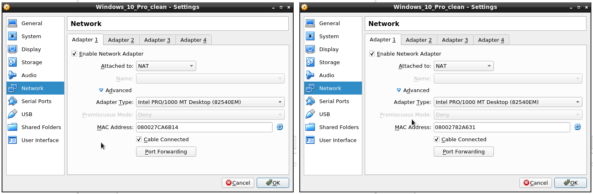
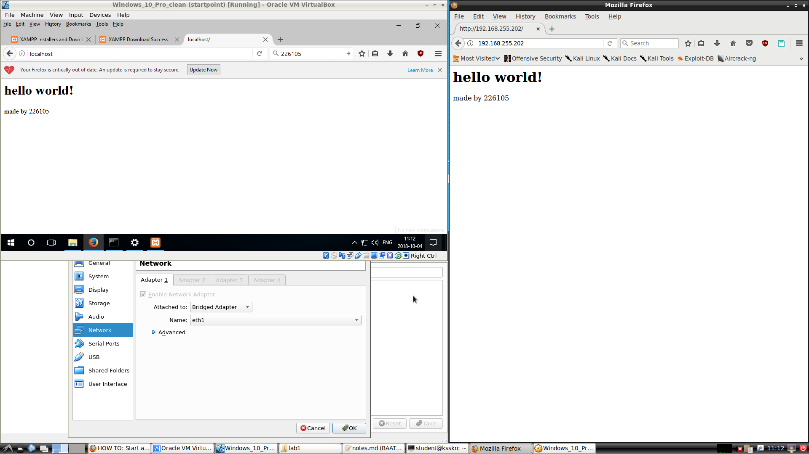
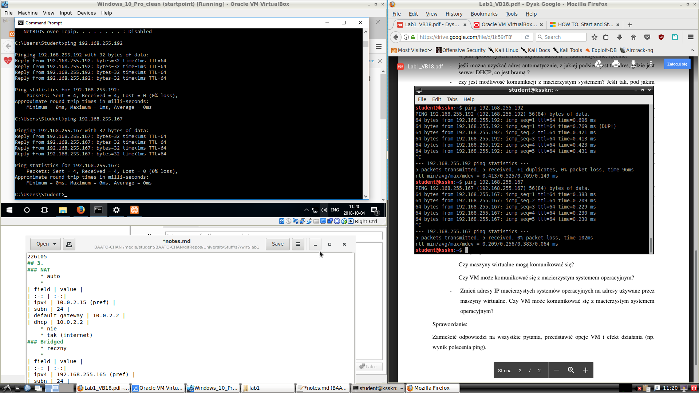
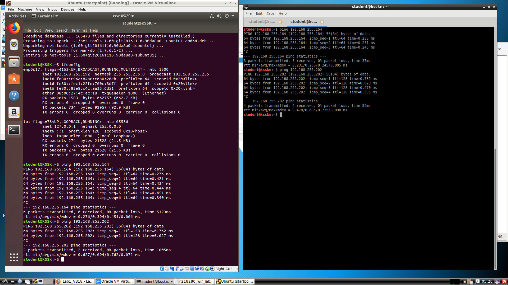

# Wirtualizacja systemów i sieci komputerowych

## Sprawozdanie z laboratorium

Data | Tytuł zajęć | Uczestnicy
:-: | :-: | :-:
04.10.2018 09:15 | Praca z maszyną wirtualną | Bartosz Rodziewicz (226105) <!--TODO: uzupelnic imie i nazwisko--> (218280)

### 2. Zmienić adres sprzętowy maszyny

Adres MAC wirtualnej karty sieciowej został zmieniony, co widać na poniższym screenshocie.

### 3. Porównanie różnych metod konfiguracji wirtualnej karty sieciowej

Attached to | Sposób uzyskania adresu IP | Parametry adresu jeśli auto | Komunikacja host <-> VM | komunikacja VM <-> Internet
:-: | :-: | :-: | :-: | :-:
NAT | auto | IP: 10.0.2.15 Brama: 10.0.2.2 Serwerem DHCP i bramą jest VirtualBox | nie | tak
Bridged adapter | auto | IP: 192.168.255.202 Brama: 192.168.255.254 Serwerem DHCP i bramą są odpowiednie urządzenia z sieci do której jest podłączony host | tak IP: 192.168.255.164 | tak
Internal Network | zależy od konfiguracji, domyślnie ręcznie, możliwość włączenia DHCP w VBox | N/A | nie | nie

Nie udało nam się przetestować trybu host-only - nie byliśmy w stanie utworzyć interfejsu sieciowego do połączeń host-only na hoście. Wydaje nam się, że wynikało to z braku uprawnień.

### 4. Połączenie host <-> VM

Wykonanie tego punktu polegało na postawieniu serwera WWW na VM, konfigurację karty VM i połączenie z poziomu hosta.

Jako serwer WWW wybraliśmy open sourcowy serwer Apache w wersji XAMPP (z uwagi na prostotę instalacji i konfiguracji pod Windowsem).

Konfiguracja karty VM polegała na ustawieniu trybu bridged. Resztę zrobił za nas DHCP z sieci laboratoryjnej.

Maszyna wirtualna znajdowała się pod adresem `192.168.255.202`.

Poprawne połączenie z napisaną na szybko "stroną" widać na poniższym screenshocie.

### 5. Połączenie VM@host0 <-> VM@host1

Ten punkt sprawił nam pewne trudności - nie byliśmy w stanie do końca zrozumieć polecenia.

Zrozumieliśmy, że należy na jednym komputerze (nazywamy go `host0`) uruchomić VM z Windowsem, na drugim (`host1`) VM z Ubuntu i nawiązać pomiędzy nimi połączenie.

Karty sieciowe w VM w obu przypadkach były ustawione w trybie bridged. Adresy w sieci prezentowały się następująco:

System | Adres IP
:-: | :-:
`host0` | 192.168.255.164
VM@`host0` | 192.168.255.202
`host1` | 192.168.255.167
VM@`host1` | 192.168.255.192

Pozytywne połączenia ping widać poniżej:

Nie mamy screenshota pingów pomiędzy hostem a VM, ale udowodniliśmy działanie tego połączenia w pkt. 4, a od tego czasu konfiguracja sieci nie uległa zmianie.

Problem sprawiło nam zrozumienie pierwszego założenia o ręcznym ustawieniu adresów - nie wiedzieliśmy czym jest sieć VM.

Dodatkowo niemożliwym było zrealizowanie drugiego założenia o zmianie adresu IP hostów na adresy używane przez VMy, z uwagi na brak uprawnień.
