### Zadanie 1 - Tworzenie i konfiguracja maszyny wirutalnej
Udało nam się poprawnie utworzyć maszynę wirutalną przy pomocy dostarczonego pliku, który mieliśmy zaimportować oraz ustawić w odpowiedni sposób parametry maszyny.
### 1.3 - Statystyki zużycia
W programie Virtual Machine Manager włączyliśmy raportowanie o zużyciu dysku, sieci i pamięci RAM (zużycie CPU jest domyślnie ustawione) dodatkowo możliwe jest wybranie okresu czasu aktualizowania raportu.

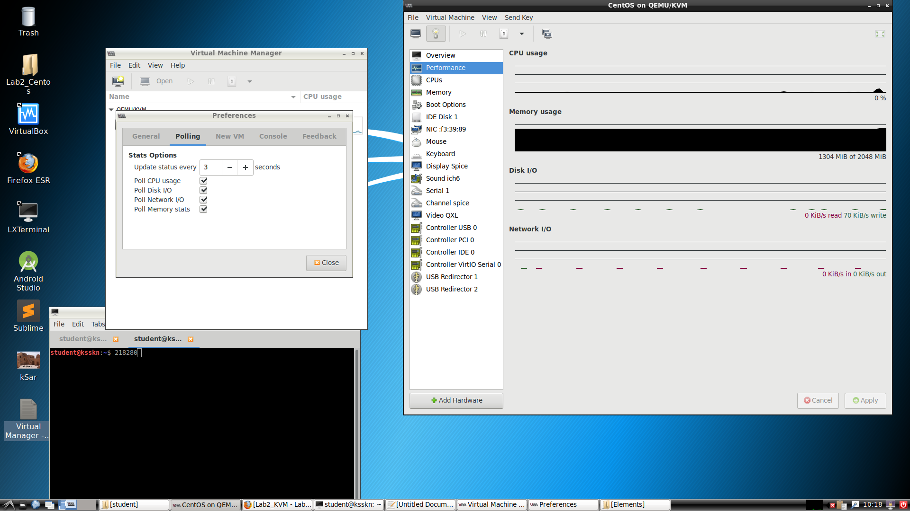

### 1.4 - Alokacja zasobów procesora
Na wirtualnej maszynie, po wejściu w ustawienia i przejściu do zakładki CPUs możliwe jest "dokładniejsze" zarządzanie procesorem. Można ręcznie zmienić ilość rdzeni lub wątków (oczywiście zależy to od architektury danego procesora)

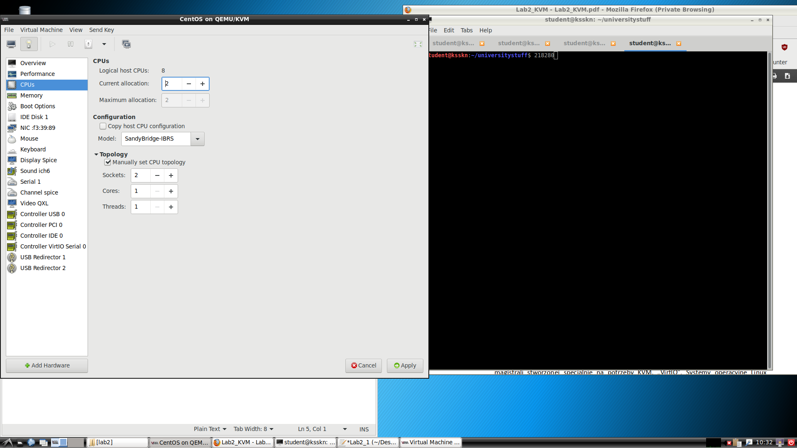

### 1.7 - Ustawienia karty sieciowej
Zmieniając ustawienia karty sieciowej testowaliśmy możliwości połączenia przy zastosowaniu sieci nat oraz interfejsu fizycznego hosta.
#### Sieć NAT
* Dostęp do sieci : TAK
* Ping do Kali Linux : TAK

Dostęp do sieci
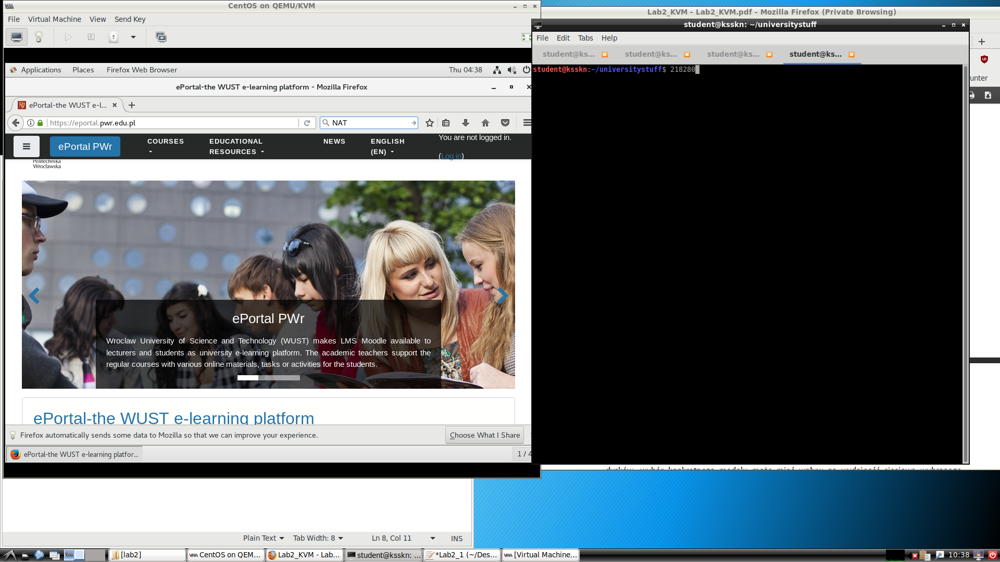

#### Interfejs fizyczny hosta
* Dostęp do sieci : TAK
* Ping do Kali Linux : NIE

Dostęp do sieci
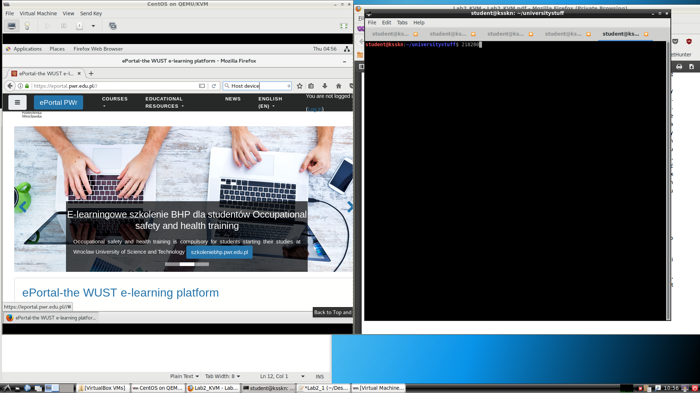

Konfiguracja
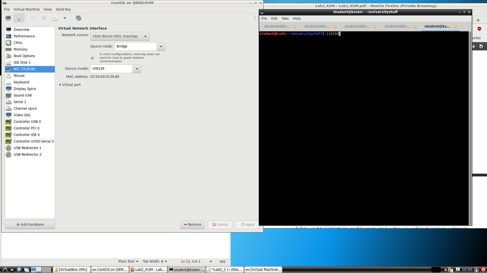

### 1.8 - Dodanie nowego dysku
Udało się nam poprawnie dodać dysk dla maszyny wirtualnej. Do listowania dostępnych dysków użyliśmy polecenia "lsblk".

Przed dodaniem dysku
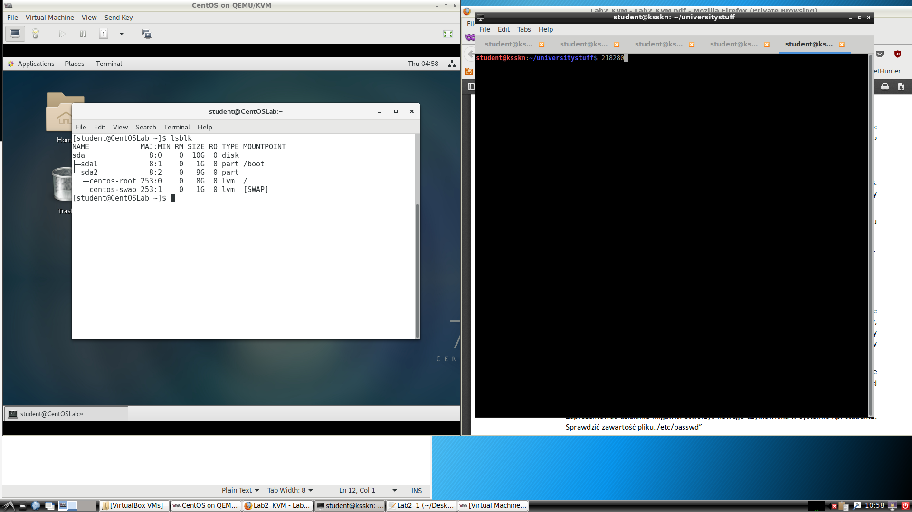

Po dadaniu dysku
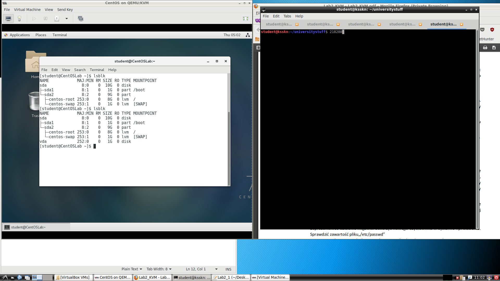

Jak widać na ostatniej pozycji pojawił nam się utworzony dysk (vda)

### Snapshoty
Utworzyliśmy nowego użytkownika przy pomocy komendy "useradd" o nazwie "student2". 
Można zauważyć, że w pliku passwd (ścieżka /etc/passwd) znajduje się dodany użytkownik. 
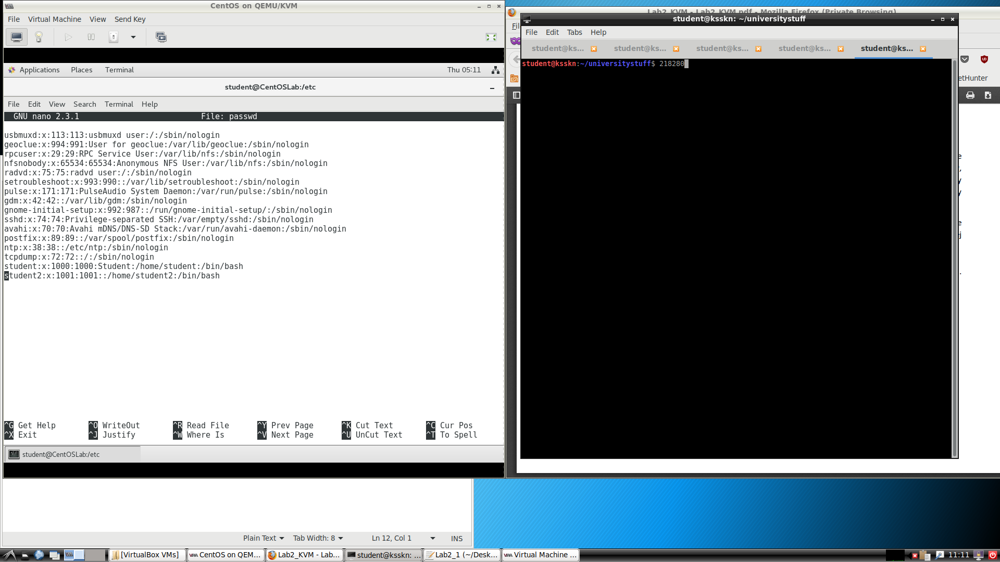

Następnie zrobiliśmy migawkę systemu
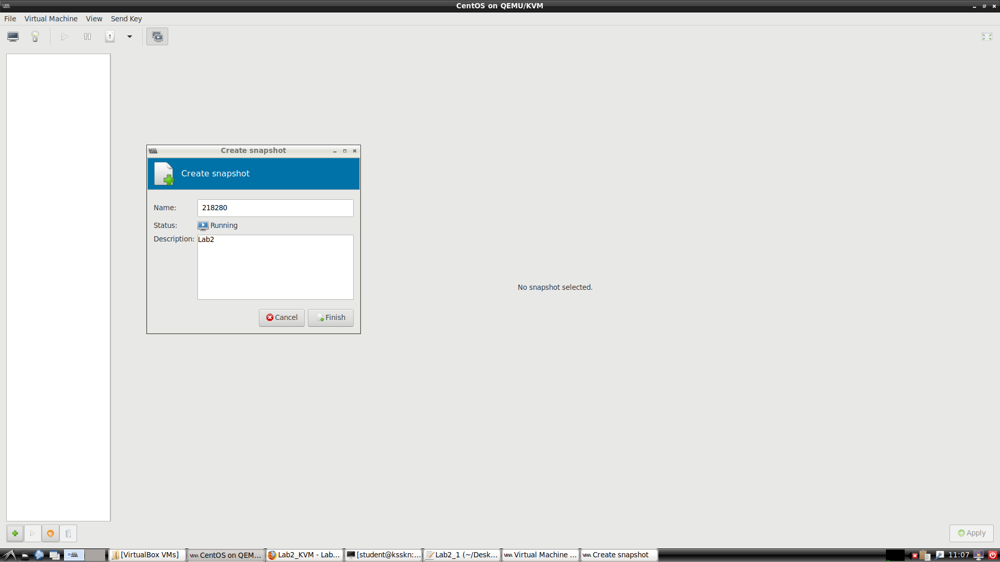

Po przywróceniu systemu z utworzonej migawki użytkownik "student2" nie znajduje się w pliku passwd.
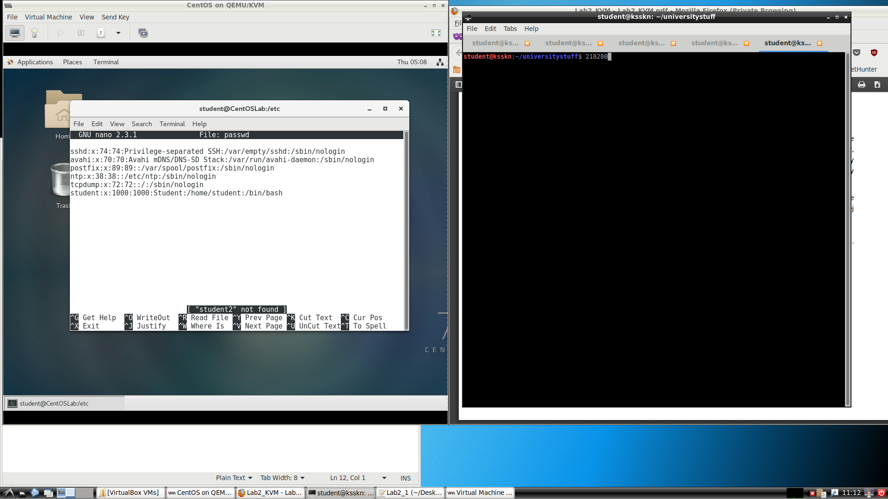

### Zadanie 2 - Badanie kosztów środowiska z maszynami wirtualnymi

#### Obciążenie hosta poprzez maszyny wirtualne

Obciążenie procesora hosta przy pojedynczej maszynie widać na poniższym screenie.

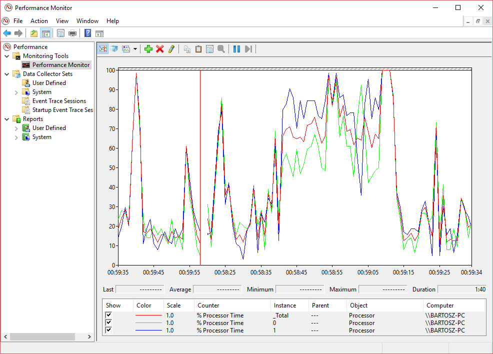

Wynik dla dwóch maszyn wygląda następująco.

#### Wykonanie testów
Instrukcja do tego ćwiczenia bardzo nieprecyzyjnie opisywała scenariusz testów. Z jednej strony zachęcani byliśmy do testowania na KVM, jednak do KVM nie mieliśmy przygotowanych maszyn z Windowsem. Z drugiej instrukcja była pisana tak jakby była przygotowana pod Windowsa jako system hosta. Dodatkowo nie mieliśmy podanych żadnych narzędzi benchmarkowych, które działają jednocześnie pod Linuxem i pod Windowsem, a więc dane z takich testów byłyby niemożliwe do porównania. To wszystko

Scenariusz na który się zdecydowaliśmy to wykonanie kilku testów w domu na naszych prywatnych komputerach.

Narzędziem służącym do obsługi wirtualnych maszyn był VirtualBox. Narzędziem benchmarkowym y-cruncher. W każdym wypadku wykonywaliśmy jeden i taki sam test - dziesięciokrotne liczenie 50 milionów cyfr rozwinięcia dziesiętnego liczby pi.

#### Omówienie wyników

W sprawozdaniu nie załączamy wszystkich wyników, a jedynie przetworzone na procentowe dane na wykresach. Prezentują się one następująco.

Na wynikach zauważana jest tendencja, że Linux jest lżejszym systemem przez co lepiej radzi sobie przy emulacji.

Natomiast jeśli chodzi o dość znaczy spadek mocy w komputerze drugim wydaje mi się, że wynika to z różnic pomiędzy tymi dwoma komputerami.

Pierwszy PC posiada dwurdzeniowy, dwu wątkowy procesor o taktowaniu 4.2GHz. Drugi natomiast posiada 4 rdzeniowy, 8 wątkowy procesor, ale o taktowaniu tylko 2.4GHz. Wydaje mi się, że y-cruncher radzi sobie o wiele lepiej z rozłożeniem obliczeń na wiele wątków, niż VirtualBox, który musi rozłożyć całą maszynę.
