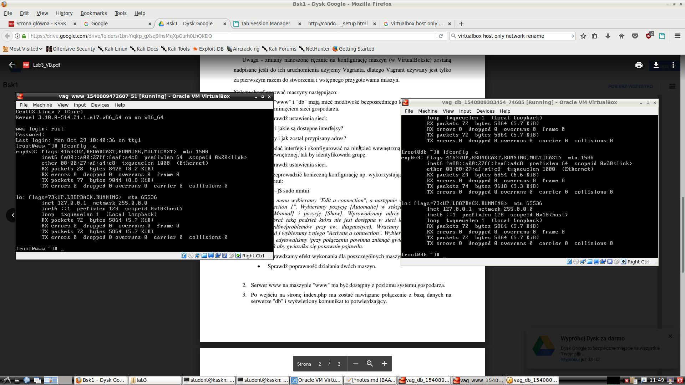
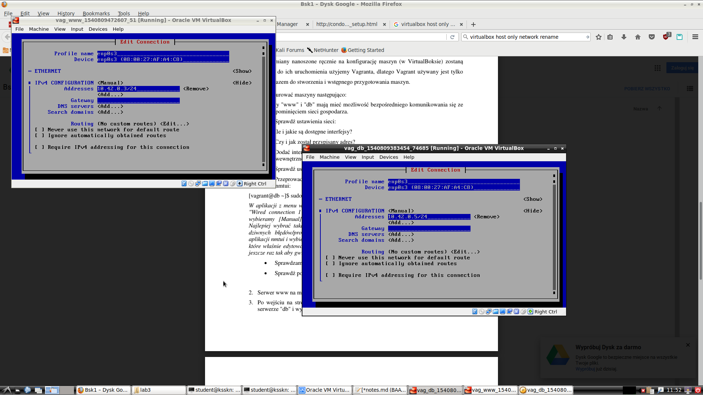
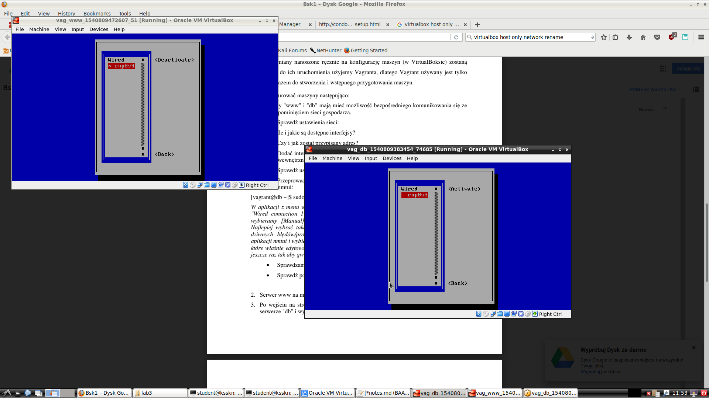
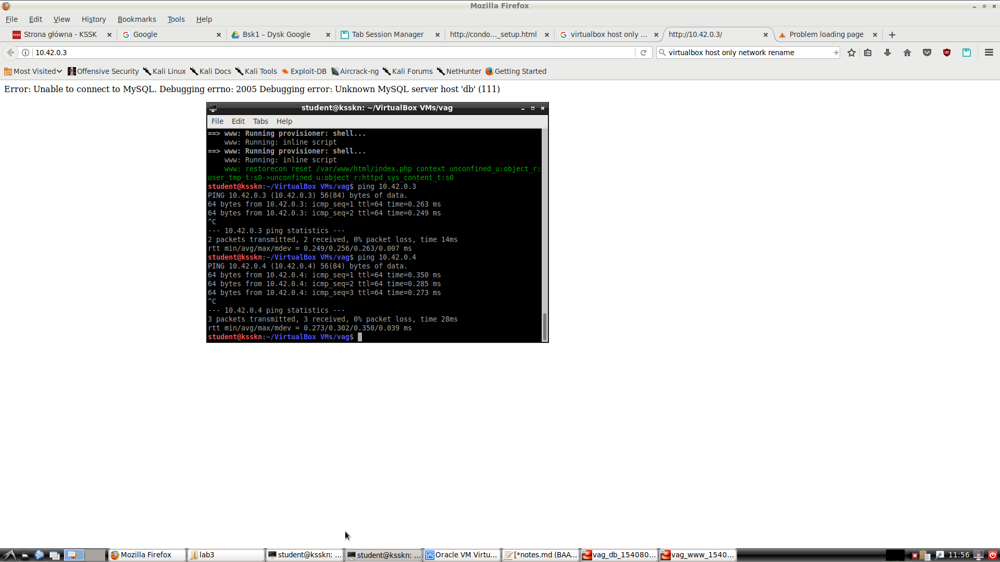
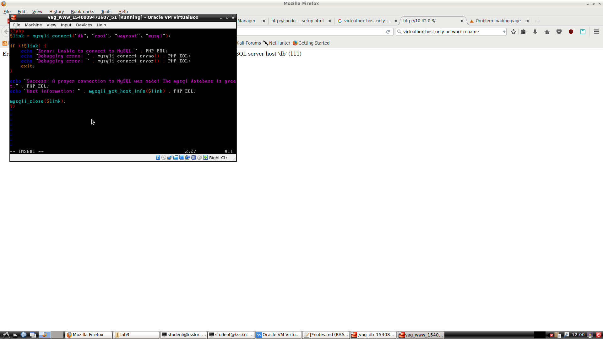
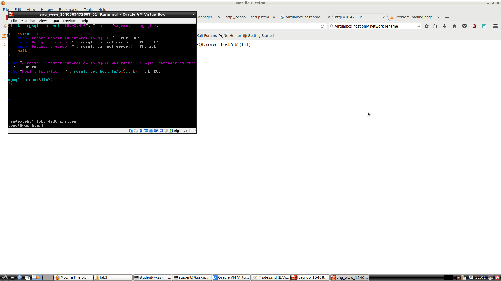
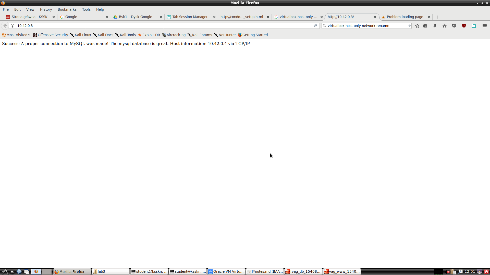
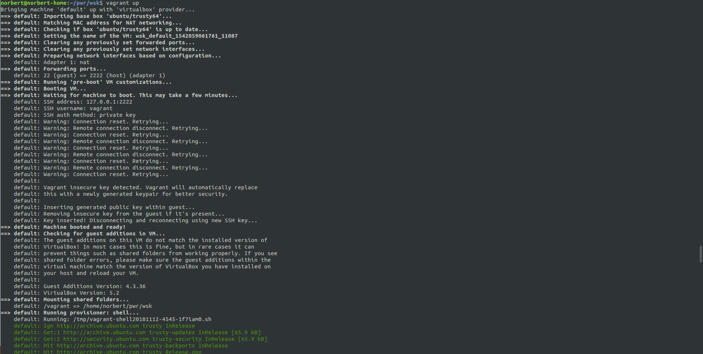

# Wirtualizacja systemów i sieci komputerowych

## Sprawozdanie z laboratorium

Data | Tytuł zajęć | Uczestnicy
:-: | :-: | :-:
29.10.2018 09:15 | Praca z maszyną wirtualną - Vagrant | Norbert Małecki (218280) Bartosz Rodziewicz (226105)

### Przebieg laboratorium
Pracę rozpoczęliśmy od postawieniu dwóch maszyn wirtualnych poprzez uruchomienie komendy `vargant up` w katalogu `~/VirtualBox VMs/vag/`.

Domyślna konfiguracja sieciowa maszyn stworzonych przez Vagranta prezentuje się następująco:

Zadanie mówi, aby maszyny były dostępne z poziomu komputera hosta, ale nie były widoczne w sieci laboratoryjnej, więc skonfigurowaliśmy je w trybie `host-only`.

Instrukcja mówi, że powinniśmy ustawić nazwę sieci na własną jednak nie udało nam się tego zrobić. Dlatego na screenshocie zamieściliśmy nasz indeks.

W maszynach dostępne są dwa interfejsy - wirtualne połączenie Ethernet i Loopback:

Z uwagi na naszą konfigurację sieci `host-only` (bez DHCP) adres nie został automatycznie pobrany i musieliśmy ustawić go ręcznie.

Adresy zostały ustawione następująco.
* Host - `10.42.0.1`
* Serwer WWW - `10.42.0.3`
* Baza danych - `10.42.0.4`
Maska podsieci to `255.255.255.0`, a brama domyślna nie jest ustawiona.

Do konfiguracji maszyn wirtualnych użyliśmy narzędzia `nmtui`, zgodnie z dołączoną instrukcją użycia w instrukcji do laboratorium.

Po tej konfiguracji ping z hosta szedł do obu maszyn wirtualnych, było połączenie z serwerem WWW, jednak serwer nie łączył się z bazą danych.

Po chwili zastanowienia się uświadomiliśmy sobie, że kod php na serwerze nie jest w stanie automatycznie znaleźć adresu naszej bazy danych. Znaleźliśmy plik `index.php`, który znajdował się na serwerze WWW w folderze `/var/www/html/`.

Za pomocą Vima (nie było to łatwe) zmieniliśmy argument funkcji `mysqli_connect` z `db` na właściwy adres maszyny z bazą danych.

Po odświeżeniu strony na serwerze WWW (oczywiście z poziomu hosta) uzyskaliśmy komunikat potwierdzający połączenie z bazą danych.

### Realizacja projektu
Wykorzystaliśmy gotowy obraz pobrany z [https://app.vagrantup.com/ubuntu/boxes/trusty64](https://app.vagrantup.com/ubuntu/boxes/trusty64).

Następnie zmieniliśmy domyślny plik `Vagrantfile` tak aby możliwe było użycie odpowiednich komend potrzebnych do dostosowania maszyny. W tym celu utworzyliśmy skrypt `bootstrap.sh`, który był uruchamiany poprzez dodanie do pliku `Vagranfile` komendy `config.vm.provision :shell, path: "bootstrap.sh"`. Możliwe jest podanie komend bezpośrednio w pliku `Vagrantfile`, ale lepiej jednak jest oddzielić pliki od siebie.

Skrypt zawierał komendy służące do zainstalowania PHP, systemu kontroli wersji Git oraz serwera Apache.

Po utworzeniu maszyny wirtualnej i zalogowaniu się sprawdziliśmy czy system jest prawidłowo skonfigurowany.

