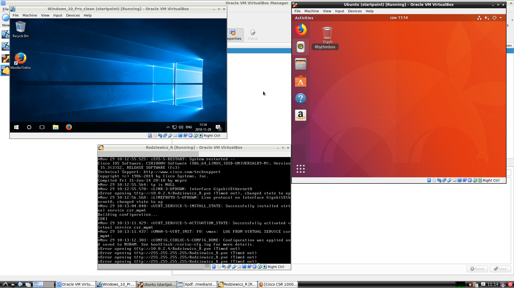
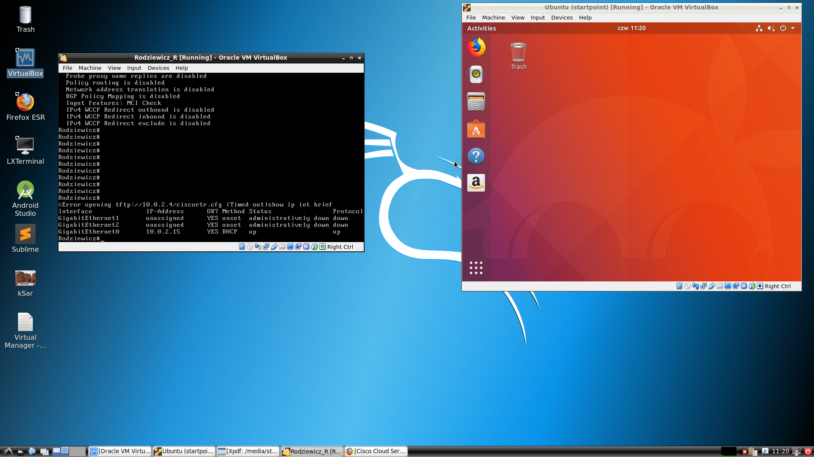
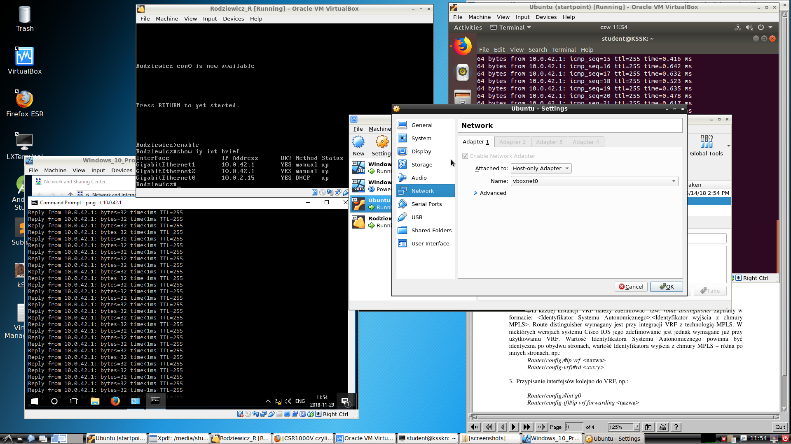
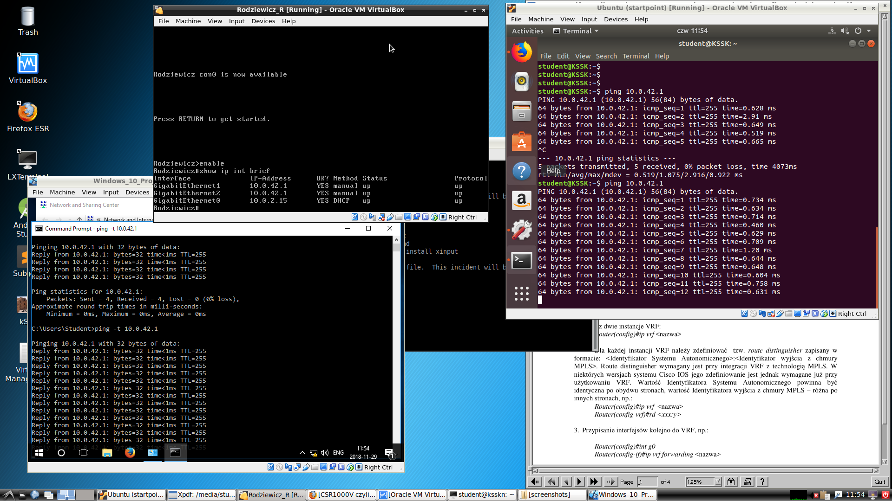
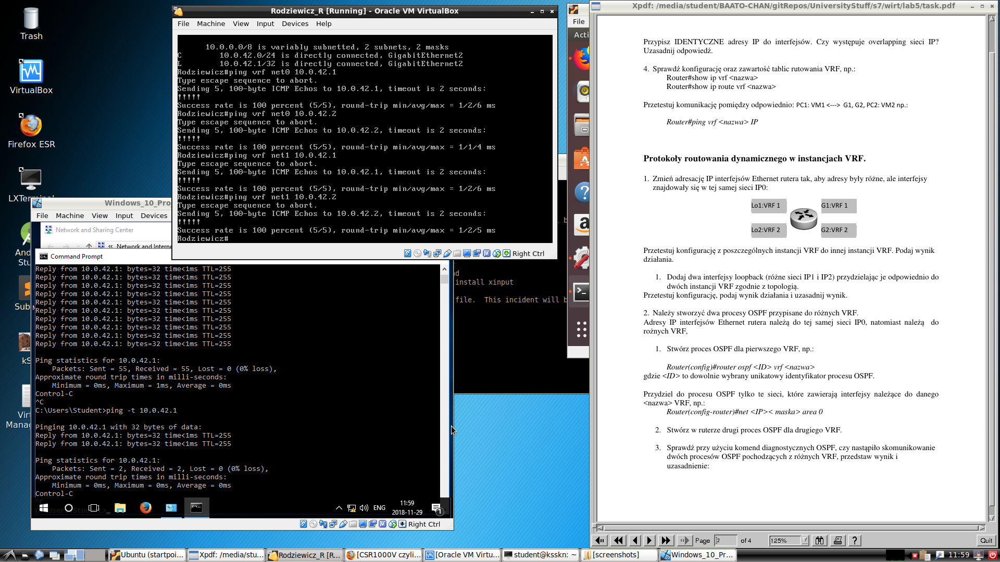
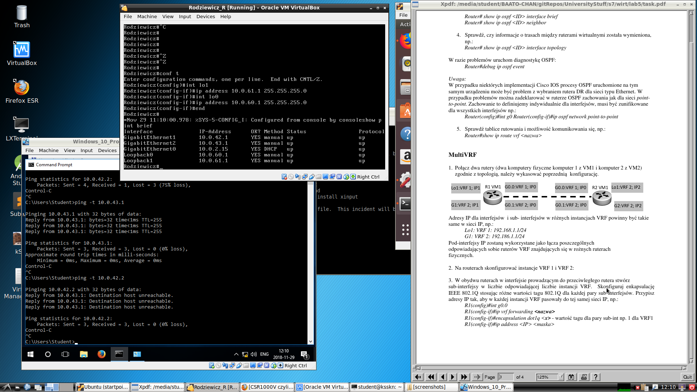
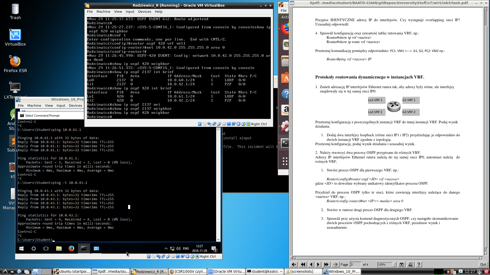

# Wirtualizacja systemów i sieci komputerowych

## Sprawozdanie z laboratorium

Data | Tytuł zajęć | Uczestnicy
:-: | :-: | :-:
29.11.2018 09:15 | Konfiguracja routingu między VM | Norbert Małecki (218280) Bartosz Rodziewicz (226105)

### Podstawowa konfiguracja
Zajęcia rozpoczęliśmy od utworzenia maszyny wirtualnej korzystając z gotowego obrazu routera SCR1000V, oraz dodatkowych dwóch maszyn - Windows 10 oraz Ubuntu.

Ze względu na równoczesne działanie 3 maszyn wirtualnych musieliśmy odpowiednio ograniczyć zasoby, tak aby możliwe było również korzystanie z samego hosta.

Przez długi czas mieliśmy jednak problem z prawidłowym podniesieniem się maszyny routera, która chwilę po wybootowaniu się restartowała.

Następnie sprawdziliśmy obecną konfigurację z pomocą komendy `show ip int brief`

W ustawieniach VirtualBoxa zarówna dla maszyny Windows oraz Ubuntu zmieniliśmy tryb sieciowy na "Host-only Adapter".

W kolejnym kroku przypisaliśmy identyczne adresy IP do interfejsów i sprawdziliśmy możliwość pingowania z Windowsa i Ubuntu do routera. Nie występował overlapping sieci IP dzięki temu, że interfejsy przypisaliśmy do innych VRF.

Sukcesem zakończyła się również próba pingowania routera

### Protokoły routowania dynamicznego w instancjach VRF
Dodaliśmy dwa interfejsy loopback

Po utworzeniu procesów OSPF komendy `show ip ospf <ID> interface brief` oraz `show ip ospf <ID> neighbor` nie pokazały nam prawidłowego rezultatu

Ze względu na ograniczenie czasowe nie udało nam się znaleźć przyczyny nieprawidłowego skonfigurowania routera.
